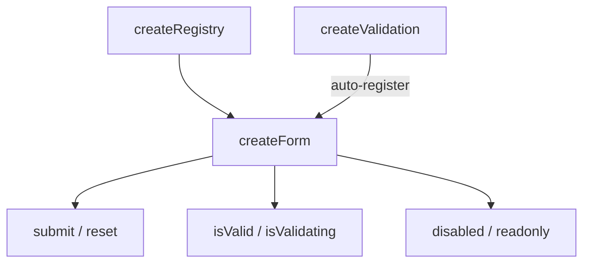

# createForm

Coordinates validation across multiple fields. A pure registry of `createValidation` instances — it provides `submit()`, `reset()`, and aggregate `isValid`/`isValidating` state. Per-field validation logic lives in `createValidation`. The form is the mothership — it coordinates, not creates.

<DocsPageFeatures :frontmatter />

## Usage

### Creating a Form

Create a form and register validation contexts. Each validation owns its own fields and rules:

```ts collapse no-filename
import { createForm, createValidation, useRules } from '@vuetify/v0'

const form = createForm()
const rules = useRules()

const validation = createValidation({ rules })
const email = validation.register({
  id: 'email',
  value: '',
  rules: ['required', 'email'],
})

form.register(validation)

await form.submit()

console.log(email.errors.value) // ['Required']

form.reset()
```

### Auto-Registration

When a `createValidation` instance is created inside a component that has a parent form context, it **auto-registers** with the form — no manual `form.register()` needed:

```vue
<script setup lang="ts">
  import { createValidation, useRules } from '@vuetify/v0'

  // Parent provides form context — this validation auto-registers
  const rules = useRules()
  const validation = createValidation({ rules })

  const email = validation.register({
    id: 'email',
    value: '',
    rules: ['required', 'email'],
  })
</script>
```

Use `standalone: true` to opt out of auto-registration:

```ts
const validation = createValidation({ rules, standalone: true })
```

### Disabled and Readonly

The form exposes `disabled` and `readonly` as reactive refs. Components can read these to conditionally disable inputs:

```ts
const form = createForm({ disabled: true })

form.disabled.value = false // Toggle at runtime
```

### Injecting a Form Context

Use `useForm` to inject an existing form context provided by a parent component:

```ts
import { useForm } from '@vuetify/v0'

const form = useForm() // Returns undefined if no parent form
```

## Architecture

`createForm` is a pure registry. Validations register with it for coordination:


```mermaid "Form Architecture"
flowchart TD
  createRegistry --> createForm
  createValidation -->|auto-register| createForm
  createForm --> submit[submit / reset]
  createForm --> aggregate[isValid / isValidating]
  createForm --> state[disabled / readonly]
```

## Reactivity

Form-level state is fully reactive.

| Property/Method | Reactive | Notes |
| - | :-: | - |
| `isValid` | <AppSuccessIcon /> | Computed from all registered validations |
| `isValidating` | <AppSuccessIcon /> | Computed from all registered validations |
| `disabled` | <AppSuccessIcon /> | ShallowRef, read by components |
| `readonly` | <AppSuccessIcon /> | ShallowRef, read by components |

<DocsApi />
