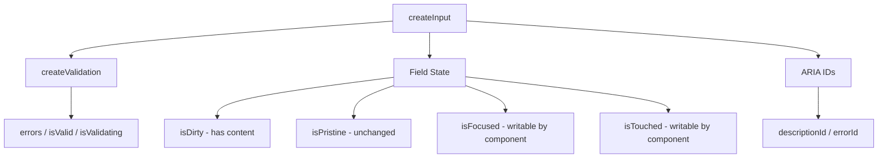

# createInput

Shared form field primitive providing validation lifecycle, field state tracking, ARIA ID generation, and error merging. Used internally by Input, NumberField, Select, and Combobox.

<DocsPageFeatures :frontmatter />

## Usage

```ts collapse
import { createInput } from '@vuetify/v0'
import { ref } from 'vue'

const value = ref('')
const input = createInput({
  value,
  rules: [v => !!v || 'Required'],
})

// Field state
input.isDirty.value      // false (no content)
input.isPristine.value   // true (unchanged)
input.isTouched.value    // false (not interacted)

// Trigger validation
await input.validate()
input.isValid.value      // false
input.errors.value       // ['Required']
input.state.value        // 'invalid'

// Update value
value.value = 'hello'
input.isDirty.value      // true
input.isPristine.value   // false

// Reset
input.reset()
value.value              // '' (initial value)
input.isPristine.value   // true
input.isValid.value      // null (unvalidated)
```

## Architecture



## Reactivity

| Property | Type | Description |
|----------|------|-------------|
| `value` | `Ref<T>` | The field value (same ref passed in) |
| `isDirty` | `Readonly<Ref<boolean>>` | Has content (via `dirty` predicate) |
| `isPristine` | `Readonly<Ref<boolean>>` | Unchanged since mount/reset |
| `isFocused` | `ShallowRef<boolean>` | Writable — component sets on focus/blur |
| `isTouched` | `ShallowRef<boolean>` | Writable — component sets after first interaction |
| `isDisabled` | `Readonly<Ref<boolean>>` | Resolved from `disabled` option |
| `isReadonly` | `Readonly<Ref<boolean>>` | Resolved from `readonly` option |
| `errors` | `Readonly<Ref<string[]>>` | Merged validation + manual errors |
| `isValid` | `Readonly<Ref<boolean \| null>>` | Tri-state: null (unvalidated), true, false |
| `isValidating` | `Readonly<Ref<boolean>>` | Async validation in progress |
| `state` | `Readonly<Ref<InputState>>` | `'pristine' \| 'valid' \| 'invalid'` |

| Method | Description |
|--------|-------------|
| `validate()` | Run rules, returns `Promise<boolean>` |
| `reset()` | Restore initial value, clear validation |

> [!TIP]
> `isDirty` and `isPristine` are not inverses. A pre-filled form field is dirty AND pristine. A cleared field is not-dirty AND not-pristine.

## Generic Types

createInput is generic over the value type:

```ts no-filename
// String (default) — for text inputs
createInput({ value: ref('') })

// Number | null — for numeric inputs
createInput<number | null>({
  value: ref<number | null>(null),
  dirty: v => v !== null,
  equals: (a, b) => Object.is(a, b),
})

// ID | ID[] — for select inputs
createInput<ID | ID[]>({
  value: ref<ID[]>([]),
  dirty: v => Array.isArray(v) ? v.length > 0 : v != null,
})
```

## Examples

::: example
/composables/create-input/basic

### Text Field with State Tracking

A minimal text field built on `createInput`, showing all six reactive field states — `isDirty`, `isPristine`, `isTouched`, `isFocused`, `isValid`, and `state` — updating live as you type, focus, and blur.

:::

::: faq

??? Why doesn't createInput handle events like blur or input?

Composables never bind DOM events — that's a component responsibility. createInput exposes `validate()` and writable refs (`isFocused`, `isTouched`). The component decides when to call them based on its event policy.

??? How does createInput differ from createValidation?

createValidation handles rule evaluation only. createInput wraps it and adds field state (dirty, pristine, focused, touched), ARIA IDs, error merging with manual messages, and the `error` prop override. Think of createInput as the full "form field" while createValidation is just the "rule runner."

??? Why is there no validateOn option?

`validateOn` is event policy — "validate on blur vs input vs submit." That decision belongs in the component, not the composable. The component calls `input.validate()` whenever it decides to.

:::

<DocsApi />
