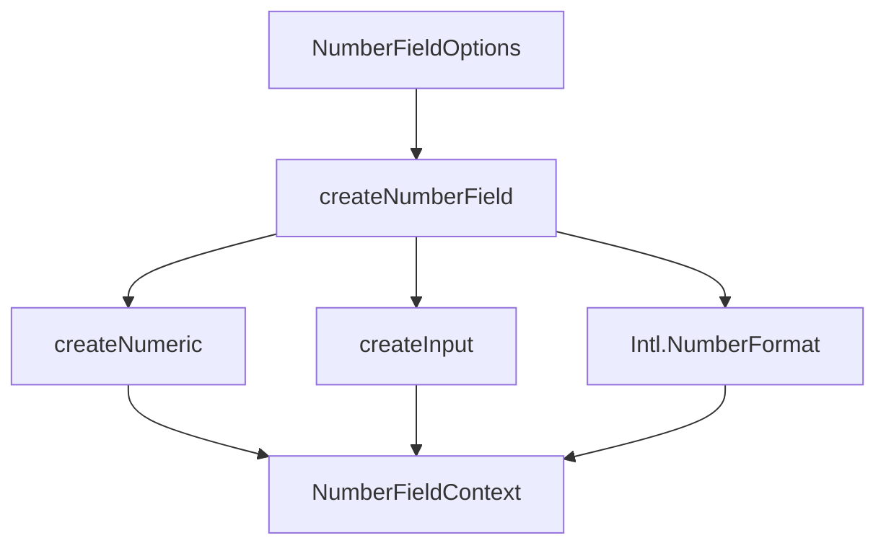

# createNumberField

Numeric value with locale-aware formatting, step snapping, and field validation. Give it a min/max/step, get increment/decrement, formatted display, and parse/commit for text input.

<DocsPageFeatures :frontmatter />

## Usage

```ts collapse
import { createNumberField } from '@vuetify/v0'
import { shallowRef } from 'vue'

// Basic — standalone counter
const field = createNumberField({ min: 0, max: 100, step: 1 })
field.increment()       // 1
field.increment(5)      // 6  (multiplier)
field.value.value       // 6
field.display.value     // '6'

// Currency formatting
const price = shallowRef<number | null>(42)
const currency = createNumberField({
  value: price,
  min: 0,
  max: 10000,
  step: 0.01,
  locale: 'en-US',
  format: { style: 'currency', currency: 'USD' },
})
currency.display.value  // '$42.00'
currency.parse('$1,234.56')  // 1234.56

// With validation
const validated = createNumberField({
  min: 1,
  max: 100,
  rules: [v => v !== null || 'Required'],
})
await validated.input.validate()
validated.input.errors.value  // ['Required']
```

## Architecture



`createNumeric` provides pure math (step, clamp, snap, boundary checks). `createInput` provides field state (dirty, pristine, focus, validation). `Intl.NumberFormat` provides locale-aware formatting and parsing.

## Reactivity

| Property | Type | Reactive | Description |
|----------|------|----------|-------------|
| `value` | `Ref<number \| null>` | Yes | Current numeric value |
| `display` | `Readonly<Ref<string>>` | Yes | Formatted display string |
| `canIncrement` | `Readonly<Ref<boolean>>` | Yes | Whether value can go up |
| `canDecrement` | `Readonly<Ref<boolean>>` | Yes | Whether value can go down |
| `numeric` | `NumericContext` | No | Underlying numeric math context |
| `input` | `InputContext` | Partial | Field state (focus, dirty, validation) |
| `increment(n?)` | `(multiplier?: number) => void` | -- | Increment by step * multiplier |
| `decrement(n?)` | `(multiplier?: number) => void` | -- | Decrement by step * multiplier |
| `floor()` | `() => void` | -- | Set to minimum |
| `ceil()` | `() => void` | -- | Set to maximum |
| `formatValue(v)` | `(value: number) => string` | -- | Format a number |
| `parse(text)` | `(text: string) => number \| null` | -- | Parse text to number |
| `commit()` | `() => void` | -- | Snap and optionally clamp |

## Examples

::: example
/composables/create-number-field/basic

### Basic

Standalone composable usage without the NumberField component. Demonstrates increment, decrement, formatting, and boundary state.
:::

::: faq

??? How does parsing handle different locales?

`createNumberField` builds a stripping regex from `Intl.NumberFormat.formatToParts`. It removes group separators, currency symbols, and literal characters automatically, then normalizes the decimal separator to `.` before parsing with `Number()`.

??? What's the difference between this and createNumeric?

`createNumeric` is a pure math primitive with no reactivity or DOM concerns. `createNumberField` orchestrates `createNumeric` + `createInput` + `Intl.NumberFormat` into a complete field with reactive state, formatting, parsing, and validation.

??? Does commit() always clamp?

By default yes. Set `clamp: false` to allow values outside min/max after typing. The value still gets snapped to the step grid.

??? Can I share the value ref across multiple fields?

Yes. Pass the same `Ref<number | null>` to multiple `createNumberField` instances. Each field formats independently but writes to the same source.

:::

<DocsApi />
