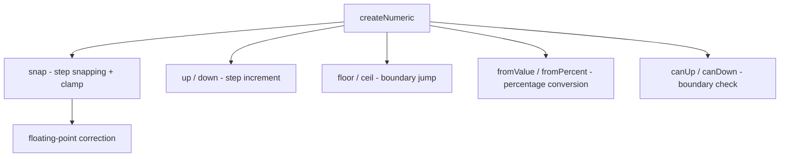

# createNumeric

Pure numeric math for bounded values with step snapping, range clamping, and floating-point precision correction.

<DocsPageFeatures :frontmatter />

## Usage

```ts collapse
import { createNumeric } from '@vuetify/v0'

const numeric = createNumeric({ min: 0, max: 100, step: 5 })

numeric.snap(47)        // 45
numeric.snap(48)        // 50
numeric.up(50)          // 55
numeric.down(50)        // 45
numeric.floor()         // 0
numeric.ceil()          // 100
numeric.fromValue(50)   // 50 (percentage)
numeric.fromPercent(33) // 30 (snapped value)
numeric.canUp(100)      // false
numeric.canDown(0)      // false
```

## Architecture



## Reactivity

createNumeric is a pure function factory — it returns plain functions, not reactive refs. This makes it composable with any reactive system.

| Method | Returns | Description |
|--------|---------|-------------|
| `snap(value)` | `number` | Round to nearest step, clamp to [min, max] |
| `up(value, multiplier?)` | `number` | Increment by step × multiplier |
| `down(value, multiplier?)` | `number` | Decrement by step × multiplier |
| `floor()` | `number` | Return min value |
| `ceil()` | `number` | Return max value |
| `fromValue(value)` | `number` | Convert value to 0–100 percentage |
| `fromPercent(percent)` | `number` | Convert percentage to snapped value |
| `canUp(value)` | `boolean` | Whether increment is possible |
| `canDown(value)` | `boolean` | Whether decrement is possible |

## Examples

::: gn-example
/composables/create-numeric/basic

### Bounded Stepper

A counter (0–100, step 5) wired to `createNumeric` with boundary guards and a live percentage readout. Because `createNumeric` returns plain functions rather than reactive refs, the example keeps its own `shallowRef<number>` for the current value and calls `numeric.up(value)` / `numeric.down(value)` on click — each returns the next snapped value and the template re-renders automatically when `value` changes.

`canDown` and `canUp` return `false` at the boundaries (0 and 100), which the `:disabled` bindings map directly to button state. The `fromValue(value)` call converts the current value to a 0–100 percentage for the display below the counter, demonstrating that `createNumeric` is equally useful for display derivation, not just mutations.

This composable has no opinions about where the value lives — the same `numeric` instance could serve multiple independent counters simultaneously. Reach for [createSlider](/composables/forms/create-slider) when you need registered thumbs, percentage-to-value conversion from pointer events, and reactive `values`; use [createNumberField](/composables/forms/create-number-field) when you need Intl formatting and field validation on top of the same math.

:::

::: faq

??? What happens with floating-point steps like 0.1?

createNumeric automatically corrects floating-point artifacts. `snap(0.1 + 0.2)` returns `0.3`, not `0.30000000000000004`. The correction uses `toFixed` based on the decimal places in `step` and `min`.

??? What does wrap do?

When `wrap: true`, incrementing past `max` wraps to `min`, and decrementing past `min` wraps to `max`. Useful for circular values like angles (0–360) or hours (0–23).

??? How does leap differ from step?

`step` is the standard increment (Arrow keys). `leap` defaults to `step * 10` and is intended for larger jumps (PageUp/PageDown). Both are exposed as readonly properties for components to use.

:::

<DocsApi />
