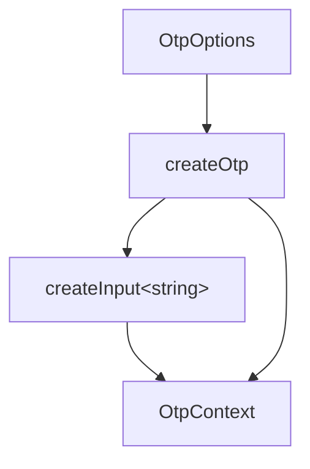

# createOtp

Manage a fixed-length one-time-password or verification-code value with pattern-gated entry, length-based completion detection, and a decisional async hook. Headless — your component owns rendering, focus, and event wiring.

<DocsPageFeatures :frontmatter />

## Usage

```ts collapse
import { createOtp } from '@vuetify/v0'

const otp = createOtp({
  length: 6,
  pattern: 'numeric',
  onComplete: async value => {
    const ok = await verify(value)
    return ok // false clears the value and surfaces an error
  },
})

otp.setAt(0, '4')          // single character at a position
otp.paste('123456')        // distributes filtered characters
otp.value.value            // '412345' joined string
otp.isComplete.value       // true when length reached and all chars valid
otp.accepts('a')           // false under 'numeric'
otp.clear()
```

## Architecture



Layer 2 orchestrator. Aggregates createInput for validation, dirty tracking, and ARIA wiring. No registry, no focus traversal, no observers — rendering, per-element refs, and keyboard wiring are the consumer's responsibility.

## Patterns

| Pattern | Matches |
| - | - |
| `'numeric'` | `[0-9]` |
| `'alphanumeric'` | `[a-zA-Z0-9]` |
| `'alphabetic'` | `[a-zA-Z]` |
| `RegExp` | Custom; tested per character |

`accepts(char)` is the single point of truth and is reactive through `MaybeRefOrGetter` — toggle modes at runtime and every helper respects the new pattern on the next call.

## Behavior

- `setAt(index, char)` writes a single character at a position. Empty `char` truncates the joined value to `value.slice(0, index)` — matching the Backspace mental model. Multi-character `char` is reduced to its first character (use `paste` for distribution).
- `paste(text, index = 0)` filters `text` through `accepts`, splices the filtered characters in at `index`, clips the result to `length`, and returns the count consumed so consumers can decide where to advance focus.
- `isComplete` is true when the joined value reaches `length` and every character passes `accepts`. A watcher fires `onComplete(value)` exactly once on the false → true edge.
- `onComplete` is decisional. Return / resolve `false` to reject — `createOtp` clears the value and surfaces `v0.otp.rejected` through `input.errors`. The error clears automatically on the next mutation.
- While an async `onComplete` is pending, mutation helpers no-op so the user can't race the verification.

## Examples

::: example
/composables/create-otp/basic

### Six-Input Numeric OTP

A minimal six-input numeric OTP. The consumer's component owns the inputs, refs, and focus advance; `createOtp` owns the state. Note how `paste` returns the number of characters consumed, so a single pasted code distributes across the inputs and the next focus target is straightforward to compute. The example also demonstrates Backspace handling and the data-attribute styling pattern used across v0 examples.

:::

## FAQ

::: faq

??? Why is the value a string and not Ref&lt;string[]&gt;?

Backends and form submissions expect the joined string. Storing as an array would force two derivations on every read and break v-model compatibility with `InputContext<string>`. Per-position access is plain string indexing — `value.value[i] ?? ''` — which the consumer's component does inline when rendering.

??? Why is onComplete decisional instead of an observational event?

The dominant flow is "user finished typing → verify → wrong, clear it." Folding that into the completion event collapses a state machine consumers would otherwise hand-roll. Async verification also avoids racing a separate `validate` option for who clears the value first.

??? Where does focus management live?

In your component, not in `createOtp`. The composable has no concept of slots, element refs, or "which input is focused" because rendering shape is the component's call. A six-input OTP and a single-input OTP with character overlay use the same `createOtp` underneath.

:::

<DocsApi />
