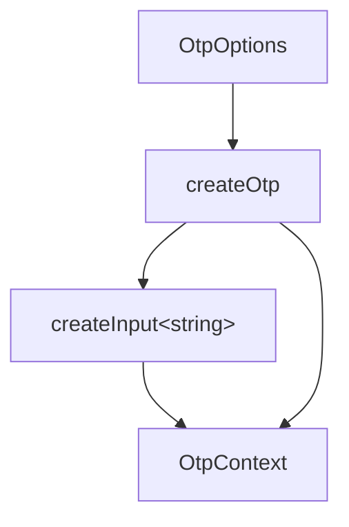

# createOtp

Manage a fixed-length one-time-password or verification-code value with pattern-gated entry, length-based completion detection, and a decisional async hook. Headless — your component owns rendering, focus, and event wiring.

<DocsPageFeatures :frontmatter />

## Usage

```ts collapse
import { createOtp } from '@vuetify/v0'

const otp = createOtp({
  length: 6,
  pattern: 'numeric',
  onComplete: async value => {
    const ok = await verify(value)
    return ok // false clears the value and surfaces an error
  },
})

otp.write(0, '4')          // single character at a position
otp.distribute('123456')   // distributes filtered characters
otp.value.value            // '412345' joined string
otp.isComplete.value       // true when length reached and all chars valid
otp.accepts('a')           // false under 'numeric'
otp.clear()
```

## Architecture



Layer 2 orchestrator. Aggregates createInput for validation, dirty tracking, and ARIA wiring. No registry, no focus traversal, no observers — rendering, per-element refs, and keyboard wiring are the consumer's responsibility.

## Options

### Patterns

| Pattern | Matches |
| - | - |
| `'numeric'` | `[0-9]` |
| `'alphanumeric'` | `[a-zA-Z0-9]` |
| `'alphabetic'` | `[a-zA-Z]` |
| `RegExp` | Custom; tested per character |

`accepts(char)` is the single point of truth and is reactive through `MaybeRefOrGetter` — toggle modes at runtime and every helper respects the new pattern on the next call.

## Reactivity

| Property | Type | Reactive | Description |
| - | - | :-: | - |
| `value` | `Readonly<Ref<string>>` | <AppSuccessIcon /> | Joined OTP string. Readonly — mutate via the helpers below. |
| `length` | `Readonly<Ref<number>>` | <AppSuccessIcon /> | Target character count from the `length` option. |
| `input` | `InputContext<string>` | <AppSuccessIcon /> | Underlying `createInput` surface — ARIA IDs, errors, validation, focus/touched. |
| `isComplete` | `Readonly<Ref<boolean>>` | <AppSuccessIcon /> | `true` when value reaches `length` and every character passes `accepts`. Fires `onComplete` on the false → true edge. |
| `write(index, char)` | `(index: number, char: string) => void` | — | Writes one character at `index`. Empty `char` truncates to `value.slice(0, index)` (Backspace mental model). Multi-character `char` is reduced to the first character — use `distribute` for multi-character input. |
| `distribute(text, index?)` | `(text: string, index?: number) => number` | — | Filters `text` through `accepts`, splices at `index` (default `0`), clips to `length`. Returns the count consumed so consumers can advance focus. |
| `clear()` | `() => void` | — | Empties the joined value. |
| `fill(text)` | `(text: string) => void` | — | Replaces the joined value (filtered + clipped). |
| `accepts(char)` | `(char: string) => boolean` | — | Pattern test, exposed so consumers can guard `beforeinput`. |

Every helper is gated on the configured `disabled` and `readonly` options, and on the internal pending state while an async `onComplete` is in flight.

## Examples

::: gn-example
/composables/create-otp/useVerification.ts 1
/composables/create-otp/VerificationCode.vue 2
/composables/create-otp/verification-code.vue 3

### Email Verification Flow

A six-digit verification-code field with an async, decisional completion check. The composable owns the `createOtp` instance and a mock backend round-trip: `onComplete` resolves `true` to accept the code or `false` to reject it, clearing the value and surfacing `input.errors`. The component owns the per-cell `<input>` elements, the template refs, the focus advance, and the paste handler — focus and rendering are deliberately outside the composable. The entry wires the two together and renders a status line driven by `isValidating`, the rejection error, and a local `verified` flag.

Reach for this split when the verification step is more than a value capture: an async check that locks input while it runs, a rejection path that re-arms cleanly, and paste support that distributes a copied code across the cells in one keystroke. `distribute` returns how many characters it consumed so the component can land focus on the next empty slot, and while the async `onComplete` is pending every mutation helper no-ops — the user cannot race the verifier. Enter `424242` to pass; any other code exercises the reject-and-retry branch, where the first new keystroke clears the error automatically.

The tradeoffs mirror the headless contract. Because focus is rendering territory, the component wires it by hand; consumers who prefer roving focus can wrap the cells in useRovingFocus without touching the state model. A single wide input over the same `createOtp` works without modification — only the markup changes. See [createInput](/composables/forms/create-input) for the validation, error, and field-state surface aggregated underneath, and [createValidation](/composables/forms/create-validation) for the rules array that flows through unchanged.

| File | Role |
|------|------|
| `useVerification.ts` | Owns the `createOtp` instance, the async `onComplete` backend check, and a derived `status` |
| `VerificationCode.vue` | Renders the per-cell inputs and owns template refs, focus advance, backspace, and paste |
| `verification-code.vue` | Wires the composable to the component and renders the status line and reset control |

:::

## FAQ

::: faq

??? Why is the value a single string instead of an array?

Backends and form submissions expect the joined string. Storing as an array would force two derivations on every read and break v-model compatibility with `InputContext<string>`. Per-position access is plain string indexing — `value.value[i] ?? ''` — which the consumer's component does inline when rendering.

??? Why is onComplete decisional instead of an observational event?

The dominant flow is "user finished typing → verify → wrong, clear it." Folding that into the completion event collapses a state machine consumers would otherwise hand-roll. Async verification also avoids racing a separate `validate` option for who clears the value first.

??? When does onComplete fire?

Exactly once on the false → true edge of `isComplete` — when the value first reaches `length` with every character passing `accepts`. Mutations after completion don't re-fire it; clearing and re-completing does. The watcher dedupes via an internal sentinel that resets whenever the value drops back below complete (or on rejection), so a clear-and-refill cycle still re-fires `onComplete`.

??? What happens during async verification?

While an async `onComplete` is pending, every mutation helper (`write`, `distribute`, `fill`, `clear`) is a no-op — the field is effectively locked until the promise settles, so the user can't race the verifier. On rejection, the value clears and `input.errors` surfaces `v0.otp.rejected`; on the next successful mutation the rejection clears automatically.

??? Where does focus management live?

In your component, not in `createOtp`. The composable has no concept of slots, element refs, or "which input is focused" because rendering shape is the component's call. A six-input OTP and a single-input OTP with character overlay use the same `createOtp` underneath.

:::

<DocsApi />
