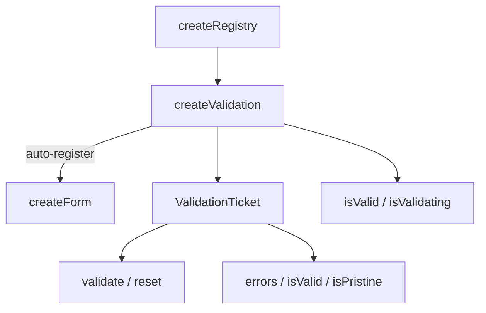

# createValidation

Per-field validation lifecycle composable. Manages validation state — errors, validity, pristine tracking — for individual fields. Works standalone or auto-registers with a parent `createForm`.

<DocsPageFeatures :frontmatter />

## Usage

### Standalone

Create a validation instance and register fields with rules:

```ts collapse no-filename
import { createValidation } from '@vuetify/v0'

const validation = createValidation()

const email = validation.register({
  id: 'email',
  value: '',
  rules: [
    v => !!v || 'Required',
    v => /^.+@\S+\.\S+$/.test(String(v)) || 'Invalid email',
  ],
})

await email.validate()

console.log(email.errors.value)    // ['Required']
console.log(email.isValid.value)   // false
console.log(email.isPristine.value) // true

email.reset()
```

### With Rule Aliases

When a rules context is provided via `createRulesPlugin` or `createRulesContext`, alias strings resolve automatically:

```ts
import { createValidation } from '@vuetify/v0'

const validation = createValidation()

const name = validation.register({
  id: 'name',
  value: '',
  rules: ['required', 'slug'],
})
```

### With Standard Schema

Pass schema objects directly — they're auto-detected and wrapped:

```ts
import { z } from 'zod'
import { createValidation } from '@vuetify/v0'

const validation = createValidation()

const age = validation.register({
  id: 'age',
  value: '',
  rules: [z.coerce.number().int().min(18, 'Must be 18+')],
})
```

### Auto-Registration with Forms

When created inside a component with a parent form context, `createValidation` **auto-registers** with the form. The form can then coordinate submit and reset across all registered validations. Cleanup happens automatically via `onScopeDispose`:

```vue
<script setup lang="ts">
  import { createValidation } from '@vuetify/v0'

  // Parent provides form context via createFormContext or createFormPlugin
  // This validation auto-registers with it
  const validation = createValidation()

  const email = validation.register({
    id: 'email',
    value: '',
    rules: ['required', 'email'],
  })
</script>
```

### Bulk Registration

Use `onboard()` to register multiple fields at once:

```ts
const validation = createValidation()

const fields = validation.onboard([
  { id: 'name', value: '', rules: ['required'] },
  { id: 'email', value: '', rules: ['required', 'email'] },
  { id: 'bio', value: '', rules: [v => String(v).length <= 500 || 'Too long'] },
])
```

### Silent Validation

Check validity without updating the UI:

```ts
const valid = await email.validate(true) // silent = true
// email.errors.value is unchanged
// email.isValid.value is unchanged
```

## Architecture

`createValidation` extends `createRegistry` with per-ticket validation state. When a parent form context exists, it auto-registers like a child component:



### Race Safety

Async validation uses a generation counter to prevent stale results. If a newer validation starts before an older one completes, the older result is discarded:

```ts
// User types fast — each keystroke triggers validation
email.value = 'a'     // generation 1
email.value = 'ab'    // generation 2 — generation 1 result discarded
email.value = 'abc'   // generation 3 — generation 2 result discarded
// Only generation 3 result is applied
```

## Reactivity

Field-level and aggregate state are fully reactive.

| Property/Method | Reactive | Notes |
| - | :-: | - |
| `isValid` | <AppSuccessIcon /> | Computed aggregate from all tickets |
| `isValidating` | <AppSuccessIcon /> | Computed aggregate from all tickets |
| `ticket.value` | <AppSuccessIcon /> | ShallowRef, resets isValid on change |
| `ticket.errors` | <AppSuccessIcon /> | ShallowRef array |
| `ticket.isValid` | <AppSuccessIcon /> | ShallowRef (null/true/false) |
| `ticket.isPristine` | <AppSuccessIcon /> | ShallowRef boolean |
| `ticket.isValidating` | <AppSuccessIcon /> | ShallowRef boolean |

<DocsApi />
