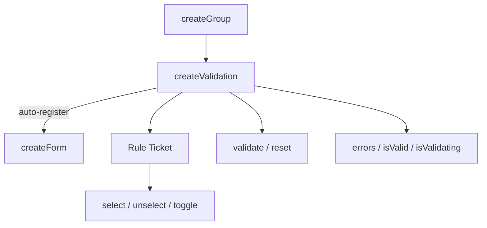

# createValidation

Per-input validation with reactive rules, async validation, and Standard Schema support.

<DocsPageFeatures :frontmatter />

## Usage

### Standalone

Create a validation instance with rules. Pass a value source so `validate()` reads from it automatically:

```ts collapse no-filename
import { createValidation } from '@vuetify/v0'
import { shallowRef } from 'vue'

const email = shallowRef('')
const validation = createValidation({
  value: email,
  rules: [
    v => !!v || 'Required',
    v => /^.+@\S+\.\S+$/.test(String(v)) || 'Invalid email',
  ],
})

await validation.validate()

console.log(validation.errors.value)    // ['Required', 'Invalid email']
console.log(validation.isValid.value)   // false

validation.reset()
```

### Explicit Value

Pass the value directly to `validate()` instead of storing a value source:

```ts
const validation = createValidation({
  rules: [v => !!v || 'Required'],
})

await validation.validate('')       // validate with empty string
await validation.validate('hello')  // validate with 'hello'
```

### With Rule Aliases

When a rules context is provided via `createRulesPlugin` or `createRulesContext`, alias strings resolve automatically:

```ts
const validation = createValidation({
  rules: ['required', 'slug'],
})
```

### With Standard Schema

Any [Standard Schema](https://standardschema.dev)-compliant library works without an adapter — pass the schema object directly and it's auto-detected:

::: code-group

```ts zod
import { z } from 'zod'

const validation = createValidation({
  rules: [z.coerce.number().int().min(18, 'Must be 18+')],
})
```

```ts valibot
import * as v from 'valibot'

const validation = createValidation({
  rules: [v.pipe(v.string(), v.email('Invalid email'))],
})
```

```ts arktype
import { type } from 'arktype'

const validation = createValidation({
  rules: [type('string.email')],
})
```

:::

### Dynamic Rules

Register rules individually after creation:

```ts
const validation = createValidation()

validation.register(v => !!v || 'Required')
validation.register(v => /^.+@\S+\.\S+$/.test(String(v)) || 'Invalid email')
```

Use `onboard()` to register multiple rules at once:

```ts
validation.onboard([
  v => !!v || 'Required',
  v => v.length >= 8 || 'Min 8 characters',
  v => /[A-Z]/.test(String(v)) || 'Must contain uppercase',
])
```

### Enabling and Disabling Rules

Each rule is a ticket with selection methods from `createGroup`. The `enroll` option (default `true`) controls whether newly registered rules are active immediately. Set `enroll: false` to register rules in an inactive state:

```ts
const validation = createValidation({
  rules: [
    v => !!v || 'Required',
    v => /^.+@\S+\.\S+$/.test(String(v)) || 'Invalid email',
  ],
})

// Disable the email format rule
const [, format] = [...validation.values()]
format.unselect()

await validation.validate('')
// Only 'Required' runs — format rule is inactive

// Re-enable it
format.select()
```

### Silent Validation

Check validity without updating the UI:

```ts
const valid = await validation.validate('', true) // silent = true
// validation.errors.value is unchanged
// validation.isValid.value is unchanged
```

### Auto-Registration with Forms

When created inside a component with a parent form context, `createValidation` **auto-registers** with the form. The form can then coordinate submit and reset across all registered validations. Cleanup happens automatically via `onScopeDispose`:

```vue
<script setup lang="ts">
  import { createValidation } from '@vuetify/v0'
  import { shallowRef } from 'vue'

  // Parent provides form context via createFormContext or createFormPlugin
  // This validation auto-registers with it
  const email = shallowRef('')
  const validation = createValidation({
    value: email,
    rules: ['required', 'email'],
  })
</script>
```

## Architecture

`createValidation` extends `createGroup` with per-input validation state. Each ticket is a rule. When a parent form context exists, it auto-registers:



### Race Safety

Async validation uses a generation counter to prevent stale results. If a newer validation starts before an older one completes, the older result is discarded.

## Reactivity

Context-level state is fully reactive. Rule tickets inherit selection reactivity from `createGroup`.

| Property/Method | Reactive | Notes |
| - | :-: | - |
| `errors` | <AppSuccessIcon /> | ShallowRef array of error strings |
| `isValid` | <AppSuccessIcon /> | ShallowRef (null/true/false) |
| `isValidating` | <AppSuccessIcon /> | ShallowRef boolean |
| `selectedIds` | <AppSuccessIcon /> | Reactive Set of active rule IDs |
| `ticket.isSelected` | <AppSuccessIcon /> | Ref boolean per rule |

## Examples

::: gn-example
/composables/create-validation/useEmailField.ts 1
/composables/create-validation/EmailField.vue 2
/composables/create-validation/email-field.vue 3

### Standalone Field Validation

A "build your own field" example that wires `createValidation` straight to a plain input — no `Input` component, no parent form. The composable owns the email value as the validation source (`value: email`), mixes two synchronous rules (required, format) with one async rule that simulates a 700 ms availability check, and exposes a derived `status` so the UI never has to read the tri-state `isValid` directly. All active rules run concurrently, and the async availability rule guards itself on sync validity — re-checking required and format before awaiting — so the network call only fires for well-formed input.

Validation is driven on blur rather than on every keystroke: `onBlur()` flips a `touched` flag and calls `validate()`, while a `watch` on the value resets the result the moment the user edits a field they have already checked. `isValidating` powers the pending spinner and `errors` renders the message list, all settling in a single tick thanks to the composable's generation-based race safety — a second blur while a check is pending discards the stale result. The state panel underneath surfaces `status`, `isValid`, `isValidating`, `touched`, and the error count live so the policy is observable.

Reach for this pattern when you need validation on a control the `Input` component does not cover, or when validation has to coordinate with surrounding state you already own. For the batteries-included field that integrates the same engine, see [createInput](/composables/forms/create-input); to aggregate many fields behind one submit button, see [createForm](/composables/forms/create-form); for alias-based rule registration, see [useRules](/composables/plugins/use-rules).

| File | Role |
|------|------|
| `useEmailField.ts` | Owns the value, the `createValidation` instance (sync + async rules), the blur handler, and a derived status |
| `EmailField.vue` | Presentational field — renders the input, pending spinner, availability badge, and error list |
| `email-field.vue` | Entry — wires the composable to the field and shows a live validation-state panel |
:::

## FAQ

::: faq

??? Can I use a Zod or Valibot schema as a rule?

Yes. Any [Standard Schema](https://standardschema.dev)-compliant schema works without an adapter — pass the schema object directly in `rules` and it's auto-detected alongside function rules and alias strings.

??? How do I check validity without showing errors in the UI?

Pass `silent` as the second argument: `validate(value, true)`. It returns the boolean result while leaving `errors` and `isValid` unchanged.

??? How does createValidation differ from createForm?

createValidation owns one input's rules and validity state; [createForm](/composables/forms/create-form) is a registry that coordinates `submit` and `reset` across many validations. A validation created inside a form's tree auto-registers with it.

:::

<DocsApi />
