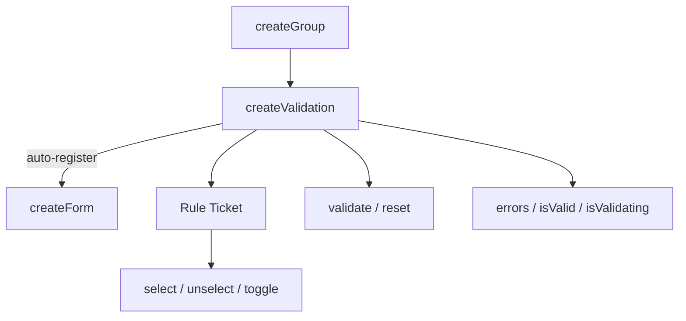

# createValidation

Per-input validation with reactive rules, async validation, and Standard Schema support.

<DocsPageFeatures :frontmatter />

## Usage

### Standalone

Create a validation instance with rules. Pass a value source so `validate()` reads from it automatically:

```ts collapse no-filename
import { createValidation } from '@vuetify/v0'
import { shallowRef } from 'vue'

const email = shallowRef('')
const validation = createValidation({
  value: email,
  rules: [
    v => !!v || 'Required',
    v => /^.+@\S+\.\S+$/.test(String(v)) || 'Invalid email',
  ],
})

await validation.validate()

console.log(validation.errors.value)    // ['Required', 'Invalid email']
console.log(validation.isValid.value)   // false

validation.reset()
```

### Explicit Value

Pass the value directly to `validate()` instead of storing a value source:

```ts
const validation = createValidation({
  rules: [v => !!v || 'Required'],
})

await validation.validate('')       // validate with empty string
await validation.validate('hello')  // validate with 'hello'
```

### With Rule Aliases

When a rules context is provided via `createRulesPlugin` or `createRulesContext`, alias strings resolve automatically:

```ts
const validation = createValidation({
  rules: ['required', 'slug'],
})
```

### With Standard Schema

Any [Standard Schema](https://standardschema.dev)-compliant library works without an adapter — pass the schema object directly and it's auto-detected:

::: code-group

```ts zod
import { z } from 'zod'

const validation = createValidation({
  rules: [z.coerce.number().int().min(18, 'Must be 18+')],
})
```

```ts valibot
import * as v from 'valibot'

const validation = createValidation({
  rules: [v.pipe(v.string(), v.email('Invalid email'))],
})
```

```ts arktype
import { type } from 'arktype'

const validation = createValidation({
  rules: [type('string.email')],
})
```

:::

### Dynamic Rules

Register rules individually after creation:

```ts
const validation = createValidation()

validation.register(v => !!v || 'Required')
validation.register(v => /^.+@\S+\.\S+$/.test(String(v)) || 'Invalid email')
```

Use `onboard()` to register multiple rules at once:

```ts
validation.onboard([
  v => !!v || 'Required',
  v => v.length >= 8 || 'Min 8 characters',
  v => /[A-Z]/.test(String(v)) || 'Must contain uppercase',
])
```

### Enabling and Disabling Rules

Each rule is a ticket with selection methods from `createGroup`. The `enroll` option (default `true`) controls whether newly registered rules are active immediately. Set `enroll: false` to register rules in an inactive state:

```ts
const validation = createValidation({
  rules: [
    v => !!v || 'Required',
    v => /^.+@\S+\.\S+$/.test(String(v)) || 'Invalid email',
  ],
})

// Disable the email format rule
const [, format] = [...validation.values()]
format.unselect()

await validation.validate('')
// Only 'Required' runs — format rule is inactive

// Re-enable it
format.select()
```

### Silent Validation

Check validity without updating the UI:

```ts
const valid = await validation.validate('', true) // silent = true
// validation.errors.value is unchanged
// validation.isValid.value is unchanged
```

### Auto-Registration with Forms

When created inside a component with a parent form context, `createValidation` **auto-registers** with the form. The form can then coordinate submit and reset across all registered validations. Cleanup happens automatically via `onScopeDispose`:

```vue
<script setup lang="ts">
  import { createValidation } from '@vuetify/v0'
  import { shallowRef } from 'vue'

  // Parent provides form context via createFormContext or createFormPlugin
  // This validation auto-registers with it
  const email = shallowRef('')
  const validation = createValidation({
    value: email,
    rules: ['required', 'email'],
  })
</script>
```

## Architecture

`createValidation` extends `createGroup` with per-input validation state. Each ticket is a rule. When a parent form context exists, it auto-registers:



### Race Safety

Async validation uses a generation counter to prevent stale results. If a newer validation starts before an older one completes, the older result is discarded.

## Reactivity

Context-level state is fully reactive. Rule tickets inherit selection reactivity from `createGroup`.

| Property/Method | Reactive | Notes |
| - | :-: | - |
| `errors` | <AppSuccessIcon /> | ShallowRef array of error strings |
| `isValid` | <AppSuccessIcon /> | ShallowRef (null/true/false) |
| `isValidating` | <AppSuccessIcon /> | ShallowRef boolean |
| `selectedIds` | <AppSuccessIcon /> | Reactive Set of active rule IDs |
| `ticket.isSelected` | <AppSuccessIcon /> | Ref boolean per rule |

## Examples

::: gn-example
/composables/create-validation/async-validation

### Async Validation

A username availability checker with four rules — two synchronous (required, min-length), one format check, and one async rule that simulates a 800 ms network call against a hard-coded set of taken usernames. The rules run in order and short-circuit on the first failure, so the async rule only fires when the earlier guards pass.

`isValidating` drives a spinning border and hides the "Available" badge while the promise is in flight. Once it settles, `isValid` flips to `true` or `false` and `errors` updates in one tick. Generation-based race safety means a second "Check Availability" click while the first is pending silently discards the stale result — the state panel at the bottom makes this visible by showing live rule counts and the `isValidating` flag.

The pattern for an input that validates on demand (rather than on blur) is to reset on `@input` and call `validate()` explicitly — the example follows this: typing resets to `null`, clicking "Check Availability" triggers the full rule chain. See [createInput](/composables/forms/create-input) for the blur-based validation policy and [createForm](/composables/forms/create-form) for coordinating multiple validations across a submit button.

:::

::: gn-example
/composables/create-validation/toggle-rules

### Enabling and Disabling Rules

A password strength checker with four named rules (length, uppercase, number, special character) registered via `onboard()`, which returns one ticket per rule. Each ticket carries the selection methods from `createGroup` — `isSelected`, `select()`, `unselect()`, and `toggle()` — so the checkbox list can toggle rules directly without routing through the parent validation context.

Only selected rules run during `validate()`. Unchecking a rule removes it from the active set immediately; the next validation call skips it entirely. The rule count line below the controls reads `selectedIds.size` and `size` live to show how many rules are active at any moment.

This pattern is useful for progressive disclosure in forms (show additional constraints as the user advances) or for conditional rules that depend on other field values. For rules that should always run, the simpler `rules: [...]` option in the constructor is sufficient. See [createValidation](/composables/forms/create-validation#enabling-and-disabling-rules) for the full enabling/disabling API and [useRules](/composables/plugins/use-rules) for alias-based rule registration.

:::

<DocsApi />
