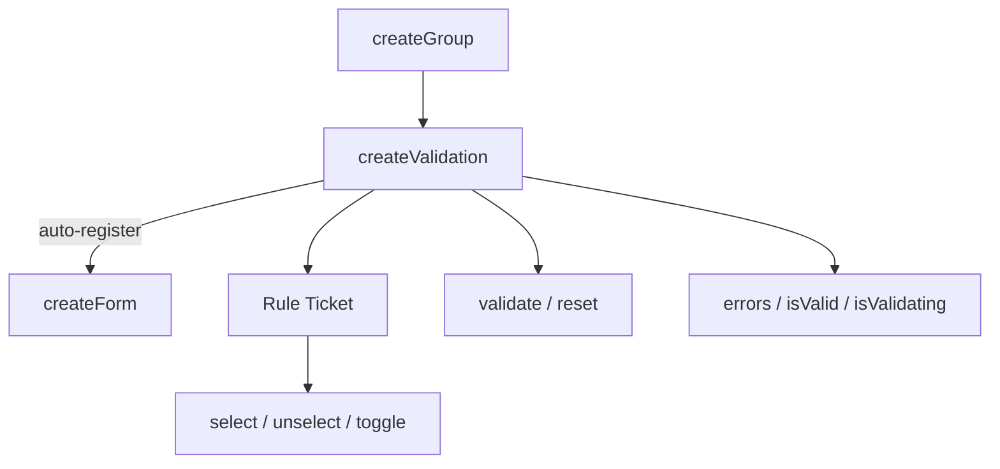

# createValidation

Per-input validation composable built on `createGroup`. Each registered rule becomes a ticket that can be enabled or disabled via selection methods. Only active (selected) rules run during validation.

<DocsPageFeatures :frontmatter />

## Usage

### Standalone

Create a validation instance with rules. Pass a value source so `validate()` reads from it automatically:

```ts collapse no-filename
import { createValidation } from '@vuetify/v0'
import { shallowRef } from 'vue'

const email = shallowRef('')
const validation = createValidation({
  value: email,
  rules: [
    v => !!v || 'Required',
    v => /^.+@\S+\.\S+$/.test(String(v)) || 'Invalid email',
  ],
})

await validation.validate()

console.log(validation.errors.value)    // ['Required', 'Invalid email']
console.log(validation.isValid.value)   // false

validation.reset()
```

### Explicit Value

Pass the value directly to `validate()` instead of storing a value source:

```ts
const validation = createValidation({
  rules: [v => !!v || 'Required'],
})

await validation.validate('')       // validate with empty string
await validation.validate('hello')  // validate with 'hello'
```

### With Rule Aliases

When a rules context is provided via `createRulesPlugin` or `createRulesContext`, alias strings resolve automatically:

```ts
const validation = createValidation({
  rules: ['required', 'slug'],
})
```

### With Standard Schema

Pass schema objects directly — they're auto-detected and wrapped:

```ts
import { z } from 'zod'

const validation = createValidation({
  rules: [z.coerce.number().int().min(18, 'Must be 18+')],
})
```

### Dynamic Rules

Register rules individually after creation:

```ts
const validation = createValidation()

validation.register(v => !!v || 'Required')
validation.register(v => /^.+@\S+\.\S+$/.test(String(v)) || 'Invalid email')
```

### Enabling and Disabling Rules

Each rule is a ticket with selection methods from `createGroup`. Use `enroll` to control whether rules are active by default:

```ts
const validation = createValidation({
  rules: [
    v => !!v || 'Required',
    v => /^.+@\S+\.\S+$/.test(String(v)) || 'Invalid email',
  ],
})

// Disable the email format rule
const [, format] = [...validation.values()]
format.unselect()

await validation.validate('')
// Only 'Required' runs — format rule is inactive

// Re-enable it
format.select()
```

### Silent Validation

Check validity without updating the UI:

```ts
const valid = await validation.validate('', true) // silent = true
// validation.errors.value is unchanged
// validation.isValid.value is unchanged
```

### Auto-Registration with Forms

When created inside a component with a parent form context, `createValidation` **auto-registers** with the form. The form can then coordinate submit and reset across all registered validations. Cleanup happens automatically via `onScopeDispose`:

```vue
<script setup lang="ts">
  import { createValidation } from '@vuetify/v0'
  import { shallowRef } from 'vue'

  // Parent provides form context via createFormContext or createFormPlugin
  // This validation auto-registers with it
  const email = shallowRef('')
  const validation = createValidation({
    value: email,
    rules: ['required', 'email'],
  })
</script>
```

## Architecture

`createValidation` extends `createGroup` with per-input validation state. Each ticket is a rule. When a parent form context exists, it auto-registers:



### Race Safety

Async validation uses a generation counter to prevent stale results. If a newer validation starts before an older one completes, the older result is discarded.

## Reactivity

Context-level state is fully reactive. Rule tickets inherit selection reactivity from `createGroup`.

| Property/Method | Reactive | Notes |
| - | :-: | - |
| `errors` | <AppSuccessIcon /> | ShallowRef array of error strings |
| `isValid` | <AppSuccessIcon /> | ShallowRef (null/true/false) |
| `isValidating` | <AppSuccessIcon /> | ShallowRef boolean |
| `selectedIds` | <AppSuccessIcon /> | Reactive Set of active rule IDs |
| `ticket.isSelected` | <AppSuccessIcon /> | Ref boolean per rule |

<DocsApi />
