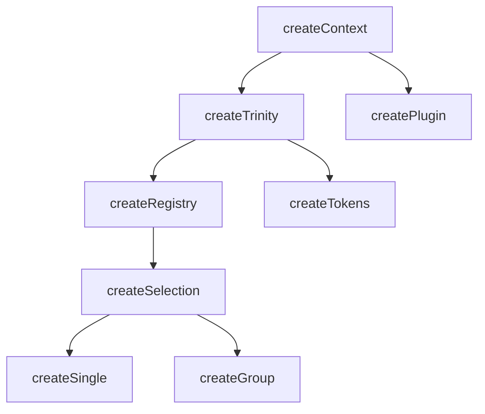

# createContext

The `createContext` factory function is at the heart of all functionality in Vuetify0. It is a small wrapper around the Vue 3 [provide](https://vuejs.org/guide/components/provide-inject.html#provide) and [inject](https://vuejs.org/guide/components/provide-inject.html#inject) APIs, allowing you to create a context that can be shared across components.

<DocsPageFeatures :frontmatter />

## Usage

```ts
import { shallowRef } from 'vue'
import { createContext } from '@vuetify/v0'
import type { ShallowRef } from 'vue'

interface MyContext {
  isDisabled: ShallowRef<boolean>
}

const [useContext, provideContext] = createContext<MyContext>('namespace')

provideContext({ isDisabled: shallowRef(false) })

export { useContext }
```

## Architecture

`createContext` is the foundation for all dependency injection in Vuetify0:



<DocsApi />
