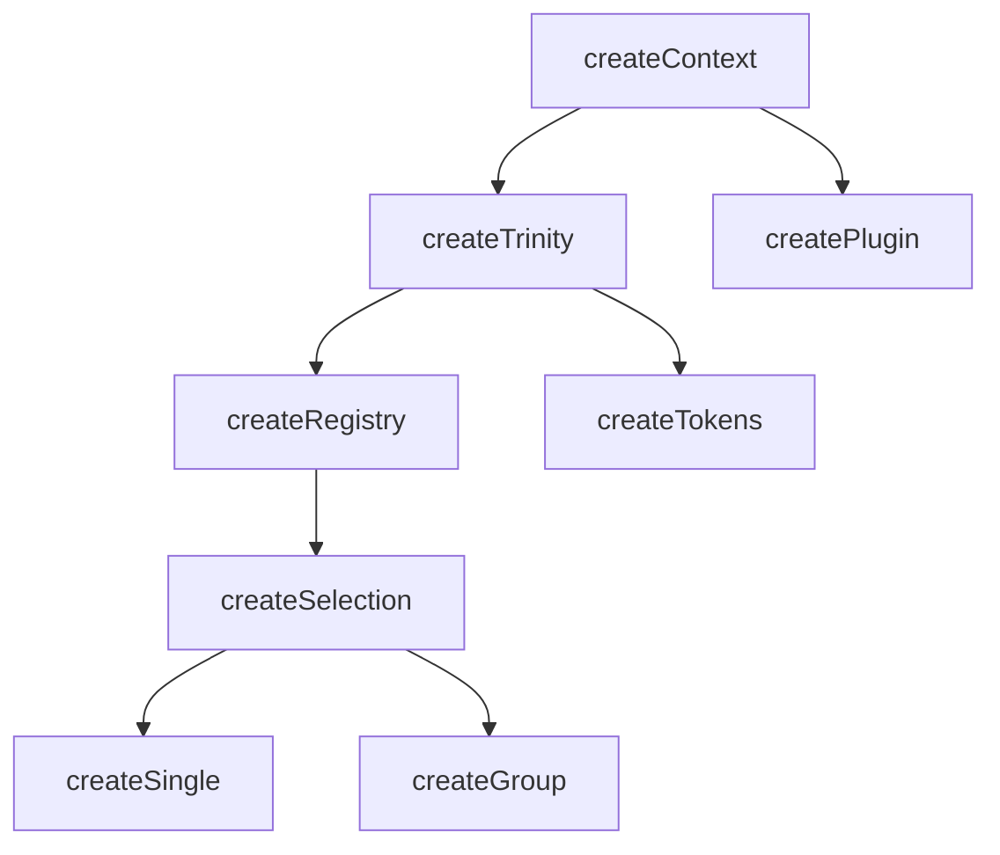
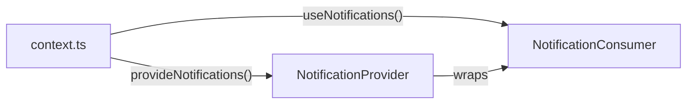

# createContext

The `createContext` factory function is at the heart of all functionality in Vuetify0. It is a small wrapper around the Vue 3 [provide](https://vuejs.org/guide/components/provide-inject.html#provide) and [inject](https://vuejs.org/guide/components/provide-inject.html#inject) APIs, allowing you to create a context that can be shared across components.

<DocsPageFeatures :frontmatter />

## Usage

```ts collapse
import { shallowRef } from 'vue'
import { createContext } from '@vuetify/v0'
import type { ShallowRef } from 'vue'

interface MyContext {
  isDisabled: ShallowRef<boolean>
  isSelected?: ShallowRef<boolean>
  type: 'primary' | 'secondary' | 'tertiary'
}

const [useContext, provideContext] = createContext<MyContext>('namespace')

provideContext({
  isDisabled: shallowRef(false) ,
  isSelected: shallowRef(true),
  type: 'primary',
})

export { useContext }
```

## Architecture

`createContext` is the foundation for all dependency injection in Vuetify0:



## Examples

::: example
/composables/create-context/context.ts
/composables/create-context/NotificationProvider.vue
/composables/create-context/NotificationConsumer.vue
/composables/create-context/notifications.vue

### Notification System

This example demonstrates the provider/consumer pattern using `createContext`. The context acts as a contract between components that produce state and components that consume it.



**File breakdown:**

| File | Role |
|------|------|
| `context.ts` | Defines the `NotificationContext` interface and creates the typed `[useNotifications, provideNotifications]` tuple |
| `NotificationProvider.vue` | Implements the context—creates reactive state and methods, then calls `provideNotifications()` |
| `NotificationConsumer.vue` | Consumes the context via `useNotifications()` to display and interact with notifications |
| `notifications.vue` | Entry point that composes Provider around Consumer |

**Key patterns:**

- Provider components are invisible wrappers that render only `<slot />`
- Consumers import only from `context.ts`, never from the Provider
- `shallowReactive` for arrays that mutate in place

Click the buttons to add notifications. Click a notification to dismiss it.

:::

## Reactivity

`createContext` is a **factory function** that returns plain functions. It does not introduce reactivity itself—reactivity comes from the values you provide.

| Return | Reactive | Notes |
| - | :-: | - |
| `useContext()` | <AppErrorIcon /> | Function, returns injected value |
| Injected value | <AppSuccessIcon /> | If you provide refs/reactive objects |

> [!TIP] Reactivity is what you provide
> The context system is a transport layer. If you provide `ref()` or `reactive()` values, consumers get reactive access. Plain objects remain plain.

<DocsApi />
