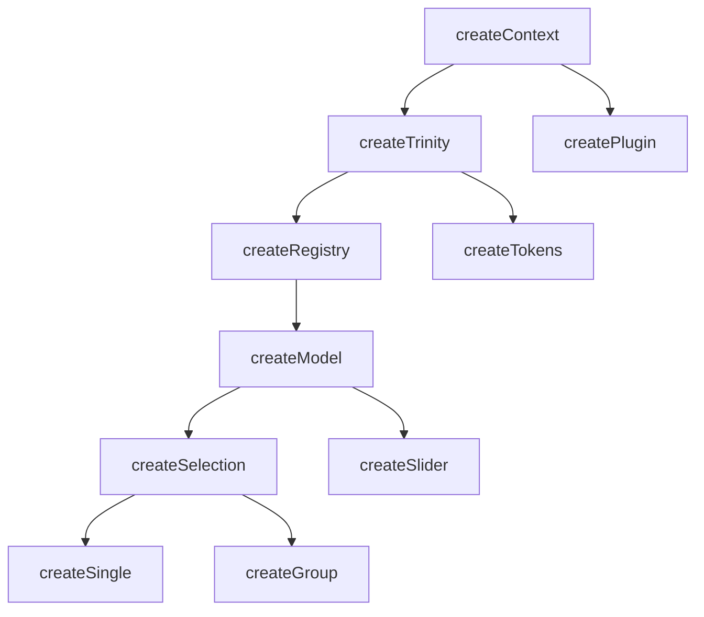
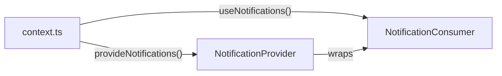

# createContext

Type-safe dependency injection factory built on Vue's provide/inject. Shares state across component trees without prop drilling.

<DocsPageFeatures :frontmatter />

## Usage

`createContext` has two modes depending on whether you pass a key:

### Static Key Mode

For singletons — one instance for the entire app (theme, locale, breakpoints):

```ts collapse
import { shallowRef } from 'vue'
import { createContext } from '@vuetify/v0'
import type { ShallowRef } from 'vue'

interface MyContext {
  isDisabled: ShallowRef<boolean>
  isSelected?: ShallowRef<boolean>
  type: 'primary' | 'secondary' | 'tertiary'
}

const [useContext, provideContext] = createContext<MyContext>('namespace')

provideContext({
  isDisabled: shallowRef(false),
  isSelected: shallowRef(true),
  type: 'primary',
})

export { useContext }
```

### Dynamic Key Mode

For multiple independent instances of the same context type (nested panels, tabs within tabs). Omit the key — both `provide` and `use` accept a runtime key at call time:

```ts
interface PanelContext {
  isOpen: ShallowRef<boolean>
  toggle: () => void
}

const [usePanel, providePanel] = createContext<PanelContext>()

// Provider — runtime key identifies this instance
providePanel('panel-main', mainContext)
providePanel('panel-sidebar', sidebarContext)

// Consumer — same runtime key to inject
const panel = usePanel('panel-main')
```

### Suffix Pattern

For parent-child context hierarchies where a child needs to know which parent it belongs to:

```ts
// Item context appends ':item' to whatever parent key it's given
const [useItem, provideItem] = createContext<ItemContext>({ suffix: 'item' })

provideItem('v0:panel', itemContext)  // Provides to 'v0:panel:item'
const item = useItem('v0:panel')      // Injects from 'v0:panel:item'
```

## Architecture

`createContext` is the foundation for all dependency injection in Vuetify0:


```mermaid "Context Hierarchy"
flowchart TD
  createContext:::primary --> createTrinity
  createContext --> createPlugin
  createTrinity --> createRegistry
  createTrinity --> createTokens
  createRegistry --> createModel
  createModel --> createSelection
  createModel --> createSlider
  createSelection --> createSingle
  createSelection --> createGroup
```

## Examples

::: example
/composables/create-context/context.ts
/composables/create-context/NotificationProvider.vue
/composables/create-context/NotificationConsumer.vue
/composables/create-context/notifications.vue

### Notification System

This example demonstrates the provider/consumer pattern using `createContext`. The context acts as a contract between components that produce state and components that consume it.


```mermaid "Provider/Consumer Data Flow"
graph LR
  A["context.ts"]:::info -->|"provideNotifications()"| B["NotificationProvider"]:::success
  A -->|"useNotifications()"| C["NotificationConsumer"]:::warning
  B -->|"wraps"| C
```

**File breakdown:**

| File | Role |
|------|------|
| `context.ts` | Defines the `NotificationContext` interface and creates the typed `[useNotifications, provideNotifications]` tuple |
| `NotificationProvider.vue` | Implements the context—creates reactive state and methods, then calls `provideNotifications()` |
| `NotificationConsumer.vue` | Consumes the context via `useNotifications()` to display and interact with notifications |
| `notifications.vue` | Entry point that composes Provider around Consumer |

**Key patterns:**

- Provider components are invisible wrappers that render only `<slot />`
- Consumers import only from `context.ts`, never from the Provider
- `shallowReactive` for arrays that mutate in place

Click the buttons to add notifications. Click a notification to dismiss it.

:::

<DocsApi />
