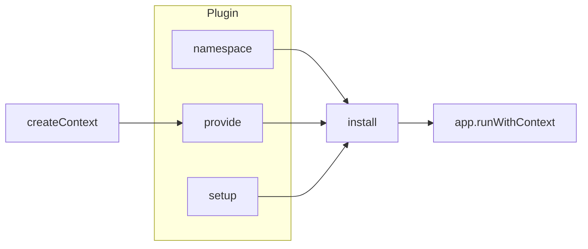

# createPlugin

This composable allows you to create a Vue plugin with specific functionality that can be registered and used within your application.

<DocsPageFeatures :frontmatter />

## Usage

Use in conjunction with the [createContext](/composables/foundation/create-context "createContext Documentation") composable to make [Vue plugins](https://vuejs.org/guide/reusability/plugins "Vue Plugins Documentation") that work seemlessly with [Vue Provide / Inject](https://vuejs.org/guide/components/provide-inject "Vue Provide / Inject Documentation").

```ts
import { createContext, createPlugin } from '@vuetify/v0'

interface MyPluginContext {
  app: string
}

// use is the inject function and provide is the provide function
export const [useMyContext, provideMyContext] = createContext<MyPluginContext>('provide-namespace')

export function createMyPlugin () {
  const context = {
    app: 'my-app'
  }

  return createPlugin({
    namespace: 'provide-namespace',
    provide: (app: App) => {
      provideMyContext(context, app)
    },
    setup: (app: App) => {
      // For everything else not provide related
    }
  })
}
```

> [!TIP]
> The **setup** and **provide** functions do the same thing, they are separated for semantic purposes.

Then, in your main application file, register the plugin like so:

```ts { resource="src/main.ts" }
import { createApp } from 'vue'
import { createMyPlugin } from './path/to/plugin'

const app = createApp(App)

app.use(createMyPlugin())
```

Now, whenever your application starts, the plugin is registered and the context is provided. Use the `useMyContext` function to access this context in any component:

```vue { resource="src/components/MyComponent.vue" }
<template>
  <div>{{ context.app }}</div>
</template>

<script setup lang="ts">
  import { useMyContext } from './path/to/plugin'

  const context = useMyContext()
</script>
```

## Architecture

`createPlugin` wraps `createContext` for Vue plugin registration:



<DocsApi />
