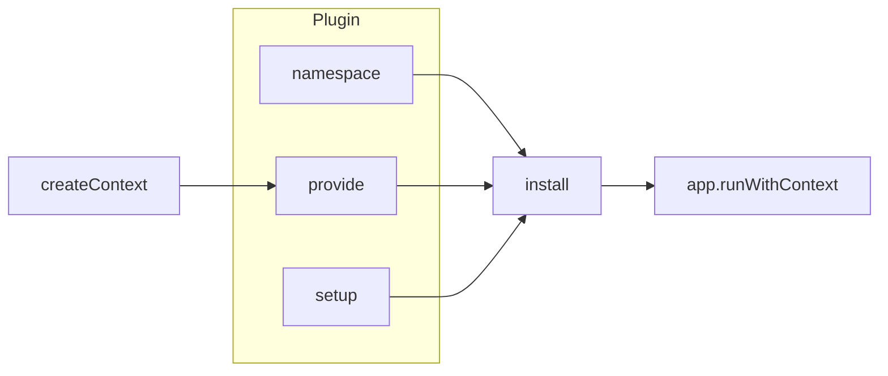
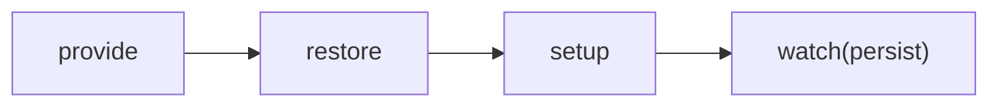
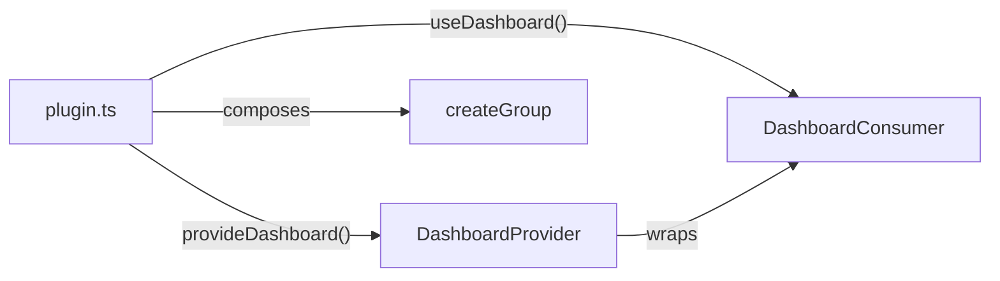

# createPlugin

This composable allows you to create a Vue plugin with specific functionality that can be registered and used within your application.

<DocsPageFeatures :frontmatter />

## Usage

Use in conjunction with the [createContext](/composables/foundation/create-context "createContext Documentation") composable to make [Vue plugins](https://vuejs.org/guide/reusability/plugins "Vue Plugins Documentation") that work seemlessly with [Vue Provide / Inject](https://vuejs.org/guide/components/provide-inject "Vue Provide / Inject Documentation").

```ts collapse
import { createContext, createPlugin } from '@vuetify/v0'

interface MyPluginContext {
  app: string
}

// use is the inject function and provide is the provide function
export const [useMyContext, provideMyContext] = createContext<MyPluginContext>('provide-namespace')

export function createMyPlugin () {
  const context = {
    app: 'my-app'
  }

  return createPlugin({
    namespace: 'provide-namespace',
    provide: (app: App) => {
      provideMyContext(context, app)
    },
    setup: (app: App) => {
      // For everything else not provide related
    }
  })
}
```

> [!TIP]
> The **setup** and **provide** functions do the same thing, they are separated for semantic purposes.

Then, in your main application file, register the plugin like so:

```ts { resource="src/main.ts" }
import { createApp } from 'vue'
import { createMyPlugin } from './path/to/plugin'

const app = createApp(App)

app.use(createMyPlugin())
```

Now, whenever your application starts, the plugin is registered and the context is provided. Use the `useMyContext` function to access this context in any component:

```vue { resource="src/components/MyComponent.vue" }
<template>
  <div>{{ context.app }}</div>
</template>

<script setup lang="ts">
  import { useMyContext } from './path/to/plugin'

  const context = useMyContext()
</script>
```

## Architecture

`createPlugin` wraps `createContext` for Vue plugin registration:


```mermaid "Plugin Architecture"
flowchart LR
  subgraph Plugin
    A[namespace]
    B[provide]
    C[setup]
  end

  createContext --> B
  A --> install
  B --> install
  C --> install
  install --> app.runWithContext
```

## Persistence

Plugins can automatically save and restore state across page reloads using `useStorage`. Add `persist` and `restore` hooks to the plugin config, then consumers opt in with `persist: true`.

### Plugin author

Define what to save and how to restore in the `createPluginContext` config:

```ts collapse no-filename
import { createPluginContext } from '@vuetify/v0'

export const [createThemeContext, createThemePlugin, useTheme] =
  createPluginContext('v0:theme', createTheme, {
    setup: (context, app, options) => {
      // adapter setup...
    },
    // Return the value to save — called reactively
    persist: ctx => ctx.selectedId.value,
    // Apply saved value on load — called before setup
    restore: (ctx, saved) => ctx.select(saved),
  })
```

### Consumer

```ts no-filename
app.use(createThemePlugin({ persist: true }))
```

When `persist: true` is passed, the plugin automatically:

1. Reads from `useStorage` using the plugin namespace as key
2. Calls `restore` with the saved value before `setup` runs
3. Watches the `persist` return value and writes changes to storage

> [!TIP]
> The `default` option becomes the true default — it's only used when no persisted value exists.

### Lifecycle


```mermaid "Persist Lifecycle"
flowchart LR
  A[provide] --> B[restore]
  B --> C[setup]
  C --> D["watch(persist)"]
```

The critical ordering is **restore before setup**. This means adapters (like the theme CSS variable injector) see the correct restored state on their first run — no flash of wrong values.

### Built-in support

| Plugin | Persists | Storage key |
|--------|----------|-------------|
| `createThemePlugin` | Selected theme ID | `v0:theme` |
| `createRtlPlugin` | RTL direction | `v0:rtl` |
| `createLocalePlugin` | Selected locale | `v0:locale` |

## Examples

::: example
/composables/create-plugin/plugin.ts 2
/composables/create-plugin/DashboardProvider.vue 3
/composables/create-plugin/DashboardConsumer.vue 4
/composables/create-plugin/dashboard.vue 1

### Dashboard Features

This example demonstrates how to create a plugin that manages feature flag state using `createPlugin`, `createContext`, and `createGroup`. The plugin composes a group for selection state instead of reimplementing toggle logic.


```mermaid "Plugin Architecture"
graph LR
  A["plugin.ts"]:::info -->|"provideDashboard()"| B["DashboardProvider"]:::success
  A -->|"useDashboard()"| C["DashboardConsumer"]:::warning
  A -->|"composes"| D["createGroup"]:::info
  B -->|"wraps"| C
```

**File breakdown:**

| File | Role |
|------|------|
| `plugin.ts` | Defines the `DashboardContext` (wrapping a `GroupContext`), creates the context tuple, and exports the `createDashboardPlugin` factory |
| `DashboardProvider.vue` | Creates the plugin instance and provides the context, rendering only a slot |
| `DashboardConsumer.vue` | Consumes the context via `useDashboard()` and uses the group's `toggle()`, `selectAll()`, and `unselectAll()` methods |
| `dashboard.vue` | Entry point that composes Provider around Consumer |

**Key patterns:**

- Provider components are invisible wrappers that render only a slot
- The plugin composes `createGroup` — each feature is a ticket with selection state built in
- In a real app, the factory would return a plugin for `app.use()` — here it returns `context` directly for the sandbox
- Consumers import only from `plugin.ts`, never from the Provider

:::

<DocsApi />
