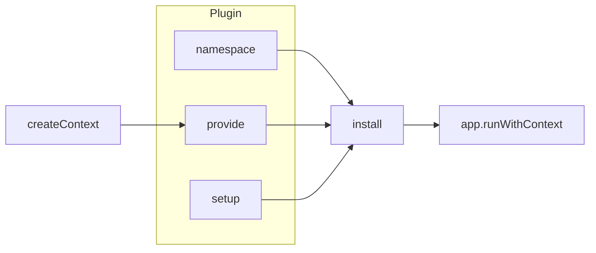
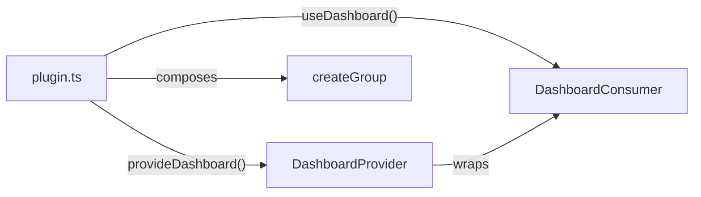
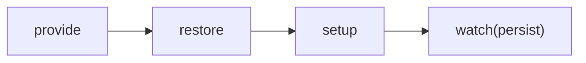

# createPlugin

<DocsPageFeatures :frontmatter />

Register app-wide plugins with typed context any component can consume. Prefer `createPluginContext` unless you need to control provide and setup yourself.

## Usage

For most cases, use `createPluginContext` — it generates the full plugin tuple from a factory function:

```ts collapse no-filename
import { createPluginContext } from '@vuetify/v0'

interface AnalyticsOptions {
  trackPageviews?: boolean
}

interface AnalyticsContext {
  track: (event: string) => void
}

export const [createAnalyticsContext, createAnalyticsPlugin, useAnalytics] =
  createPluginContext<AnalyticsOptions, AnalyticsContext>(
    'my:analytics',
    (options) => ({
      track: (event) => {
        if (options.trackPageviews) console.log(event)
      },
    }),
  )
```

```ts src/main.ts
import { createApp } from 'vue'
import { createAnalyticsPlugin } from './plugins/analytics'
import App from './App.vue'

const app = createApp(App)

app.use(createAnalyticsPlugin({ trackPageviews: true }))

app.mount('#app')
```

```vue src/components/MyComponent.vue
<script setup lang="ts">
  import { useAnalytics } from './plugins/analytics'

  const analytics = useAnalytics()
  analytics.track('page_view')
</script>
```

## Architecture

`createPlugin` wraps `createContext` for Vue plugin registration:


```mermaid "Plugin Architecture"
flowchart LR
  subgraph Plugin
    A[namespace]
    B[provide]
    C[setup]
  end

  createContext --> B
  A --> install
  B --> install
  C --> install
  install --> app.runWithContext
```

### Low-level API

Use `createPlugin` directly when you need fine-grained control over plugin setup, or when composing with existing `createContext` instances:

```ts collapse
import { createContext, createPlugin } from '@vuetify/v0'
import type { App } from 'vue'

interface MyPluginContext {
  app: string
}

export const [useMyContext, provideMyContext] = createContext<MyPluginContext>('provide-namespace')

export function createMyPlugin () {
  const context = {
    app: 'my-app',
  }

  return createPlugin({
    namespace: 'provide-namespace',
    provide: (app: App) => {
      provideMyContext(context, app)
    },
    setup: (app: App) => {
      // For everything else not provide related
    },
  })
}
```

> [!TIP]
> The **setup** and **provide** hooks are separated for semantic purposes — `provide` is for DI context, `setup` is for side effects (watchers, adapters, globals).

## Vue DevTools

Opt a plugin into the **v0** inspector in Vue DevTools with `{ devtools: true }`. Off by default.

The inspector shows that plugin's context — refs and class getters unwrapped, functions omitted. Pass `inspect` to overlay extra keys (adapter names, values behind methods) without replacing the rest of the snapshot.

```ts
import { createLogger, createPluginContext } from '@vuetify/v0'

export const [createLoggerContext, createLoggerPlugin, useLogger] =
  createPluginContext('v0:logger', createLogger, {
    inspect: ctx => ({
      level: ctx.current(),
      enabled: ctx.enabled(),
    }),
  })
```

```ts src/main.ts
import { createApp } from 'vue'
import { createLocalePlugin, createThemePlugin } from '@vuetify/v0'
import App from './App.vue'

const app = createApp(App)

app.use(createThemePlugin({ devtools: true }))
app.use(createLocalePlugin()) // not in the inspector

app.mount('#app')
```

Plugin authors can default it on via `createPluginContext` config (`devtools: true`); the install-time option overrides.

`createPluginContext` binds the context for you. Plugins that wrap `createPlugin` directly must call `bindPluginContext` from `provide`, or the inspector shows `context: undefined`:

```ts
import { bindPluginContext, createContext, createPlugin } from '@vuetify/v0'
import type { App } from 'vue'

const [useMyContext, provideMyContext] = createContext<{ ready: boolean }>('v0:my-plugin')

export function createMyPlugin () {
  const context = { ready: true }
  const namespace = 'v0:my-plugin'

  return createPlugin({
    namespace,
    devtools: true,
    provide: (app: App) => {
      provideMyContext(context, app)
      bindPluginContext(app, namespace, context)
    },
  })
}
```

This is `__DEV__`-gated and a no-op if `@vue/devtools-api` is not present. Pair it with `vite-plugin-vue-devtools` (or the browser extension) so the inspector has a host.

## Examples

::: gn-example
/composables/create-plugin/plugin.ts 2
/composables/create-plugin/DashboardProvider.vue 3
/composables/create-plugin/DashboardConsumer.vue 4
/composables/create-plugin/dashboard.vue 1

### Dashboard Features

A four-file plugin example showing how `createPlugin`, `createContext`, and `createGroup` compose to manage feature-flag state for a dashboard. `plugin.ts` is the factory: it calls `createGroup()`, bulk-registers five feature toggles with `onboard()`, pre-selects two via `group.select(['animations', 'notifications'])`, assembles a `DashboardContext` object (app name, locale ref, locales list, and the group instance), and calls `provideDashboard(context)` through the `[useDashboard, provideDashboard]` tuple produced by `createContext`. A commented-out block shows how the same code would be wrapped in `createPlugin()` for `app.use()` in a real app — for sandbox purposes the factory returns the context object directly.

`DashboardProvider.vue` creates the plugin instance and calls `provideContext` in a single `setup` call, then renders only a slot. `DashboardConsumer.vue` destructures `{ group, locale, locales, app }` from `useDashboard()` and renders a feature grid — each feature is a ticket with `toggle()`, `isSelected`, and `value` — alongside a locale selector that writes directly to `context.locale`. The critical pattern: the consumer never imports from the provider; it only imports from `plugin.ts`. `dashboard.vue` composes the two.

The example illustrates the primary reason to compose `createGroup` inside a plugin rather than manage selection state ad hoc: the group handles toggle logic, mandatory enforcement, select-all, and unselect-all without any custom bookkeeping. The plugin is the factory; the group is the logic layer; the context is the contract. For plugin contexts that need persistence across page reloads, see the [Persistence](/composables/foundation/create-plugin#persistence) section.


```mermaid "Plugin Architecture"
graph LR
  A["plugin.ts"]:::info -->|"provideDashboard()"| B["DashboardProvider"]:::success
  A -->|"useDashboard()"| C["DashboardConsumer"]:::warning
  A -->|"composes"| D["createGroup"]:::info
  B -->|"wraps"| C
```

**File breakdown:**

| File | Role |
|------|------|
| `plugin.ts` | Defines the `DashboardContext` (wrapping a `GroupContext`), creates the context tuple, and exports the `createDashboardPlugin` factory |
| `DashboardProvider.vue` | Creates the plugin instance and provides the context, rendering only a slot |
| `DashboardConsumer.vue` | Consumes the context via `useDashboard()` and uses the group's `toggle()`, `selectAll()`, and `unselectAll()` methods |
| `dashboard.vue` | Entry point that composes Provider around Consumer |

**Key patterns:**

- Provider components are invisible wrappers that render only a slot
- The plugin composes `createGroup` — each feature is a ticket with selection state built in
- In a real app, the factory would return a plugin for `app.use()` — here it returns `context` directly for the sandbox
- Consumers import only from `plugin.ts`, never from the Provider

:::

## Recipes

### Persistence

Plugins can automatically save and restore state across page reloads using `useStorage`. Add `persist` and `restore` hooks to the plugin config, then consumers opt in with `persist: true`.

#### Plugin author

Define what to save and how to restore in the `createPluginContext` config:

```ts collapse no-filename
import { createPluginContext, createTheme } from '@vuetify/v0'

export const [createThemeContext, createThemePlugin, useTheme] =
  createPluginContext('v0:theme', createTheme, {
    setup: (context, app, options) => {
      // adapter setup...
    },
    persist: ctx => ctx.selectedId.value,
    restore: (ctx, saved) => ctx.select(saved as string),
  })
```

#### Consumer

```ts src/main.ts
import { createApp } from 'vue'
import { createThemePlugin } from '@vuetify/v0'
import App from './App.vue'

const app = createApp(App)

app.use(createThemePlugin({ persist: true }))

app.mount('#app')
```

When `persist: true` is passed, the plugin automatically:

1. Reads from `useStorage` using the plugin namespace as key
2. Calls `restore` with the saved value before `setup` runs
3. Watches the `persist` return value and writes changes to storage

> [!TIP]
> The `default` option becomes the true default — it's only used when no persisted value exists.

#### Lifecycle


```mermaid "Persist Lifecycle"
flowchart LR
  A[provide] --> B[restore]
  B --> C[setup]
  C --> D["watch(persist)"]
```

The critical ordering is **restore before setup**. This means adapters (like the theme CSS variable injector) see the correct restored state on their first run — no flash of wrong values.

#### Hook signatures

```ts
import { createPluginContext, createTheme } from '@vuetify/v0'
import type { PluginContextConfig } from '@vuetify/v0'

const hooks: PluginContextConfig<unknown, ReturnType<typeof createTheme>> = {
  persist: ctx => ctx.selectedId.value,
  restore: (ctx, saved) => ctx.select(saved as string),
}

createPluginContext('v0:theme', createTheme, hooks)
```

The `persist` return value is stored under the plugin namespace key (e.g. `v0:theme`). `restore` receives whatever was stored — cast to the expected type inside the hook.

#### Built-in support

| Plugin | Persists | Storage key |
|--------|----------|-------------|
| `createThemePlugin` | Selected theme ID | `v0:theme` |
| `createRtlPlugin` | RTL direction | `v0:rtl` |
| `createLocalePlugin` | Selected locale | `v0:locale` |

## FAQ

::: faq

??? When should I use `createPluginContext` instead of `createPlugin`?

`createPluginContext` generates the full `[createXContext, createXPlugin, useX]` tuple from a factory function — use it for most plugins. Drop to `createPlugin` directly only when you need fine-grained control over setup, or are composing with an existing [createContext](/composables/foundation/create-context) instance.

??? What's the difference between the `provide` and `setup` hooks?

`provide` is for DI context — it calls your `provideXContext()`. `setup` is for everything else: side effects like watchers, adapters, and globals. They're separated for semantic clarity.

??? How do I persist plugin state across page reloads?

Add `persist` and `restore` hooks to the plugin config and have consumers opt in with `persist: true`. The plugin reads and writes through `useStorage` under the plugin namespace, calling `restore` with the saved value before `setup` runs so adapters never flash wrong values.

??? Why does my `default` option seem ignored after a reload?

With `persist: true`, a previously persisted value wins on load — `default` is only used when no persisted value exists yet. `restore` runs before `setup` and applies the saved value, so `default` is the true fallback, not an override.

:::

<DocsApi />
