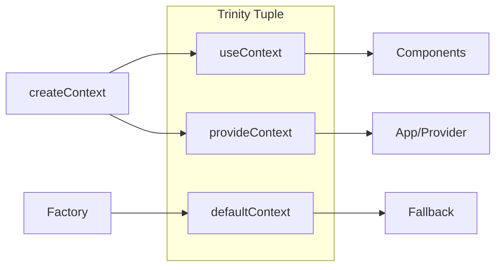

# createTrinity

The **createTrinity** factory function is a type-safe utility for generating a 3-item tuple—called a **trinity**—which contains a context consumer, a provider, and the underlying context object.

<DocsPageFeatures :frontmatter />

## Usage

The trinity pattern is the marrying of provide and inject with a context object. It provides a clean and type safe way to create a sharable singleton state.

```ts
import { createContext, createTrinity } from '@vuetify/v0'
import { ref } from 'vue'

interface User {
  id: string
  name: string
}

interface UserContext {
  user: Ref<User>
  updateUser: (user: User) => void
}

function createUserContext() {
  const [useContext, provideContext] = createContext<UserContext>('user')

  const user = ref<User>({ id: '123', name: 'John Doe' })

  function updateUser(newUser: User) {
    user.value = newUser
  }

  const context: UserContext = {
    user,
    updateUser
  }

  return createTrinity<UserContext>(useContext, provideContext, context)
}

export const [useUser, provideUser, defaultUserContext] = createUserContext()
```

## Architecture

`createTrinity` builds on `createContext` to provide a standardized 3-tuple pattern:



<DocsApi />
