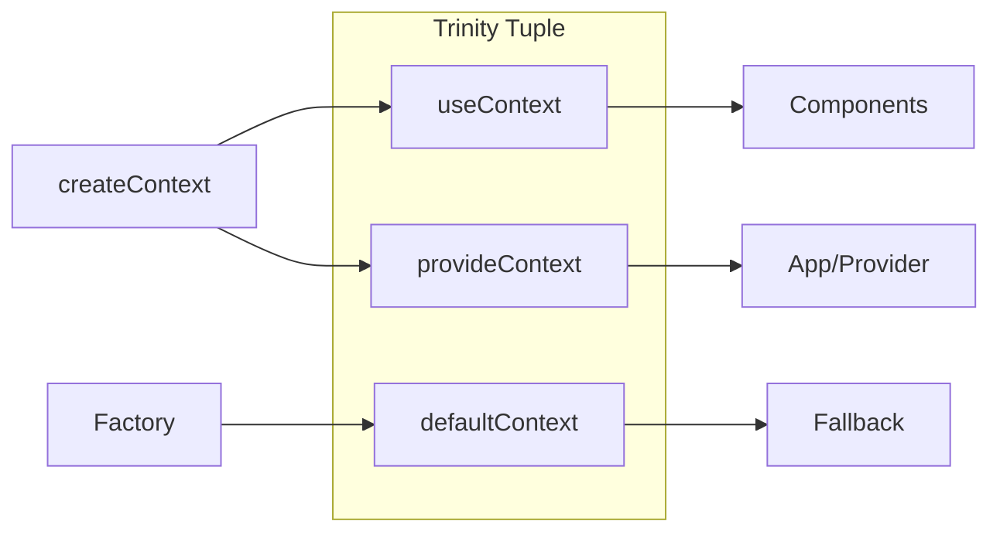
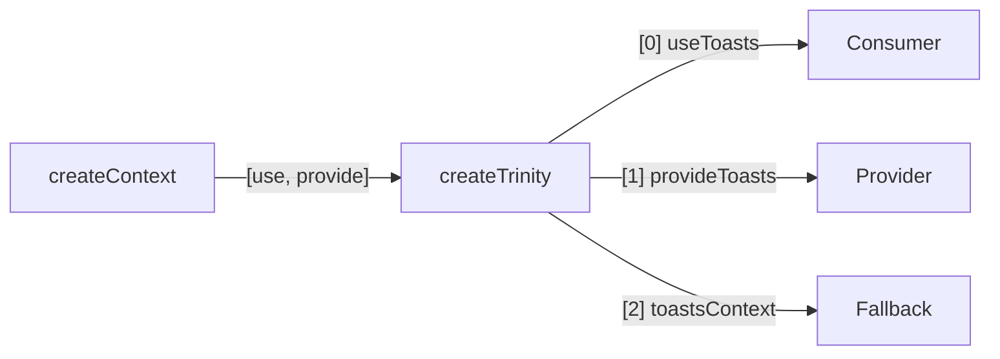

# createTrinity

Generates a typed `[useX, provideX, defaultX]` tuple for Vue's provide/inject dependency injection pattern.

<DocsPageFeatures :frontmatter />

## Usage

The trinity pattern is the marrying of provide and inject with a context object. It provides a clean and type safe way to create a sharable singleton state.

```ts collapse
import { ref } from 'vue'
import { createContext, createTrinity } from '@vuetify/v0'
import type { Ref } from 'vue'

interface User {
  id: string
  name: string
}

interface UserContext {
  user: Ref<User>
  update: (user: User) => void
}

function createUserContext() {
  const [useContext, provideContext] = createContext<UserContext>('user')

  const user = ref<User>({ id: '123', name: 'John Doe' })

  function update(record: User) {
    user.value = record
  }

  const context: UserContext = {
    user,
    update,
  }

  return createTrinity<UserContext>(useContext, provideContext, context)
}

export const [useUser, provideUser, context] = createUserContext()
```

## Architecture

`createTrinity` builds on `createContext` to provide a standardized 3-tuple pattern:


```mermaid "Trinity Pattern"
flowchart LR
  subgraph Trinity Tuple
    A[useContext]
    B[provideContext]
    C[defaultContext]
  end

  createContext --> A
  createContext --> B
  Factory --> C

  A --> Components
  B --> App/Provider
  C --> Fallback
```

## Examples

::: example
/composables/create-trinity/toasts.ts 2
/composables/create-trinity/ToastProvider.vue 3
/composables/create-trinity/ToastConsumer.vue 4
/composables/create-trinity/toast-system.vue 1

### Toast Notification System

A toast notification system split into four files demonstrating real-world trinity usage:

| File | Role |
|------|------|
| `toasts.ts` | Context factory — creates the trinity tuple |
| `ToastProvider.vue` | Calls `provideToasts()` and renders a slot |
| `ToastConsumer.vue` | Calls `useToasts()` to inject and display toasts |
| `toast-system.vue` | Entry point — wraps Provider around Consumer |


```mermaid "Trinity Flow"
graph LR
  A["createContext"]:::info -->|"[use, provide]"| B["createTrinity"]:::success
  B -->|"[0] useToasts"| C["Consumer"]:::warning
  B -->|"[1] provideToasts"| D["Provider"]:::warning
  B -->|"[2] toastsContext"| E["Fallback"]:::warning
```

**Key patterns:**

- `createToastContext` wraps both `createContext` and `createTrinity` — the factory builds the context object and returns the trinity in one step
- `provideToasts()` called with no arguments provides the default context — the trinity's provider wrapper handles the fallback automatically
- `ToastConsumer` calls `useToasts()` to inject the context from the nearest provider
- The entry point composes Provider and Consumer — the same pattern scales to any app

:::

<DocsApi />
