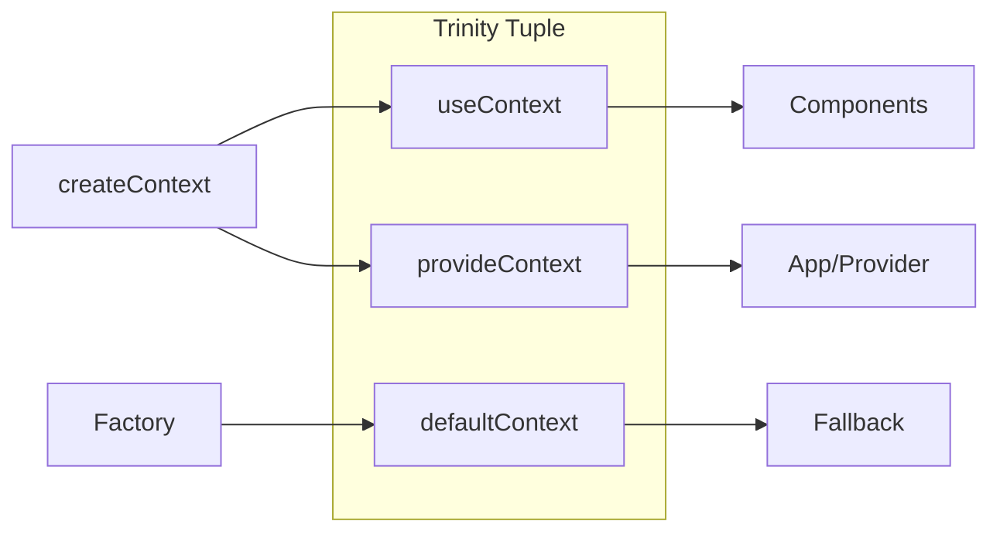
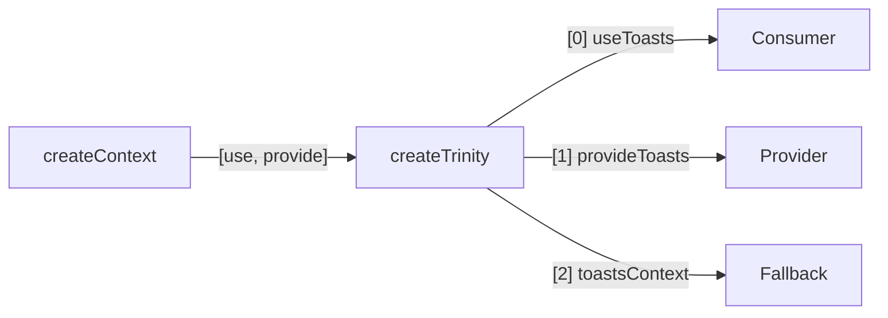

# createTrinity

Generates a typed `[useX, provideX, defaultX]` tuple for Vue's provide/inject dependency injection pattern.

<DocsPageFeatures :frontmatter />

## Usage

The trinity pattern is the marrying of provide and inject with a context object. It provides a clean and type safe way to create a sharable singleton state.

```ts collapse
import { ref } from 'vue'
import { createContext, createTrinity } from '@vuetify/v0'
import type { Ref } from 'vue'

interface User {
  id: string
  name: string
}

interface UserContext {
  user: Ref<User>
  update: (user: User) => void
}

function createUserContext() {
  const [useContext, provideContext] = createContext<UserContext>('user')

  const user = ref<User>({ id: '123', name: 'John Doe' })

  function update(record: User) {
    user.value = record
  }

  const context: UserContext = {
    user,
    update,
  }

  return createTrinity<UserContext>(useContext, provideContext, context)
}

export const [useUser, provideUser, context] = createUserContext()
```

## Architecture

`createTrinity` builds on `createContext` to provide a standardized 3-tuple pattern:


```mermaid "Trinity Pattern"
flowchart LR
  subgraph Trinity Tuple
    A[useContext]
    B[provideContext]
    C[defaultContext]
  end

  createContext --> A
  createContext --> B
  Factory --> C

  A --> Components
  B --> App/Provider
  C --> Fallback
```

### Plugin Trinity

When building a Vue plugin, use [createPluginContext](/composables/foundation/create-plugin) instead of wiring `createContext + createTrinity` manually. It generates the same trinity tuple from a factory function with far less boilerplate:

```ts no-filename
// Manual (createTrinity) — needed for non-plugin state
export const [useUser, provideUser, userContext] = createUserContext()

// Plugin (createPluginContext) — preferred for app.use() plugins
export const [createThemeContext, createThemePlugin, useTheme] =
  createPluginContext('v0:theme', options => createTheme(options))
```

`createTrinity` is the right tool when you want a shared singleton *without* a Vue plugin — component-scoped contexts, library utilities, or any state that doesn't need `app.use()` lifecycle hooks.

## Examples

::: gn-example
/composables/create-trinity/toasts.ts 2
/composables/create-trinity/ToastProvider.vue 3
/composables/create-trinity/ToastConsumer.vue 4
/composables/create-trinity/toast-system.vue 1

### Toast Notification System

A toast notification system across four files that demonstrates the full trinity pattern end-to-end. `toasts.ts` contains the only call to `createTrinity` — it builds a `shallowReactive` toast array, `push` / `dismiss` / `clear` methods, and a 4-second auto-dismiss timer, then passes `useContext` and `provideContext` (wrapped from `createContext`) into `createTrinity` to produce the exported `[useToasts, provideToasts, toastsContext]` tuple. `ToastProvider.vue` calls `provideToasts()` with no arguments and renders only a slot — the trinity's fallback context means the provider needs no props. `ToastConsumer.vue` destructures `{ toasts, push, dismiss, clear }` from `useToasts()` and drives a type-styled stack with quick-fire presets, a custom message composer, and an active-count display. `toast-system.vue` composes the two components, completing the pattern.

The bottom "Trinity tuple breakdown" panel inside the consumer renders all three tuple members by name — `useToasts`, `provideToasts`, `toastsContext` — making the three roles concrete. Notice that `ToastConsumer` never imports from `ToastProvider.vue`; it only imports from `toasts.ts`. That separation is the point: context is the contract, not the provider component.

Reach for `createTrinity` when you want a shared singleton *without* a Vue plugin — state that doesn't need `app.use()` lifecycle hooks but still needs typed provide/inject. For plugin-backed state (theme, locale, storage), prefer [createPluginContext](/composables/foundation/create-plugin), which generates the same tuple plus install hooks.

| File | Role |
|------|------|
| `toasts.ts` | Context factory — creates the trinity tuple |
| `ToastProvider.vue` | Calls `provideToasts()` and renders a slot |
| `ToastConsumer.vue` | Calls `useToasts()` to inject and display toasts |
| `toast-system.vue` | Entry point — wraps Provider around Consumer |


```mermaid "Trinity Flow"
graph LR
  A["createContext"]:::info -->|"[use, provide]"| B["createTrinity"]:::success
  B -->|"[0] useToasts"| C["Consumer"]:::warning
  B -->|"[1] provideToasts"| D["Provider"]:::warning
  B -->|"[2] toastsContext"| E["Fallback"]:::warning
```

**Key patterns:**

- `createToastContext` wraps both `createContext` and `createTrinity` — the factory builds the context object and returns the trinity in one step
- `provideToasts()` called with no arguments provides the default context — the trinity's provider wrapper handles the fallback automatically
- `ToastConsumer` calls `useToasts()` to inject the context from the nearest provider
- The entry point composes Provider and Consumer — the same pattern scales to any app

:::

## FAQ

::: faq

??? What does `createTrinity` add over `createContext`?

[createContext](/composables/foundation/create-context) gives you the `[use, provide]` pair; `createTrinity` returns a 3-tuple that also includes a default context instance. That third member lets `provide` be called with no arguments and fall back to the default automatically.

??? Should I use `createTrinity` or `createPluginContext`?

Use `createTrinity` for a shared singleton that doesn't need `app.use()` lifecycle — component-scoped contexts or library utilities. Use [createPluginContext](/composables/foundation/create-plugin) for plugin-backed state like theme, locale, or storage; it generates the same tuple plus install hooks.

??? Can I provide the context without passing an argument?

Yes. Because the trinity bundles a default context as its third member, calling `provideX()` with no arguments provides that fallback — the provider wrapper handles it automatically.

:::

<DocsApi />
