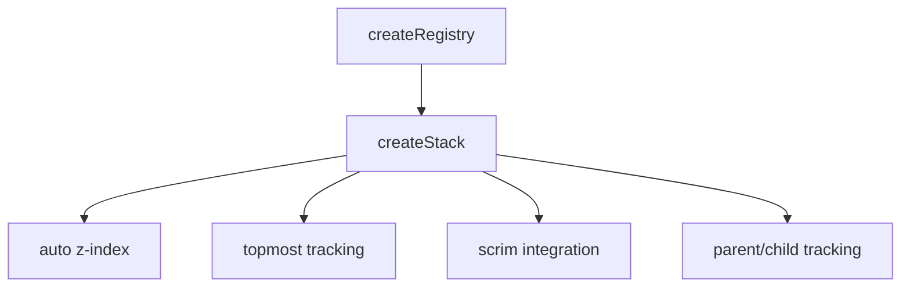
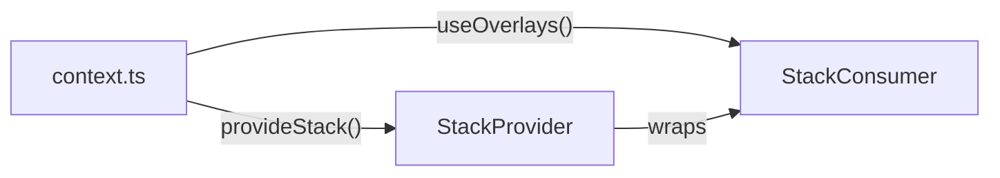

# createStack

A composable for managing overlay z-index stacking with automatic calculation, scrim integration, and parent/child tracking for nested overlays.

<DocsPageFeatures :frontmatter />

## Usage

```ts collapse
import { shallowRef } from 'vue'
import { useStack } from '@vuetify/v0'

const isOpen = shallowRef(false)

function onDismiss () {
  isOpen.value = false
}

const { styles, globalTop, zIndex } = useStack(isOpen, {
  baseZIndex: 2000,
  onDismiss,
})

// styles.value = { zIndex: 2000 } when first overlay
// styles.value = { zIndex: 2010 } when second overlay
// globalTop.value = true when this is the topmost overlay
```

## Architecture

`createStack` extends `createRegistry` with z-index management and scrim coordination:



## Context

The stack context provides global state for scrim components:

```ts
import { stack } from '@vuetify/v0'

// Check if any overlays are active
stack.isActive.value // boolean

// Get the topmost overlay
stack.top.value // StackTicket | undefined

// Z-index for scrim (one below top overlay)
stack.scrimZIndex.value // number

// Dismiss top non-blocking overlay (or by ID)
stack.dismiss()
stack.dismiss('specific-id')
```

## SSR Safety

For SSR applications, use the plugin to ensure each app gets its own registry:

```ts
import { createApp } from 'vue'
import { createStackPlugin } from '@vuetify/v0'

const app = createApp(App)
app.use(createStackPlugin())
```

## Examples

::: example
/composables/create-stack/context.ts
/composables/create-stack/StackProvider.vue
/composables/create-stack/StackConsumer.vue
/composables/create-stack/overlays.vue

### Overlay Stack

This example demonstrates overlay stacking with `createStack`. Each overlay gets an automatically calculated z-index, and the scrim appears below the topmost overlay.



**File breakdown:**

| File | Role |
|------|------|
| `context.ts` | Defines overlay context with open/close methods |
| `StackProvider.vue` | Provides stack context and renders scrim |
| `StackConsumer.vue` | Displays buttons to open overlays at different stack levels |
| `overlays.vue` | Entry point that composes Provider around Consumer |

**Key patterns:**

- `useStack(isActive)` registers overlay when active
- `globalTop` determines if this overlay should handle escape key
- `styles` provides the z-index CSS
- Scrim uses `stack.scrimZIndex` to position below top overlay

Click a button to open an overlay. Open multiple overlays to observe z-index layering.

:::

<DocsApi />
