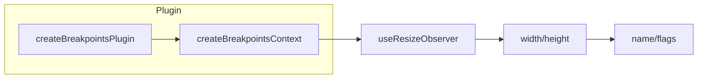

# useBreakpoints

The `useBreakpoints` composable provides comprehensive responsive design capabilities through reactive viewport dimension detection. It automatically tracks window size changes and provides boolean flags for current breakpoint ranges, enabling mobile-first and responsive layouts.

<DocsPageFeatures :frontmatter />

## Installation

First, install the breakpoints plugin in your application:

```ts
import { createApp } from 'vue'
import { createBreakpointsPlugin } from '@vuetify/v0'
import App from './App.vue'

const app = createApp(App)

app.use(
  createBreakpointsPlugin({
    mobileBreakpoint: 'md',
    breakpoints: {
      xs: 0,
      sm: 600,
      md: 960,
      lg: 1280,
      xl: 1920,
      xxl: 2560,
    },
  })
)

app.mount('#app')
```

## Usage

Once the plugin is installed, use the `useBreakpoints` composable in any component:

```vue UseBreakpoints
<script setup lang="ts">
  import { useBreakpoints } from '@vuetify/v0'

  const breakpoints = useBreakpoints()
</script>

<template>
  <div>
    <nav v-if="breakpoints.mdAndUp">
      <!-- Desktop navigation -->
    </nav>
    <nav v-else>
      <!-- Mobile navigation -->
    </nav>

    <p v-if="breakpoints.isMobile">Mobile layout active</p>
    <p>Current breakpoint: {{ breakpoints.name }}</p>
    <p>Viewport: {{ breakpoints.width }} x {{ breakpoints.height }}</p>
  </div>
</template>
```

## Architecture

`useBreakpoints` uses the plugin pattern with viewport observation:



<DocsApi />
