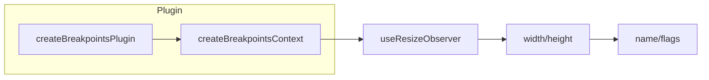

# useBreakpoints

Reactive viewport detection for building responsive layouts with named breakpoints.

<DocsPageFeatures :frontmatter />

## Installation

Install the Breakpoints plugin in your app's entry point:

```ts main.ts
import { createApp } from 'vue'
import { createBreakpointsPlugin } from '@vuetify/v0'
import App from './App.vue'

const app = createApp(App)

app.use(
  createBreakpointsPlugin({
    mobileBreakpoint: 'sm',
    breakpoints: {
      xs: 0,
      sm: 680,
      md: 1024,
      lg: 1280,
      xl: 1920,
      xxl: 2560,
    },
  })
)

app.mount('#app')
```

## Usage

Once the plugin is installed, use the `useBreakpoints` composable in any component. Destructure the properties you need for automatic ref unwrapping in templates:

```vue collapse
<script setup lang="ts">
  import { useBreakpoints } from '@vuetify/v0'

  const { isMobile, mdAndUp, name, width, height } = useBreakpoints()

  if (isMobile.value) {
    console.log('Mobile detected')
  }
</script>

<template>
  <div>
    <!-- Destructured refs auto-unwrap in templates -->
    <nav v-if="mdAndUp">
      <!-- Desktop navigation -->
    </nav>
    <nav v-else>
      <!-- Mobile navigation -->
    </nav>

    <p v-if="isMobile">Mobile layout active</p>
    <p>Current breakpoint: {{ name }}</p>
    <p>Viewport: {{ width }} x {{ height }}</p>
  </div>
</template>
```

> [!TIP]
> When using the composable without destructuring, access `.value` in templates: `v-if="breakpoints.isMobile.value"`. Destructuring to top-level variables enables Vue's automatic ref unwrapping.

## Architecture

`useBreakpoints` uses the plugin pattern with viewport observation:


```mermaid "Breakpoints Plugin"
flowchart LR
  subgraph Plugin
    createBreakpointsPlugin --> createBreakpointsContext
  end

  createBreakpointsContext --> useResizeObserver
  useResizeObserver --> viewport[width/height]
  viewport --> breakpoint[name/flags]
```

## Reactivity

All breakpoint properties are `Readonly<ShallowRef>` and automatically update when the viewport size changes. Use `.value` in script; destructure for template auto-unwrapping.

Breakpoints are **range-based**, not exact pixel matches. The `name` is the **highest** breakpoint whose threshold the viewport meets or exceeds. For example, at `1200px` with default thresholds, `name` is `lg` because `1200 >= 1145` (the `lg` threshold) but `1200 < 1545` (the `xl` threshold). The individual flags like `lg` mean "the current breakpoint **is** lg", while `lgAndUp` means "the viewport is **at least** lg" (i.e., `lg`, `xl`, or `xxl`).

| Property | Type | Notes |
| - | - | - |
| `name` | `ShallowRef<BreakpointName>` | Current breakpoint name (highest matching threshold) |
| `width` | `ShallowRef<number>` | Viewport width in pixels |
| `height` | `ShallowRef<number>` | Viewport height in pixels |
| `isMobile` | `ShallowRef<boolean>` | Below mobile breakpoint threshold |
| `xs` / `sm` / `md` / `lg` / `xl` / `xxl` | `ShallowRef<boolean>` | True when this is the current breakpoint |
| `smAndUp` / `mdAndUp` / `lgAndUp` / `xlAndUp` | `ShallowRef<boolean>` | At or above breakpoint |
| `smAndDown` / `mdAndDown` / `lgAndDown` / `xlAndDown` | `ShallowRef<boolean>` | At or below breakpoint |
| `breakpoints` | `Record<string, number>` | Static config object (not reactive) |
| `mobileBreakpoint` | `BreakpointName \| number` | The threshold used to compute `isMobile` (static) |
| `ssr` | `boolean` | `true` when running server-side with SSR options |
| `update()` | — | Manually trigger viewport dimension and breakpoint recalculation |

> [!TIP]
> `xs` is always equivalent to "xsAndDown" (nothing is below xs), and `xxl` is always equivalent to "xxlAndUp" (nothing is above xxl). These redundant combinations are intentionally not provided.

> [!TIP] Zoom-accurate detection
> Breakpoints use `window.matchMedia` rather than `window.innerWidth`. `matchMedia` reports CSS pixels that account for browser zoom, giving accurate breakpoint detection at all zoom levels.

## Examples

::: gn-example
/composables/use-breakpoints/useDashboard.ts 1
/composables/use-breakpoints/DashboardGrid.vue 2
/composables/use-breakpoints/responsive-dashboard.vue 3

### Responsive Dashboard Layout

This example wires `useBreakpoints` into a live analytics dashboard whose card grid reflows as the viewport changes — one column on phones, scaling up to four columns on wide screens. The instrument strip above the grid reads the reactive `name`, `width`, `height`, and `isMobile` values directly, while the row of chips lights up the active per-breakpoint flag (`xs` through `xxl`). Everything updates automatically as you resize or zoom, with no manual listeners.

The teaching point is making layout decisions in JavaScript. `useDashboard.ts` maps the active breakpoint name to a column count, so the component renders a different structure per breakpoint rather than relying solely on CSS `@media` rules. Reach for this when a layout choice can't be expressed in CSS alone — picking a column count, swapping a menu for a dialog, virtualizing only on small screens, or conditionally mounting an expensive widget. Because detection runs through `window.matchMedia`, the JS flags fire at exactly the same boundaries as your CSS breakpoints, even under browser zoom.

The composable reads its instance once and exposes derived refs; the presentational `DashboardGrid.vue` translates the column count into a grid class, keeping breakpoint logic out of the markup. The plugin must be installed for reactive updates (see Installation above), and for server rendering pass `ssr` dimensions so the first paint matches the client. For a lower-level, CSS-only signal without named breakpoints, see [useMediaQuery](/composables/system/use-media-query).

| File | Role |
|------|------|
| `useDashboard.ts` | Consumes `useBreakpoints`, owns the widget data, and derives the column count plus the active-flag map |
| `DashboardGrid.vue` | Presentational grid that reflows its columns from the derived count |
| `responsive-dashboard.vue` | Entry that renders the breakpoint instrument strip and wires the composable to the grid |
:::

## SSR Support

By default, useBreakpoints returns `xs` / width `0` on the server. Pass `ssr` options to render at a known viewport size:

```ts main.ts
app.use(
  createBreakpointsPlugin({
    ssr: {
      clientWidth: 1280,
      clientHeight: 800,
    },
  })
)
```

On the server, all breakpoint flags are computed from the SSR dimensions — so `v-if="mdAndUp"` renders correctly in SSR output. On hydration, real `window.innerWidth` / `innerHeight` replace the SSR values.

> [!TIP]
> In Nuxt, read the viewport from a cookie or user-agent hint so the SSR dimensions match the actual device. See the [Nuxt integration guide](/guide/integration/nuxt#breakpoints-ssr) for a cookie-based example.

<DocsApi />
