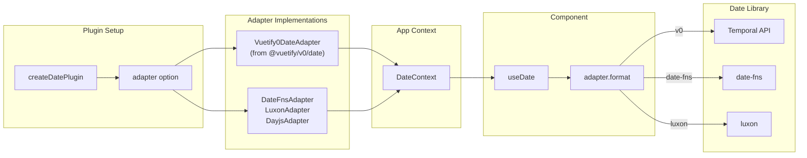

<script setup>
import BasicExample from '@/examples/composables/use-date/basic.vue'
import BasicExampleRaw from '@/examples/composables/use-date/basic.vue?raw'
import CalendarExample from '@/examples/composables/use-date/calendar.vue'
import CalendarExampleRaw from '@/examples/composables/use-date/calendar.vue?raw'
</script>

# useDate

The `useDate` composable provides comprehensive date manipulation capabilities using the adapter pattern. The default adapter uses the [Temporal API](https://tc39.es/proposal-temporal/docs/) for modern, immutable date operations with locale-aware formatting via `Intl.DateTimeFormat`. Integrates with `useLocale` for automatic locale synchronization.

<DocsPageFeatures :frontmatter />

## Installation

The built-in `Vuetify0DateAdapter` requires the `@js-temporal/polyfill` package:

::: code-group

```bash pnpm
pnpm add @js-temporal/polyfill
```

```bash npm
npm install @js-temporal/polyfill
```

```bash yarn
yarn add @js-temporal/polyfill
```

```bash bun
bun add @js-temporal/polyfill
```

:::

> [!TIP]
> The Temporal API is a Stage 3 [TC39 proposal](https://github.com/tc39/proposal-temporal). Once browsers ship native support, the polyfill will no longer be required.

Then install the date plugin with an adapter:

```ts src/plugins/zero.ts
import { Vuetify0DateAdapter } from '@vuetify/v0/date'
import { createDatePlugin } from '@vuetify/v0'

app.use(
  createDatePlugin({
    adapter: new Vuetify0DateAdapter(),
    locale: 'en-US',
  })
)
```

> [!INFO]
> The `adapter` option is **required**. The `Vuetify0DateAdapter` is exported from a separate subpath (`@vuetify/v0/date`) to avoid bundling the Temporal polyfill unless explicitly used. If you don't need date functionality, simply don't install the plugin—no polyfill will be loaded.

## Usage

Once the plugin is installed, use the `useDate` composable in any component:

<DocsExample file="basic.vue" :code="BasicExampleRaw">
  <BasicExample />
</DocsExample>

<DocsApi />

### DateAdapter Interface

The adapter provides a comprehensive API compatible with [date-io](https://github.com/dmtrKovalenko/date-io):

```ts collapse
interface DateAdapter<T> {
  locale?: string

  // Construction & Conversion
  date (value?: unknown): T | null
  toJsDate (value: T): Date
  parseISO (dateString: string): T
  toISO (date: T): string
  parse (value: string, format: string): T | null
  isValid (date: unknown): date is T  // Type predicate
  isNull (value: T | null): value is null  // Type predicate

  // Formatting
  format (date: T, formatString: string): string
  formatByString (date: T, formatString: string): string
  formatNumber (numberToFormat: string): string
  getFormatHelperText (format: string): string
  getMeridiemText (ampm: 'am' | 'pm'): string

  // Navigation
  startOfDay (date: T): T
  endOfDay (date: T): T
  startOfWeek (date: T, firstDayOfWeek?: number): T
  endOfWeek (date: T, firstDayOfWeek?: number): T
  startOfMonth (date: T): T
  endOfMonth (date: T): T
  startOfYear (date: T): T
  endOfYear (date: T): T

  // Arithmetic
  addSeconds (date: T, amount: number): T
  addMinutes (date: T, amount: number): T
  addHours (date: T, amount: number): T
  addDays (date: T, amount: number): T
  addWeeks (date: T, amount: number): T
  addMonths (date: T, amount: number): T
  addYears (date: T, amount: number): T

  // Comparison
  isAfter (date: T, comparing: T): boolean
  isAfterDay (date: T, comparing: T): boolean
  isAfterMonth (date: T, comparing: T): boolean
  isAfterYear (date: T, comparing: T): boolean
  isBefore (date: T, comparing: T): boolean
  isBeforeDay (date: T, comparing: T): boolean
  isBeforeMonth (date: T, comparing: T): boolean
  isBeforeYear (date: T, comparing: T): boolean
  isEqual (date: T, comparing: T): boolean
  isSameDay (date: T, comparing: T): boolean
  isSameHour (date: T, comparing: T): boolean
  isSameMonth (date: T, comparing: T): boolean
  isSameYear (date: T, comparing: T): boolean
  isWithinRange (date: T, range: [T, T]): boolean

  // Getters
  getYear (date: T): number
  getMonth (date: T): number  // 0-indexed
  getDate (date: T): number
  getHours (date: T): number
  getMinutes (date: T): number
  getSeconds (date: T): number
  getDiff (date: T, comparing: T | string, unit?: string): number
  getWeek (date: T, firstDayOfWeek?: number, minimalDays?: number): number
  getDaysInMonth (date: T): number

  // Setters (immutable - returns new instance)
  setYear (date: T, year: number): T
  setMonth (date: T, month: number): T  // 0-indexed
  setDate (date: T, day: number): T
  setHours (date: T, hours: number): T
  setMinutes (date: T, minutes: number): T
  setSeconds (date: T, seconds: number): T

  // Calendar Utilities
  getWeekdays (firstDayOfWeek?: number, format?: 'long' | 'short' | 'narrow'): string[]
  getWeekArray (date: T, firstDayOfWeek?: number): T[][]
  getMonthArray (date: T): T[]
  getYearRange (start: T, end: T): T[]
  getNextMonth (date: T): T
  getPreviousMonth (date: T): T

  // Utility
  mergeDateAndTime (date: T, time: T): T
  getCurrentLocaleCode (): string
  is12HourCycleInCurrentLocale (): boolean
}
```

### Format Presets

The `format()` method accepts these preset format strings:

| Preset | Example Output |
|--------|----------------|
| `fullDate` | Saturday, June 15, 2024 |
| `fullDateWithWeekday` | Saturday, June 15, 2024 |
| `normalDate` | Jun 15, 2024 |
| `shortDate` | 6/15/24 |
| `year` | 2024 |
| `month` | June |
| `monthShort` | Jun |
| `monthAndYear` | June 2024 |
| `monthAndDate` | June 15 |
| `weekday` | Saturday |
| `weekdayShort` | Sat |
| `dayOfMonth` | 15 |
| `hours12h` | 10 AM |
| `hours24h` | 10 |
| `minutes` | 30 |
| `seconds` | 45 |
| `fullTime` | 10:30:45 AM |
| `fullTime12h` | 10:30:45 AM |
| `fullTime24h` | 10:30:45 |
| `fullDateTime` | Saturday, June 15, 2024 at 10:30 AM |
| `keyboardDate` | 06/15/2024 |
| `keyboardDateTime` | 06/15/2024 10:30 AM |

### Format Tokens

The `formatByString()` method supports these tokens:

| Token | Output | Example |
|-------|--------|---------|
| `YYYY` | 4-digit year | 2024 |
| `YY` | 2-digit year | 24 |
| `MMMM` | Full month name | June |
| `MMM` | Short month name | Jun |
| `MM` | Month (zero-padded) | 06 |
| `M` | Month | 6 |
| `dddd` | Full weekday name | Saturday |
| `ddd` | Short weekday name | Sat |
| `DD` | Day (zero-padded) | 15 |
| `D` | Day | 15 |
| `HH` | 24-hour (zero-padded) | 10 |
| `H` | 24-hour | 10 |
| `hh` | 12-hour (zero-padded) | 10 |
| `h` | 12-hour | 10 |
| `mm` | Minutes (zero-padded) | 30 |
| `m` | Minutes | 30 |
| `ss` | Seconds (zero-padded) | 45 |
| `s` | Seconds | 45 |
| `A` | AM/PM | AM |
| `a` | am/pm | am |

## Examples

The following examples demonstrate common date operations using the default Temporal adapter:

### Mini Calendar

The mini calendar example shows how to render a simple month view calendar using `useDate` for date calculations and formatting.

<DocsExample file="calendar.vue" :code="CalendarExampleRaw">
  <CalendarExample />
</DocsExample>

## Locale Integration

When `useLocale` is available, `useDate` automatically syncs with the selected locale:

```ts src/main.ts
import { createApp } from 'vue'
import { Vuetify0DateAdapter } from '@vuetify/v0/date'
import { createLocalePlugin, createDatePlugin } from '@vuetify/v0'

const app = createApp(App)

// Install locale plugin first
app.use(
  createLocalePlugin({
    default: 'en',
    messages: {
      en: { /* ... */ },
      de: { /* ... */ },
    }
  })
)

// Date plugin will auto-sync with locale
app.use(
  createDatePlugin({
    adapter: new Vuetify0DateAdapter(),
    locales: {
      en: 'en-US',  // Map short codes to Intl locales
      de: 'de-DE',
    }
  })
)
```

When switching locales via `useLocale`, the date adapter automatically updates its formatting locale.

## Custom Adapters

The adapter pattern decouples date operations from the underlying library. When you call `adapter.format()`, the request flows through the provided adapter to its underlying date library:



Create custom adapters for different date libraries (date-fns, luxon, dayjs):

```ts src/adapters/date-fns-adapter.ts collapse
import type { DateAdapter } from '@vuetify/v0'
import { isValid as dateFnsIsValid, parseISO, format as dateFnsFormat } from 'date-fns'

class DateFnsAdapter implements DateAdapter<Date> {
  locale = 'en-US'

  date (value?: unknown): Date | null {
    if (value == null) return new Date()
    if (value instanceof Date) return value
    if (typeof value === 'string') return parseISO(value)
    if (typeof value === 'number') return new Date(value)
    return null
  }

  // Type predicate - enables TypeScript narrowing
  isValid (date: unknown): date is Date {
    return date instanceof Date && dateFnsIsValid(date)
  }

  // Type predicate - enables TypeScript narrowing
  isNull (value: Date | null): value is null {
    return value === null
  }

  format (date: Date, formatString: string): string {
    return dateFnsFormat(date, this.getDateFnsFormat(formatString))
  }

  // Implement remaining methods...
}

// Use with plugin
app.use(
  createDatePlugin({
    adapter: new DateFnsAdapter(),
  })
)
```

> [!TIP]
> The `isValid` and `isNull` methods are type predicates. This enables TypeScript to narrow types after validation:
> ```ts
> const date = adapter.date(input)
> if (!adapter.isNull(date) && adapter.isValid(date)) {
>   // TypeScript knows `date` is Date here
>   adapter.format(date, 'fullDate')
> }
> ```

## Known Limitations

- **parse() format parameter**: The `parse()` method's format parameter is currently ignored. The Temporal API doesn't provide built-in format parsing. The method delegates to `date()` which handles ISO 8601 strings. For custom format parsing, use a library like date-fns or luxon with a custom adapter.

### SSR and Hydration

> [!WARNING]
> Date formatting can cause hydration mismatches in SSR applications. Server and client environments may produce different formatted output due to timezone differences.

**SSR Behavior for `adapter.date()`:**
- Browser: Returns current time via `Temporal.Now.plainDateTimeISO()`
- Server: Returns epoch (1970-01-01T00:00:00) for deterministic rendering

This is intentional to prevent hydration mismatches. For SSR apps needing current time, pass `Date.now()` explicitly.

**Timezone-dependent formatting:** `Intl.DateTimeFormat` uses the system timezone. Server environments (often UTC) and client browsers (user's local timezone) produce different formatted strings.

**Solutions:**
1. **Nuxt/SSR:** Wrap formatted dates in `<ClientOnly>`:
   ```vue
   <template>
     <ClientOnly>
      <span>{{ adapter.format(date, 'fullDate') }}</span>
    </ClientOnly>
   </template>
   ```

2. **Vue SSR:** Defer formatting until after hydration:
   ```vue
   <script setup lang="ts">
     import { useDate } from '@vuetify/v0'
     import { shallowRef, onMounted, computed } from 'vue'

     const { adapter } = useDate()
     const isMounted = shallowRef(false)
     const date = adapter.date('2024-06-15T10:30:00')

     onMounted(() => { isMounted.value = true })

     const formatted = computed(() =>
       isMounted.value ? adapter.format(date, 'fullDate') : date?.toString()
     ))
   </script>
   ```

3. **Server timezone:** Set `TZ=UTC` environment variable on your server for consistent baseline
