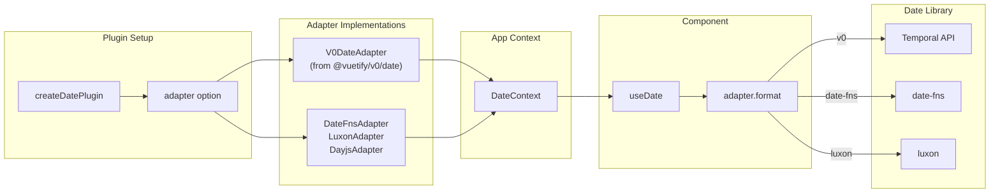

# useDate

Date manipulation using the Temporal API with locale-aware formatting and adapter support.

<DocsPageFeatures :frontmatter />

## Installation

The built-in `V0DateAdapter` requires the `@js-temporal/polyfill` package:

::: code-group no-filename

```bash pnpm
pnpm add @js-temporal/polyfill
```

```bash npm
npm install @js-temporal/polyfill
```

```bash yarn
yarn add @js-temporal/polyfill
```

```bash bun
bun add @js-temporal/polyfill
```

:::

> [!TIP]
> The Temporal API is a Stage 3 [TC39 proposal](https://github.com/tc39/proposal-temporal). Once browsers ship native support, the polyfill will no longer be required.

Then install the date plugin with an adapter:

```ts src/plugins/zero.ts
import { V0DateAdapter } from '@vuetify/v0/date'
import { createDatePlugin } from '@vuetify/v0'

app.use(
  createDatePlugin({
    adapter: new V0DateAdapter(),
    locale: 'en-US',
  })
)
```

> [!INFO]
> The `adapter` option is **required**. The `V0DateAdapter` is exported from a separate subpath (`@vuetify/v0/date`) to avoid bundling the Temporal polyfill unless explicitly used. If you don't need date functionality, simply don't install the plugin—no polyfill will be loaded.

## Usage

Once the plugin is installed, use the `useDate` composable in any component:

::: example
/composables/use-date/basic

### Date Format Presets

Today's date rendered in multiple formats — fullDate, shortDate, weekday, and time — using the current locale.

:::

## Adapters

Adapters let you swap the underlying date library without changing your application code.

| Adapter | Import | Description |
|---------|--------|-------------|
| `V0DateAdapter` | `@vuetify/v0/date` | [Temporal API](https://tc39.es/proposal-temporal/docs/) adapter[^temporal] |

[^temporal]: Requires the [@js-temporal/polyfill](https://www.npmjs.com/package/@js-temporal/polyfill) package until native Temporal ships in all evergreen browsers. Install with `pnpm add @js-temporal/polyfill`.

### DateAdapter Interface

The adapter provides a comprehensive API compatible with [date-io](https://github.com/dmtrKovalenko/date-io):

```ts collapse
abstract class DateAdapter<T> {
  /** Current locale for formatting */
  abstract get locale (): string
  abstract set locale (value: string)
  /** First day of week. 0=Sunday, 1=Monday, ... 6=Saturday. Managed by the plugin. */
  abstract get firstDayOfWeek (): number
  abstract set firstDayOfWeek (value: number)

  // Construction & Conversion
  abstract date (value?: unknown): T | null
  abstract toJsDate (value: T): Date
  abstract parseISO (date: string): T
  abstract toISO (date: T): string
  abstract parse (value: string, format: string): T | null
  abstract isValid (date: unknown): date is T  // Type predicate
  abstract isNullish (value: T | null): value is null  // Type predicate

  // Locale & Formatting
  abstract getCurrentLocaleCode (): string
  abstract is12HourCycleInCurrentLocale (): boolean
  abstract format (date: T, formatString: string): string
  abstract formatByString (date: T, formatString: string): string
  abstract getFormatHelperText (format: string): string
  abstract formatNumber (numberToFormat: string): string
  abstract getMeridiemText (ampm: 'am' | 'pm'): string

  // Navigation
  abstract startOfDay (date: T): T
  abstract endOfDay (date: T): T
  abstract startOfWeek (date: T): T
  abstract endOfWeek (date: T): T
  abstract startOfMonth (date: T): T
  abstract endOfMonth (date: T): T
  abstract startOfYear (date: T): T
  abstract endOfYear (date: T): T

  // Arithmetic
  abstract addSeconds (date: T, amount: number): T
  abstract addMinutes (date: T, amount: number): T
  abstract addHours (date: T, amount: number): T
  abstract addDays (date: T, amount: number): T
  abstract addWeeks (date: T, amount: number): T
  abstract addMonths (date: T, amount: number): T
  abstract addYears (date: T, amount: number): T

  // Comparison
  abstract isAfter (date: T, comparing: T): boolean
  abstract isAfterDay (date: T, comparing: T): boolean
  abstract isAfterMonth (date: T, comparing: T): boolean
  abstract isAfterYear (date: T, comparing: T): boolean
  abstract isBefore (date: T, comparing: T): boolean
  abstract isBeforeDay (date: T, comparing: T): boolean
  abstract isBeforeMonth (date: T, comparing: T): boolean
  abstract isBeforeYear (date: T, comparing: T): boolean
  abstract isEqual (date: T, comparing: T): boolean
  abstract isSameDay (date: T, comparing: T): boolean
  abstract isSameMonth (date: T, comparing: T): boolean
  abstract isSameYear (date: T, comparing: T): boolean
  abstract isSameHour (date: T, comparing: T): boolean
  abstract isWithinRange (date: T, range: [T, T]): boolean

  // Getters
  abstract getYear (date: T): number
  abstract getMonth (date: T): number
  abstract getDate (date: T): number
  abstract getHours (date: T): number
  abstract getMinutes (date: T): number
  abstract getSeconds (date: T): number
  abstract getDiff (date: T, comparing: T | string, unit?: string): number
  abstract getWeek (date: T, minimalDays?: number): number
  abstract getDaysInMonth (date: T): number

  // Setters (immutable - returns new instance)
  abstract setYear (date: T, year: number): T
  abstract setMonth (date: T, month: number): T
  abstract setDate (date: T, day: number): T
  abstract setHours (date: T, hours: number): T
  abstract setMinutes (date: T, minutes: number): T
  abstract setSeconds (date: T, seconds: number): T

  // Calendar Utilities
  abstract getWeekdays (weekdayFormat?: 'long' | 'short' | 'narrow'): string[]
  abstract getWeekArray (date: T): T[][]
  abstract getMonthArray (date: T): T[]
  abstract getYearRange (start: T, end: T): T[]
  abstract getNextMonth (date: T): T
  abstract getPreviousMonth (date: T): T

  // Utility
  abstract mergeDateAndTime (date: T, time: T): T
}
```

### Format Presets

The `format()` method accepts these preset format strings:

| Preset | Example Output |
|--------|----------------|
| `fullDate` | Saturday, June 15, 2024 |
| `fullDateWithWeekday` | Saturday, June 15, 2024 |
| `normalDate` | Jun 15, 2024 |
| `shortDate` | 6/15/24 |
| `year` | 2024 |
| `month` | June |
| `monthShort` | Jun |
| `monthAndYear` | June 2024 |
| `monthAndDate` | June 15 |
| `weekday` | Saturday |
| `weekdayShort` | Sat |
| `dayOfMonth` | 15 |
| `hours12h` | 10 AM |
| `hours24h` | 10 |
| `minutes` | 30 |
| `seconds` | 45 |
| `fullTime` | 10:30:45 AM |
| `fullTime12h` | 10:30:45 AM |
| `fullTime24h` | 10:30:45 |
| `fullDateTime` | Saturday, June 15, 2024 at 10:30 AM |
| `keyboardDate` | 06/15/2024 |
| `keyboardDateTime` | 06/15/2024 10:30 AM |

### Format Tokens

The `formatByString()` method supports these tokens:

| Token | Output | Example |
|-------|--------|---------|
| `YYYY` | 4-digit year | 2024 |
| `YY` | 2-digit year | 24 |
| `MMMM` | Full month name | June |
| `MMM` | Short month name | Jun |
| `MM` | Month (zero-padded) | 06 |
| `M` | Month | 6 |
| `dddd` | Full weekday name | Saturday |
| `ddd` | Short weekday name | Sat |
| `DD` | Day (zero-padded) | 15 |
| `D` | Day | 15 |
| `HH` | 24-hour (zero-padded) | 10 |
| `H` | 24-hour | 10 |
| `hh` | 12-hour (zero-padded) | 10 |
| `h` | 12-hour | 10 |
| `mm` | Minutes (zero-padded) | 30 |
| `m` | Minutes | 30 |
| `ss` | Seconds (zero-padded) | 45 |
| `s` | Seconds | 45 |
| `A` | AM/PM | AM |
| `a` | am/pm | am |

## Reactivity

The date context provides minimal reactivity, with the adapter being a static instance.

| Property | Reactive | Notes |
| - | :-: | - |
| `locale` | <AppSuccessIcon /> | Computed from `useLocale` if available |
| `adapter` | <AppErrorIcon /> | Static adapter instance |

## Examples

The following examples demonstrate common date operations using the default Temporal adapter:

::: example
/composables/use-date/calendar

### Interactive Calendar

A navigable month/year calendar with prev/next controls, today highlighted, and a consistent 5-week grid.

:::

## Locale Integration

When `useLocale` is available, `useDate` automatically syncs with the selected locale:

```ts src/main.ts
import { createApp } from 'vue'
import { V0DateAdapter } from '@vuetify/v0/date'
import { createLocalePlugin, createDatePlugin } from '@vuetify/v0'

const app = createApp(App)

// Install locale plugin first
app.use(
  createLocalePlugin({
    default: 'en',
    messages: {
      en: { /* ... */ },
      de: { /* ... */ },
    }
  })
)

// Date plugin will auto-sync with locale
app.use(
  createDatePlugin({
    adapter: new V0DateAdapter(),
    locales: {
      en: 'en-US',  // Map short codes to Intl locales
      de: 'de-DE',
    }
  })
)
```

When switching locales via `useLocale`, the date adapter automatically updates its formatting locale.

## Custom Adapters

The adapter pattern decouples date operations from the underlying library. When you call `adapter.format()`, the request flows through the provided adapter to its underlying date library:


```mermaid "Adapter Pattern Flow"
flowchart LR
  subgraph Setup["Plugin Setup"]
    plugin["createDatePlugin"]
    opts["adapter option"]
  end

  subgraph Adapters["Adapter Implementations"]
    direction TB
    v0["V0DateAdapter<br/>(from @vuetify/v0/date)"]
    custom["DateFnsAdapter<br/>LuxonAdapter<br/>DayjsAdapter"]
  end

  subgraph Provided["App Context"]
    ctx["DateContext"]
  end

  subgraph Comp["Component"]
    use["useDate"]
    invoke["adapter.format"]
  end

  subgraph Library["Date Library"]
    temporal["Temporal API"]
    datefns["date-fns"]
    luxon["luxon"]
  end

  plugin --> opts
  opts --> v0
  opts --> custom
  v0 --> ctx
  custom --> ctx
  ctx --> use
  use --> invoke
  invoke -->|v0| temporal
  invoke -->|date-fns| datefns
  invoke -->|luxon| luxon
```

Create custom adapters for different date libraries (date-fns, luxon, dayjs):

```ts src/adapters/date-fns-adapter.ts collapse
import { DateAdapter } from '@vuetify/v0'
import { isValid as dateFnsIsValid, parseISO, format as dateFnsFormat } from 'date-fns'

class DateFnsAdapter extends DateAdapter<Date> {
  locale = 'en-US'

  date (value?: unknown): Date | null {
    if (value == null) return new Date()
    if (value instanceof Date) return value
    if (typeof value === 'string') return parseISO(value)
    if (typeof value === 'number') return new Date(value)
    return null
  }

  // Type predicate - enables TypeScript narrowing
  isValid (date: unknown): date is Date {
    return date instanceof Date && dateFnsIsValid(date)
  }

  // Type predicate - enables TypeScript narrowing
  isNull (value: Date | null): value is null {
    return value === null
  }

  format (date: Date, formatString: string): string {
    return dateFnsFormat(date, this.getDateFnsFormat(formatString))
  }

  // Implement remaining methods...
}

// Use with plugin
app.use(
  createDatePlugin({
    adapter: new DateFnsAdapter(),
  })
)
```

> [!TIP]
> The `isValid` and `isNullish` methods are type predicates. This enables TypeScript to narrow types after validation:
> ```ts
> const date = adapter.date(input)
> if (!adapter.isNullish(date) && adapter.isValid(date)) {
>   // TypeScript knows `date` is Date here
>   adapter.format(date, 'fullDate')
> }
> ```

## Known Limitations

- **parse() format parameter**: The `parse()` method's format parameter is currently ignored. The Temporal API doesn't provide built-in format parsing. The method delegates to `date()` which handles ISO 8601 strings. For custom format parsing, use a library like date-fns or luxon with a custom adapter.

### SSR and Hydration

> [!WARNING]
> Date formatting can cause hydration mismatches in SSR applications. Server and client environments may produce different formatted output due to timezone differences.

**SSR Behavior for `adapter.date()`:**
- Browser: Returns current time via `Temporal.Now.plainDateTimeISO()`
- Server: Returns epoch (1970-01-01T00:00:00) for deterministic rendering

This is intentional to prevent hydration mismatches. For SSR apps needing current time, pass `Date.now()` explicitly.

**Timezone-dependent formatting:** `Intl.DateTimeFormat` uses the system timezone. Server environments (often UTC) and client browsers (user's local timezone) produce different formatted strings.

**Solutions:**
1. **Nuxt/SSR:** Wrap formatted dates in `<ClientOnly>`:
   ```vue
   <template>
     <ClientOnly>
      <span>{{ adapter.format(date, 'fullDate') }}</span>
    </ClientOnly>
   </template>
   ```

2. **Vue SSR:** Defer formatting until after hydration:
   ```vue
   <script setup lang="ts">
     import { useDate } from '@vuetify/v0'
     import { shallowRef, onMounted, computed } from 'vue'

     const { adapter } = useDate()
     const isMounted = shallowRef(false)
     const date = adapter.date('2024-06-15T10:30:00')

     onMounted(() => { isMounted.value = true })

     const formatted = computed(() =>
       isMounted.value ? adapter.format(date, 'fullDate') : date?.toString()
     ))
   </script>
   ```

3. **Server timezone:** Set `TZ=UTC` environment variable on your server for consistent baseline

<DocsApi />
