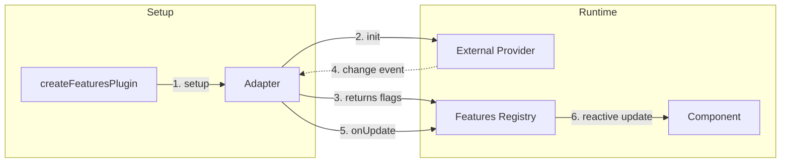
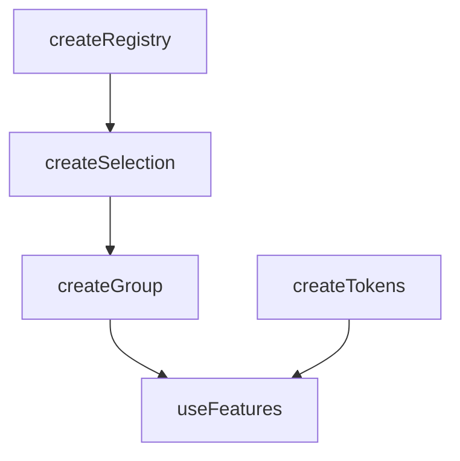

# useFeatures

Manage feature flags and simple variations across your app. Register features, toggle them, and query a variation value for A/B-style behavior.

<DocsPageFeatures :frontmatter />

## Usage

Install the Features plugin once, then access the context anywhere via `createFeatures`.

```ts
import { createApp } from 'vue'
import { createFeaturesPlugin } from '@vuetify/v0'
import App from './App.vue'

const app = createApp(App)

app.use(
  createFeaturesPlugin({
    features: {
      analytics: true,
      debug_mode: false,
      notifications: false,
      search: { $value: true, $variation: 'v2' },
    },
  })
)

app.mount('#app')
```

Now in any component, access current feature flags and variations:

```vue UseFeatures
<script setup lang="ts">
  import { useFeatures } from '@vuetify/v0'

  const features = useFeatures()
</script>

<template>
  <div>
    <p>Analytics: {{ features.get('analytics') }}</p>
    <p>Debug Mode: {{ features.get('debug_mode') }}</p>
    <p>Notifications: {{ features.get('notifications') }}</p>
    <p>Search Variation: {{ features.variation('search', 'v1') }}</p>
  </div>
</template>
```

Optionally register features at runtime:

```vue UseFeatures
<script setup lang="ts">
  import { useFeatures } from '@vuetify/v0'

  const features = useFeatures()

  // Register at runtime
  features.register({ id: 'beta', value: false })

  // Enable/disable via selection helpers
  features.select('beta')
  features.unselect('analytics')
</script>
```

## Adapters

`useFeatures` supports an adapter pattern to integrate with external feature flag providers.

### Built-in Adapters

Vuetify0 includes adapters for popular feature flag services. Each adapter is imported from its own subpath to avoid bundling unused provider SDKs.

#### Flagsmith

Requires `flagsmith` package.

```ts
import flagsmith from 'flagsmith'
import { FlagsmithFeatureAdapter } from '@vuetify/v0/features/flagsmith'

app.use(createFeaturesPlugin({
  adapter: new FlagsmithFeatureAdapter(flagsmith, {
    environmentID: '<YOUR_ENV_ID>',
    // ...other flagsmith options
  })
}))
```

#### LaunchDarkly

Requires `launchdarkly-js-client-sdk` package.

```ts
import * as LDClient from 'launchdarkly-js-client-sdk'
import { LaunchDarklyFeatureAdapter } from '@vuetify/v0/features/launchdarkly'

const client = LDClient.initialize('<YOUR_CLIENT_SIDE_ID>', { key: 'user-key' })

await client.waitForInitialization()

app.use(createFeaturesPlugin({
  adapter: new LaunchDarklyFeatureAdapter(client)
}))
```

#### PostHog

Requires `posthog-js` package.

```ts
import posthog from 'posthog-js'
import { PostHogFeatureAdapter } from '@vuetify/v0/features/posthog'

posthog.init('<YOUR_PROJECT_API_KEY>', { api_host: 'https://app.posthog.com' })

app.use(createFeaturesPlugin({
  adapter: new PostHogFeatureAdapter(posthog)
}))
```

### Multiple Adapters

You can combine flags from multiple sources by passing an array of adapters. They are initialized in order, and flags are merged (last one wins for conflicting keys).

```ts
import { FlagsmithFeatureAdapter } from '@vuetify/v0/features/flagsmith'
import { PostHogFeatureAdapter } from '@vuetify/v0/features/posthog'

app.use(createFeaturesPlugin({
  adapter: [
    new FlagsmithFeatureAdapter(flagsmith, options),
    new PostHogFeatureAdapter(posthog),
  ]
}))
```

### Custom Adapters

Create custom adapters by implementing the `FeaturesAdapterInterface`.

```ts
import type { FeaturesAdapterInterface, FeaturesAdapterFlags } from '@vuetify/v0'

class WindowFeaturesAdapter implements FeaturesAdapterInterface {
  setup (onUpdate: (flags: FeaturesAdapterFlags) => void): FeaturesAdapterFlags {
    const update = (event: CustomEvent) => {
      onUpdate(event.detail)
    }

    window.addEventListener('v0:update-features', update as EventListener)

    this.disposeFn = () => {
      window.removeEventListener('v0:update-features', update as EventListener)
    }

    // Return initial state if available, or empty object
    return window.__INITIAL_FEATURES__ || {}
  }

  dispose () {
    this.disposeFn()
  }

  private disposeFn = () => {}
}
```

### Adapter Interface

The adapter pattern decouples feature flags from the underlying provider.



```ts
interface FeaturesAdapterInterface {
  /**
   * Initialize the adapter and return initial flags.
   *
   * @param onUpdate Callback invoked when flags change.
   * @returns Initial feature flags.
   */
  setup: (onUpdate: (flags: FeaturesAdapterFlags) => void) => FeaturesAdapterFlags

  /**
   * Cleanup adapter resources.
   */
  dispose?: () => void
}
```

## Architecture

`useFeatures` extends `createGroup` for multi-selection and `createTokens` for variations:



<DocsApi />
