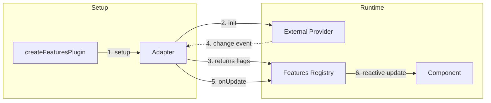
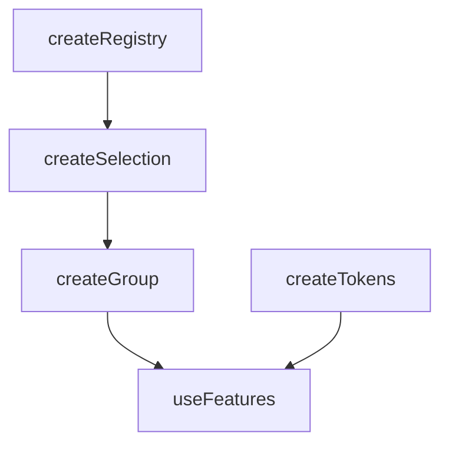

# useFeatures

Manage feature flags and variations across your application.

<DocsPageFeatures :frontmatter />

## Installation

Install the Features plugin in your app's entry point:

```ts main.ts
import { createApp } from 'vue'
import { createFeaturesPlugin } from '@vuetify/v0'
import App from './App.vue'

const app = createApp(App)

app.use(
  createFeaturesPlugin({
    features: {
      analytics: true,
      debug_mode: false,
      notifications: false,
      search: { $value: true, $variation: 'v2' },
    },
  })
)

app.mount('#app')
```

## Usage

Once the plugin is installed, access feature flags and variations in any component:

```vue collapse UseFeatures
<script setup lang="ts">
  import { useFeatures } from '@vuetify/v0'

  const features = useFeatures()
</script>

<template>
  <div>
    <p>Analytics: {{ features.get('analytics') }}</p>
    <p>Debug Mode: {{ features.get('debug_mode') }}</p>
    <p>Notifications: {{ features.get('notifications') }}</p>
    <p>Search Variation: {{ features.variation('search', 'v1') }}</p>
  </div>
</template>
```

Optionally register features at runtime:

```vue collapse UseFeatures
<script setup lang="ts">
  import { useFeatures } from '@vuetify/v0'

  const features = useFeatures()

  // Register at runtime
  features.register({ id: 'beta', value: false })

  // Enable/disable via selection helpers
  features.select('beta')
  features.unselect('analytics')
</script>
```

## Adapters

Adapters let you swap the underlying feature flag provider without changing your application code.

| Adapter | Import | Description |
|---------|--------|-------------|
| `PostHogFeatureAdapter` | `@vuetify/v0/features/adapters/posthog` | [PostHog](https://posthog.com/) integration |
| `FlagsmithFeatureAdapter` | `@vuetify/v0/features/adapters/flagsmith` | [Flagsmith](https://flagsmith.com/) integration |
| `LaunchDarklyFeatureAdapter` | `@vuetify/v0/features/adapters/launchdarkly` | [LaunchDarkly](https://launchdarkly.com/) integration |

### Flagsmith

[Flagsmith](https://flagsmith.com/) is an open-source feature flag platform. Requires the `@flagsmith/flagsmith` package.

::: code-group no-filename

```bash pnpm
pnpm add @flagsmith/flagsmith
```

```bash npm
npm install @flagsmith/flagsmith
```

```bash yarn
yarn add @flagsmith/flagsmith
```

```bash bun
bun add @flagsmith/flagsmith
```

:::

```ts
import flagsmith from '@flagsmith/flagsmith'
import { FlagsmithFeatureAdapter } from '@vuetify/v0/features/adapters/flagsmith'

app.use(createFeaturesPlugin({
  adapter: new FlagsmithFeatureAdapter(flagsmith, {
    environmentID: '<YOUR_ENV_ID>',
    // ...other flagsmith options
  })
}))
```

### LaunchDarkly

[LaunchDarkly](https://launchdarkly.com/) is a feature management platform. Requires the `launchdarkly-js-client-sdk` package.

::: code-group no-filename

```bash pnpm
pnpm add launchdarkly-js-client-sdk
```

```bash npm
npm install launchdarkly-js-client-sdk
```

```bash yarn
yarn add launchdarkly-js-client-sdk
```

```bash bun
bun add launchdarkly-js-client-sdk
```

:::

```ts
import * as LDClient from 'launchdarkly-js-client-sdk'
import { LaunchDarklyFeatureAdapter } from '@vuetify/v0/features/adapters/launchdarkly'

const client = LDClient.initialize('<YOUR_CLIENT_SIDE_ID>', { key: 'user-key' })

await client.waitForInitialization()

app.use(createFeaturesPlugin({
  adapter: new LaunchDarklyFeatureAdapter(client)
}))
```

### PostHog

[PostHog](https://posthog.com/) is an open-source product analytics and feature flag platform. Requires the `posthog-js` package.

::: code-group no-filename

```bash pnpm
pnpm add posthog-js
```

```bash npm
npm install posthog-js
```

```bash yarn
yarn add posthog-js
```

```bash bun
bun add posthog-js
```

:::

```ts
import posthog from 'posthog-js'
import { PostHogFeatureAdapter } from '@vuetify/v0/features/adapters/posthog'

posthog.init('<YOUR_PROJECT_API_KEY>', { api_host: 'https://app.posthog.com' })

app.use(createFeaturesPlugin({
  adapter: new PostHogFeatureAdapter(posthog)
}))
```

### Multiple Adapters

You can combine flags from multiple sources by passing an array of adapters. They are initialized in order, and flags are merged (last one wins for conflicting keys).

```ts
import { FlagsmithFeatureAdapter } from '@vuetify/v0/features/adapters/flagsmith'
import { PostHogFeatureAdapter } from '@vuetify/v0/features/adapters/posthog'

app.use(createFeaturesPlugin({
  adapter: [
    new FlagsmithFeatureAdapter(flagsmith, options),
    new PostHogFeatureAdapter(posthog),
  ]
}))
```

### Custom Adapters

Create custom adapters by implementing the `FeaturesAdapterInterface`.

```ts
import type { FeaturesAdapterInterface, FeaturesAdapterFlags } from '@vuetify/v0'

class WindowFeaturesAdapter implements FeaturesAdapterInterface {
  setup (onUpdate: (flags: FeaturesAdapterFlags) => void): FeaturesAdapterFlags {
    const update = (event: CustomEvent) => {
      onUpdate(event.detail)
    }

    window.addEventListener('v0:update-features', update as EventListener)

    this.disposeFn = () => {
      window.removeEventListener('v0:update-features', update as EventListener)
    }

    // Return initial state if available, or empty object
    return window.__INITIAL_FEATURES__ || {}
  }

  dispose () {
    this.disposeFn()
  }

  private disposeFn = () => {}
}
```

### Adapter Interface

The adapter pattern decouples feature flags from the underlying provider.


```mermaid "Adapter Data Flow"
flowchart LR
  subgraph Setup
    plugin[createFeaturesPlugin]
    adapter[Adapter]
  end

  subgraph Runtime
    ext[External Provider]
    registry[Features Registry]
    comp[Component]
  end

  plugin -->|1. setup| adapter
  adapter -->|2. init| ext
  adapter -->|3. returns flags| registry
  ext -.->|4. change event| adapter
  adapter -->|5. onUpdate| registry
  registry -->|6. reactive update| comp
```

```ts
interface FeaturesAdapterInterface {
  /**
   * Initialize the adapter and return initial flags.
   *
   * @param onUpdate Callback invoked when flags change.
   * @returns Initial feature flags.
   */
  setup: (onUpdate: (flags: FeaturesAdapterFlags) => void) => FeaturesAdapterFlags

  /**
   * Cleanup adapter resources.
   */
  dispose?: () => void
}
```

## Architecture

`useFeatures` extends `createGroup` for multi-selection and `createTokens` for variations:


```mermaid "Features Hierarchy"
flowchart TD
  createRegistry --> createSelection
  createSelection --> createGroup
  createGroup --> useFeatures
  createTokens --> useFeatures
```

## Reactivity

Feature flags inherit reactivity from `createGroup`. Selection state is reactive, but lookup methods return static values.

| Property | Reactive | Notes |
| - | :-: | - |
| `selectedIds` | <AppSuccessIcon /> | Set of enabled feature IDs |
| `selectedItems` | <AppSuccessIcon /> | Computed array of enabled features |
| ticket `isSelected` | <AppSuccessIcon /> | `true` when this feature is enabled |
| `variation(id, fallback?)` | <AppErrorIcon /> | Returns the `$variation` value for a feature, or `fallback` if unset |

## Examples

::: example
/composables/use-features/feature-flags

### Feature Flag Panel

Toggle boolean and variation feature flags at runtime, using ticket `isSelected`, `select()`, `unselect()`, and `variation()` to read and control which features are active.

:::

<DocsApi />
