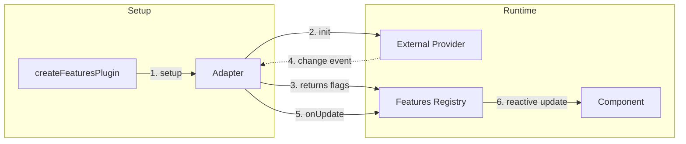
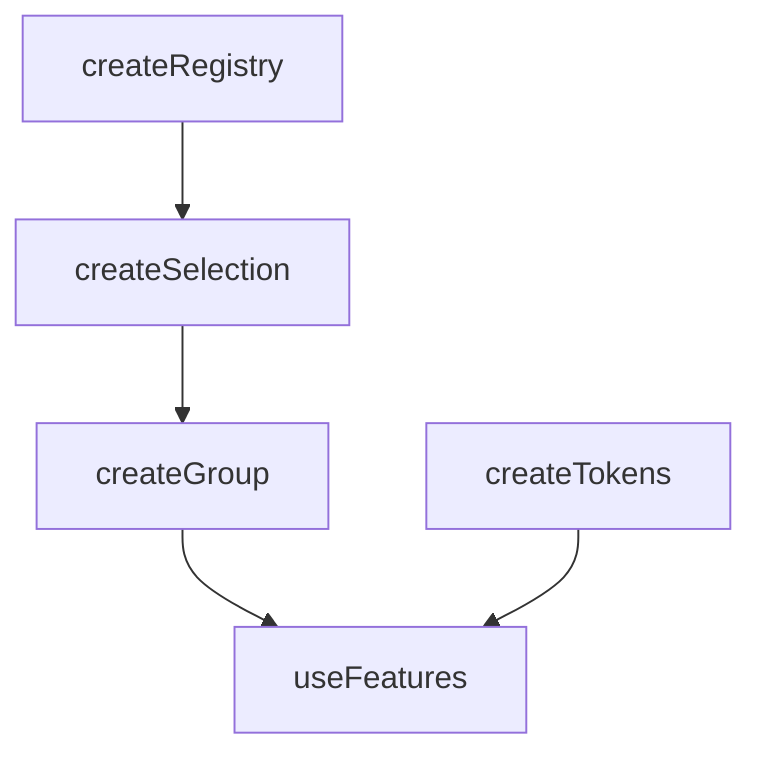

# useFeatures

Manage feature flags and variations across your application.

<DocsPageFeatures :frontmatter />

## Installation

Install the Features plugin in your app's entry point:

```ts main.ts
import { createApp } from 'vue'
import { createFeaturesPlugin } from '@vuetify/v0'
import App from './App.vue'

const app = createApp(App)

app.use(
  createFeaturesPlugin({
    features: {
      analytics: true,
      debug_mode: false,
      notifications: false,
      search: { $value: true, $variation: 'v2' },
    },
  })
)

app.mount('#app')
```

## Usage

Once the plugin is installed, access feature flags and variations in any component:

```vue collapse UseFeatures
<script setup lang="ts">
  import { useFeatures } from '@vuetify/v0'

  const features = useFeatures()
</script>

<template>
  <div>
    <p>Analytics: {{ features.get('analytics') }}</p>
    <p>Debug Mode: {{ features.get('debug_mode') }}</p>
    <p>Notifications: {{ features.get('notifications') }}</p>
    <p>Search Variation: {{ features.variation('search', 'v1') }}</p>
  </div>
</template>
```

Optionally register features at runtime:

```vue collapse UseFeatures
<script setup lang="ts">
  import { useFeatures } from '@vuetify/v0'

  const features = useFeatures()

  // Register at runtime
  features.register({ id: 'beta', value: false })

  // Enable/disable via selection helpers
  features.select('beta')
  features.unselect('analytics')
</script>
```

## Adapters

Adapters let you swap the underlying feature flag provider without changing your application code.

| Adapter | Import | Description |
|---------|--------|-------------|
| `PostHogFeaturesAdapter` | `@vuetify/v0/features/adapters/posthog` | [PostHog](https://posthog.com/) integration |
| `FlagsmithFeaturesAdapter` | `@vuetify/v0/features/adapters/flagsmith` | [Flagsmith](https://www.flagsmith.com/) integration |
| `LaunchDarklyFeaturesAdapter` | `@vuetify/v0/features/adapters/launchdarkly` | [LaunchDarkly](https://launchdarkly.com/) integration |

### Flagsmith

[Flagsmith](https://www.flagsmith.com/) is an open-source feature flag platform. Requires the `@flagsmith/flagsmith` package.

::: code-group no-filename

```bash pnpm
pnpm add @flagsmith/flagsmith
```

```bash npm
npm install @flagsmith/flagsmith
```

```bash yarn
yarn add @flagsmith/flagsmith
```

```bash bun
bun add @flagsmith/flagsmith
```

:::

```ts
import flagsmith from '@flagsmith/flagsmith'
import { FlagsmithFeaturesAdapter } from '@vuetify/v0/features/adapters/flagsmith'

app.use(createFeaturesPlugin({
  adapter: new FlagsmithFeaturesAdapter(flagsmith, {
    environmentID: '<YOUR_ENV_ID>',
    // ...other flagsmith options
  })
}))
```

### LaunchDarkly

[LaunchDarkly](https://launchdarkly.com/) is a feature management platform. Requires the `launchdarkly-js-client-sdk` package.

::: code-group no-filename

```bash pnpm
pnpm add launchdarkly-js-client-sdk
```

```bash npm
npm install launchdarkly-js-client-sdk
```

```bash yarn
yarn add launchdarkly-js-client-sdk
```

```bash bun
bun add launchdarkly-js-client-sdk
```

:::

```ts
import * as LDClient from 'launchdarkly-js-client-sdk'
import { LaunchDarklyFeaturesAdapter } from '@vuetify/v0/features/adapters/launchdarkly'

const client = LDClient.initialize('<YOUR_CLIENT_SIDE_ID>', { key: 'user-key' })

await client.waitForInitialization()

app.use(createFeaturesPlugin({
  adapter: new LaunchDarklyFeaturesAdapter(client)
}))
```

### PostHog

[PostHog](https://posthog.com/) is an open-source product analytics and feature flag platform. Requires the `posthog-js` package.

::: code-group no-filename

```bash pnpm
pnpm add posthog-js
```

```bash npm
npm install posthog-js
```

```bash yarn
yarn add posthog-js
```

```bash bun
bun add posthog-js
```

:::

```ts
import posthog from 'posthog-js'
import { PostHogFeaturesAdapter } from '@vuetify/v0/features/adapters/posthog'

posthog.init('<YOUR_PROJECT_API_KEY>', { api_host: 'https://app.posthog.com' })

app.use(createFeaturesPlugin({
  adapter: new PostHogFeaturesAdapter(posthog)
}))
```

### Multiple Adapters

You can combine flags from multiple sources by passing an array of adapters. They are initialized in order, and flags are merged (last one wins for conflicting keys).

```ts
import { FlagsmithFeaturesAdapter } from '@vuetify/v0/features/adapters/flagsmith'
import { PostHogFeaturesAdapter } from '@vuetify/v0/features/adapters/posthog'

app.use(createFeaturesPlugin({
  adapter: [
    new FlagsmithFeaturesAdapter(flagsmith, options),
    new PostHogFeaturesAdapter(posthog),
  ]
}))
```

### Custom Adapters

Create custom adapters by extending `FeaturesAdapter`.

```ts
import { FeaturesAdapter } from '@vuetify/v0'
import type { FeaturesAdapterFlags } from '@vuetify/v0'

class WindowFeaturesAdapter extends FeaturesAdapter {
  setup (onUpdate: (flags: FeaturesAdapterFlags) => void): FeaturesAdapterFlags {
    const update = (event: CustomEvent) => {
      onUpdate(event.detail)
    }

    window.addEventListener('v0:update-features', update as EventListener)

    this.disposeFn = () => {
      window.removeEventListener('v0:update-features', update as EventListener)
    }

    // Return initial state if available, or empty object
    return window.__INITIAL_FEATURES__ || {}
  }

  dispose () {
    this.disposeFn()
  }

  private disposeFn = () => {}
}
```

### Adapter Base Class

The adapter pattern decouples feature flags from the underlying provider.


```mermaid "Adapter Data Flow"
flowchart LR
  subgraph Setup
    plugin[createFeaturesPlugin]
    adapter[Adapter]
  end

  subgraph Runtime
    ext[External Provider]
    registry[Features Registry]
    comp[Component]
  end

  plugin -->|1. setup| adapter
  adapter -->|2. init| ext
  adapter -->|3. returns flags| registry
  ext -.->|4. change event| adapter
  adapter -->|5. onUpdate| registry
  registry -->|6. reactive update| comp
```

```ts
abstract class FeaturesAdapter {
  /**
   * Initialize the adapter and return initial flags.
   *
   * @param onUpdate Callback invoked when flags change.
   * @returns Initial feature flags.
   */
  abstract setup (onUpdate: (flags: FeaturesAdapterFlags) => void): FeaturesAdapterFlags

  /**
   * Cleanup adapter resources.
   */
  dispose? (): void
}
```

## Architecture

`useFeatures` extends `createGroup` for multi-selection and `createTokens` for variations:


```mermaid "Features Hierarchy"
flowchart TD
  createRegistry --> createSelection
  createSelection --> createGroup
  createGroup --> useFeatures
  createTokens --> useFeatures
```

## Reactivity

Feature flags inherit reactivity from `createGroup`. Selection state is reactive, but lookup methods return static values.

| Property | Reactive | Notes |
| - | :-: | - |
| `selectedIds` | <AppSuccessIcon /> | Set of enabled feature IDs |
| `selectedItems` | <AppSuccessIcon /> | Computed array of enabled features |
| ticket `isSelected` | <AppSuccessIcon /> | `true` when this feature is enabled |
| `variation(id, fallback?)` | <AppErrorIcon /> | Returns the `$variation` value for a feature, or `fallback` if unset |

## Examples

::: gn-example
/composables/use-features/context.ts 1
/composables/use-features/FeatureProvider.vue 2
/composables/use-features/FeaturePanel.vue 3
/composables/use-features/FeaturePreview.vue 4
/composables/use-features/feature-flags.vue 5

### Feature flag admin panel

A provider/consumer demo where one features context drives two independent consumers: an admin panel that mutates flags and a storefront preview that reacts live. `FeatureProvider` calls `createFeaturesContext` with a scoped namespace and provides it through its default slot, so every descendant resolves the same flag registry without prop-drilling. Five flags are registered up front — three boolean and two carrying a `$variation` payload — and the variation flags auto-enable because their `$value` is `true`.

The panel reads `useProxyRegistry` to iterate tickets reactively, flips boolean flags with `features.toggle(id)`, and changes a variation with `features.sync({ [id]: { $value, $variation } })` — preserving the current enabled state by reading `features.selectedIds.has(id)`. The preview consumes the same context but never mutates it: it derives a reactive map from `ticket.isSelected` and `features.variation(id)`, then gates the beta banner, dark theme, checkout label, and grid-vs-list layout off that map. Because both consumers inject one registry, a toggle in the panel re-renders the preview on the next tick.

Reach for this split when flag-editing UI and flag-consuming UI live in different parts of the tree, or as a template for an adapter integration where remote flag state from [usePermissions](/composables/plugins/use-permissions) or a service like LaunchDarkly replaces the static config. See the Adapters section for swapping the built-in context for an external provider, and [createTokens](/composables/registration/create-tokens) for how variation payloads are stored.

| File | Role |
|------|------|
| `context.ts` | Shared namespace, flag metadata, and the config builder |
| `FeatureProvider.vue` | Creates the features context and provides it via slot |
| `FeaturePanel.vue` | Admin consumer that toggles flags and picks variations |
| `FeaturePreview.vue` | Gated consumer that reacts to flags and variations live |
| `feature-flags.vue` | Entry that wraps the provider around both consumers |
:::

## FAQ

::: faq

??? What's the difference between useFeatures and usePermissions?

useFeatures toggles capabilities on or off (with optional variations) regardless of who the user is; [usePermissions](/composables/plugins/use-permissions) answers whether a given role may perform an action on a subject. Use flags for rollout and experiments, permissions for access control.

??? How do I serve a variation instead of a plain on/off flag?

Give the feature a `$variation` payload — `search: { $value: true, $variation: 'v2' }` — and read it with `features.variation('search', 'v1')`, passing a fallback for when it's unset. Variation values are static, not reactive.

??? Can I pull flags from more than one provider at once?

Yes. Pass an array of adapters to `createFeaturesPlugin`; they initialize in order and their flags merge, with the last adapter winning on conflicting keys.

??? Can I toggle or add a flag at runtime?

Yes. `features.register({ id, value })` adds a flag after install, `features.select(id)` / `features.unselect(id)` enable or disable one, and `features.toggle(id)` flips it. Selection state is reactive, so gated UI updates on the next tick.

:::

<DocsApi />
