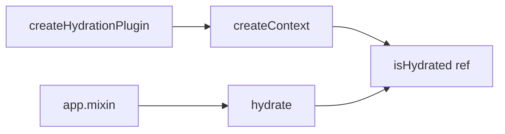

# useHydration

The `useHydration` composable provides SSR hydration state management, allowing you to detect when your application has been hydrated on the client side. This is essential for preventing hydration mismatches and controlling when browser-only features should activate.

<DocsPageFeatures :frontmatter />

## Installation

Install the Hydration plugin in your app's entry point:

```ts main.ts
import { createApp } from 'vue'
import { createHydrationPlugin } from '@vuetify/v0'
import App from './App.vue'

const app = createApp(App)

app.use(createHydrationPlugin())

app.mount('#app')
```

## Usage

Once the plugin is installed, use the `useHydration` composable in any component:

```vue UseHydration
<script setup lang="ts">
  import { useHydration } from '@vuetify/v0'

  const hydration = useHydration()
</script>

<template>
  <div>
    <p v-if="hydration.isHydrated.value">
      Application is hydrated - browser features available
    </p>
    <p v-else>
      Rendering on server or waiting for hydration
    </p>
  </div>
</template>
```

## Architecture

`useHydration` uses the plugin pattern with a simple boolean state:



<DocsApi />
