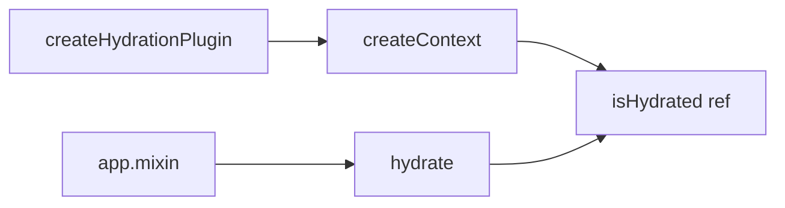

# useHydration

<DocsPageFeatures :frontmatter />

Control SSR hydration timing to prevent mismatches and optimize client-side rendering.

## Installation

Install the Hydration plugin in your app's entry point:

```ts main.ts
import { createApp } from 'vue'
import { createHydrationPlugin } from '@vuetify/v0'
import App from './App.vue'

const app = createApp(App)

app.use(createHydrationPlugin())

app.mount('#app')
```

## Usage

Once the plugin is installed, use the `useHydration` composable in any component. Destructure the properties for automatic ref unwrapping in templates:

```vue collapse no-filename UseHydration
<script setup lang="ts">
  import { useHydration } from '@vuetify/v0'

  const { isHydrated, isSettled } = useHydration()

  // In script, access .value
  if (isHydrated.value) {
    console.log('Hydration complete')
  }
</script>

<template>
  <div>
    <!-- Destructured refs auto-unwrap in templates -->
    <p v-if="isHydrated">
      Application is hydrated - browser features available
    </p>
    <p v-else>
      Rendering on server or waiting for hydration
    </p>
  </div>
</template>
```

## Architecture

`useHydration` uses the plugin pattern with a simple boolean state:


```mermaid "Hydration Plugin"
flowchart LR
  createHydrationPlugin --> createContext
  createContext --> isHydrated[isHydrated ref]
  app.mixin --> hydrate
  hydrate --> isHydrated
```

## Reactivity

All properties are `Readonly<ShallowRef>` and update when the root component mounts. Use `.value` in script; destructure for template auto-unwrapping.

| Property | Type | Notes |
| - | - | - |
| `isHydrated` | `ShallowRef<boolean>` | True after root component mounts |
| `isSettled` | `ShallowRef<boolean>` | True after next tick post-hydration |

## Examples

::: example
/composables/use-hydration/hydration-state

### Hydration State

Displays the live `isHydrated` and `isSettled` states as the component mounts and the next tick resolves, illustrating the SSR hydration lifecycle.

:::

<DocsApi />
