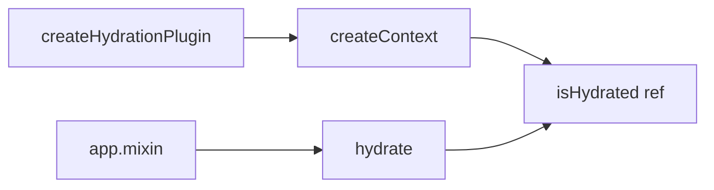

# useHydration

Control SSR hydration timing to prevent mismatches and optimize client-side rendering.

<DocsPageFeatures :frontmatter />

## Installation

Install the Hydration plugin in your app's entry point:

```ts main.ts
import { createApp } from 'vue'
import { createHydrationPlugin } from '@vuetify/v0'
import App from './App.vue'

const app = createApp(App)

app.use(createHydrationPlugin())

app.mount('#app')
```

## Usage

Once the plugin is installed, use the `useHydration` composable in any component. Destructure the properties for automatic ref unwrapping in templates:

```vue collapse no-filename UseHydration
<script setup lang="ts">
  import { useHydration } from '@vuetify/v0'

  const { isHydrated, isSettled } = useHydration()

  // In script, access .value
  if (isHydrated.value) {
    console.log('Hydration complete')
  }
</script>

<template>
  <div>
    <!-- Destructured refs auto-unwrap in templates -->
    <p v-if="isHydrated">
      Application is hydrated - browser features available
    </p>
    <p v-else>
      Rendering on server or waiting for hydration
    </p>
  </div>
</template>
```

## Architecture

`useHydration` uses the plugin pattern with a simple boolean state:


```mermaid "Hydration Plugin"
flowchart LR
  createHydrationPlugin --> createContext
  createContext --> isHydrated[isHydrated ref]
  app.mixin --> hydrate
  hydrate --> isHydrated
```

## Reactivity

All properties are `Readonly<ShallowRef>` and update when the root component mounts. Use `.value` in script; destructure for template auto-unwrapping.

| Property | Type | Notes |
| - | - | - |
| `isHydrated` | `ShallowRef<boolean>` | True after root component mounts |
| `isSettled` | `ShallowRef<boolean>` | True after next tick post-hydration |

## Examples

::: gn-example
/composables/use-hydration/hydration-state

### Hydration State

A live view of the two-phase hydration lifecycle. Two indicator cards show `isHydrated` and `isSettled` turning from false to true as the component mounts and the subsequent `nextTick` resolves. A combined status banner below derives a three-state label — `pending`, `hydrated`, `settled` — from both refs together using `toRef`. A step-progress row at the bottom maps the abstract phases (`SSR → hydrate() → nextTick → settle()`) to the current status so the sequence is visible rather than implied.

The example uses `createLoggerContext` internally — just `createHydrationPlugin`, `useHydration`, and `toRef` — so it exercises only the public API. In a real SSR app the component loads in the `pending` state and transitions through `hydrated` to `settled` in under a frame; in a client-only app the fallback context makes both refs immediately true, which is also what this example shows when the plugin is not installed. That fallback behaviour is documented in the "Fallback Hydration" section above.

Reach for `isSettled` (not just `isHydrated`) as the gate for CSS transitions and animations: `isHydrated` fires on mount, but the browser hasn't painted yet at that point, so transition classes applied immediately are suppressed. `isSettled` fires one tick later, after paint, and avoids the flash.

:::

## Recipes

### Fallback Hydration

When `useHydration()` is called without the plugin installed (no `createHydrationPlugin` in your app), it returns a fallback context where `isHydrated` and `isSettled` are **immediately `true`**. This means components that conditionally render based on `isHydrated` work correctly in client-only apps without any plugin setup.

```ts no-filename
// Without plugin: isHydrated.value === true immediately
// With plugin:    isHydrated.value starts false, becomes true after mount
const { isHydrated } = useHydration()
```

> [!TIP]
> The fallback is also what SSR-aware composables like `useResizeObserver` use internally — they call `useHydration()` to defer observation until after hydration, but work correctly even in environments where the plugin isn't installed.

## FAQ

::: faq

??? What's the difference between `isHydrated` and `isSettled`?

`isHydrated` flips true once the root component mounts — use it to gate browser-only features. `isSettled` flips true one tick later, after the browser has painted; gate CSS transitions and animations on it so the first frame isn't suppressed.

??? Why do both refs start `true` when I haven't installed the plugin?

Without `createHydrationPlugin`, `useHydration()` returns a fallback context where both `isHydrated` and `isSettled` are immediately `true`. This lets `isHydrated`-gated components work in client-only apps with no setup.

??? How do SSR-aware composables like useResizeObserver use this?

They call `useHydration()` internally to defer observation until after hydration, avoiding mismatches. The same fallback means they still work even when the plugin isn't installed.

:::

<DocsApi />
