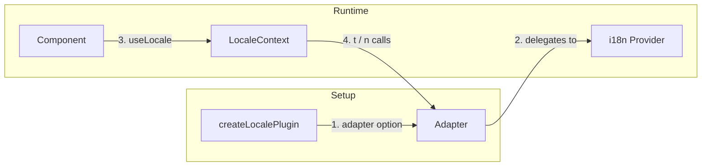
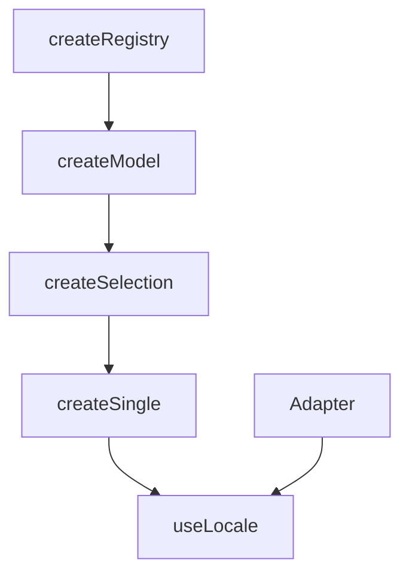

# useLocale

i18n plugin with message translation, number formatting, and locale switching.

<DocsPageFeatures :frontmatter />

## Installation

Install the Locale plugin in your app's entry point:

```ts main.ts
import { createApp } from 'vue'
import { createLocalePlugin } from '@vuetify/v0'
import App from './App.vue'

const app = createApp(App)

app.use(
  createLocalePlugin({
    default: 'en',
    messages: {
      en: {
        hello: 'Hello',
        welcome: 'Welcome, {name}!',
      },
      es: {
        hello: 'Hola',
        welcome: '¡Bienvenido, {name}!',
      },
    },
  })
)

app.mount('#app')
```

## Usage

Once the plugin is installed, use the `useLocale` composable in any component:

```vue collapse no-filename UseLocale
<script setup lang="ts">
  import { useLocale } from '@vuetify/v0'

  const locale = useLocale()

  function changeLocale(id: string) {
    locale.select(id)
  }
</script>

<template>
  <div>
    <h1>{{ locale.t('hello') }}</h1>
    <p>{{ locale.t('welcome', { name: 'John' }) }}</p>

    <button @click="changeLocale('en')">English</button>
    <button @click="changeLocale('es')">Español</button>
    <button @click="changeLocale('fr')">Français</button>
  </div>
</template>
```

## Adapters

Adapters let you swap the underlying i18n implementation without changing your application code.

| Adapter | Import | Description |
|---------|--------|-------------|
| `V0LocaleAdapter` | `@vuetify/v0` | Token-based translation with fallback chain (default) |
| `VueI18nLocaleAdapter` | `@vuetify/v0/locale/adapters/vue-i18n` | [vue-i18n](https://vue-i18n.intlify.dev/) v10+ integration |

### v0 (default)

The built-in `V0LocaleAdapter` is used when no `adapter` option is provided. It handles the full translation pipeline using the token registry:

- **Key lookup** — resolves `locale.t('key')` against `createTokens` using the selected locale
- **Fallback chain** — falls back to the `fallback` locale when a key is missing
- **Message linking** — resolves token references like `{nav.home}` within messages, with circular reference protection
- **Placeholder interpolation** — named (`{name}`) and positional (`{0}`) replacement
- **Number formatting** — `locale.n(value)` delegates to `Intl.NumberFormat` with the selected locale

This is the adapter powering the Installation and Usage examples above — no extra configuration needed.

### vue-i18n

Requires [vue-i18n](https://vue-i18n.intlify.dev/) v10+ (Composition API mode).

::: code-group no-filename

```bash pnpm
pnpm add vue-i18n
```

```bash npm
npm install vue-i18n
```

```bash yarn
yarn add vue-i18n
```

```bash bun
bun add vue-i18n
```

:::

```ts src/plugins/zero.ts
import { createI18n } from 'vue-i18n'
import { VueI18nLocaleAdapter } from '@vuetify/v0/locale/adapters/vue-i18n'
import { createLocalePlugin } from '@vuetify/v0'

const i18n = createI18n({
  locale: 'en',
  messages: {
    en: { hello: 'Hello', welcome: 'Welcome, {name}!' },
    es: { hello: 'Hola', welcome: '¡Bienvenido, {name}!' },
  },
})

app.use(i18n)
app.use(
  createLocalePlugin({
    adapter: new VueI18nLocaleAdapter(i18n),
  })
)
```

> [!TIP]
> When using the vue-i18n adapter, message storage and resolution are handled entirely by vue-i18n. The `messages` option on `createLocalePlugin` is not needed — all translations live in your vue-i18n instance.

### Custom Adapters

Create custom adapters by implementing the `LocaleAdapter` interface:

```ts src/adapters/custom-locale-adapter.ts collapse
import { LocaleAdapter } from '@vuetify/v0'

class MyLocaleAdapter extends LocaleAdapter {
  t (key: string, ...params: unknown[]): string {
    // Delegate to your i18n provider
    return myProvider.translate(key, params)
  }

  ti (key: string, ...params: unknown[]): string | undefined {
    // Same lookup as t(), but return undefined when the key is missing
    return myProvider.has(key) ? myProvider.translate(key, params) : undefined
  }

  n (value: number): string {
    return new Intl.NumberFormat('en-US').format(value)
  }
}

// Use with plugin
app.use(
  createLocalePlugin({
    adapter: new MyLocaleAdapter(),
  })
)
```

### Adapter Interface

The adapter pattern decouples translation from the underlying i18n library. When you call `locale.t()`, the request flows through the provided adapter:


```mermaid "Adapter Data Flow"
flowchart LR
  subgraph Setup
    plugin[createLocalePlugin]
    adapter[Adapter]
  end

  subgraph Runtime
    ext[i18n Provider]
    ctx[LocaleContext]
    comp[Component]
  end

  plugin -->|1. adapter option| adapter
  adapter -->|2. delegates to| ext
  comp -->|3. useLocale| ctx
  ctx -->|4. t / n calls| adapter
```

```ts
abstract class LocaleAdapter {
  abstract t (key: string, ...params: unknown[]): string
  abstract ti (key: string, ...params: unknown[]): string | undefined
  abstract n (value: number): string
}
```

## Architecture

`useLocale` extends `createSingle` for locale selection with message interpolation:


```mermaid "Locale Hierarchy"
flowchart TD
  createRegistry --> createModel
  createModel --> createSelection
  createSelection --> createSingle
  createSingle --> useLocale
  Adapter --> useLocale
```

## Reactivity

Locale selection is reactive via `createSingle`. Translation methods return static strings.

| Property | Reactive | Notes |
| - | :-: | - |
| `selectedId` | <AppSuccessIcon /> | Current locale ID |
| `selectedItem` | <AppSuccessIcon /> | Current locale ticket |
| `selectedValue` | <AppSuccessIcon /> | Current locale value |
| `selectedIndex` | <AppSuccessIcon /> | Index in registry |

## Examples

::: gn-example
/composables/use-locale/LocaleScope.vue 1
/composables/use-locale/LocalePanel.vue 2
/composables/use-locale/locale-scopes.vue 3

### Nested Locale Scopes

`createLocaleContext` provides a locale to a subtree via provide/inject instead of installing it app-wide. Because every scope provides under the same injection key, a nested scope shadows its parent: a consumer reads the nearest provider above it, so an embedded widget can run an entirely different language and message set than the page around it. Here the outer shell defaults to English (with Spanish and Japanese) while the inner checkout widget defaults to French (with German), and switching one panel's language never touches the other.

`LocaleScope.vue` is a thin provider — it calls `createLocaleContext` with a `default` locale and a `messages` dictionary, then renders its slot. `LocalePanel.vue` is the consumer: it calls `useLocale()` to resolve whichever scope wraps it and exercises every form the built-in `V0LocaleAdapter` supports — named replacement (`{ name }`), positional replacement (`{0}`), multi-placeholder (`{ count, total }`), and nested key lookup (`nav.home`). The amount line nests `locale.n()` inside `locale.t()`, so the number is formatted by `Intl.NumberFormat` for the active locale before being interpolated into the translated string.

Reach for scoped contexts over the app-wide [Installation](#installation) plugin when sections of a page need independent locales — multi-tenant dashboards, embedded third-party widgets, or isolated docs demos. For a vue-i18n integration or a custom adapter, see the Adapters section below. For component-level locale overrides, see the [Locale](/components/providers/locale) component.

| File | Role |
|------|------|
| `LocaleScope.vue` | Provider — creates a locale context from `default` + `messages` props and provides it to its slot |
| `LocalePanel.vue` | Consumer — injects `useLocale()` and renders the switcher, translations, and number format |
| `locale-scopes.vue` | Entry — nests a widget scope inside the app scope to show the two read independently |
:::

## Recipes

### Translation

Look up a message key with `t()` or `ti()`. Both run the same pipeline — selected locale, then the `fallback` locale, then placeholder interpolation — and differ only in what they return when the key is missing.

| Method | On a miss | Reach for it when |
| - | - | - |
| `t(key, ...params)` | Echoes the raw `key` back | A visible string is always wanted and the key itself is an acceptable last resort |
| `ti(key, ...params)` | Returns `undefined` | You want to supply your own fallback string inline |

#### Translate if exists

`ti()` ("translate if exists") never echoes the key. Pair it with the nullish-coalescing operator to provide an inline default — the pattern every v0 component uses for its accessible names:

```vue no-filename TranslateIfExists
<script setup lang="ts">
  import { useLocale } from '@vuetify/v0'

  const locale = useLocale()
</script>

<template>
  <nav :aria-label="locale.ti('Pagination.label') ?? 'Pagination'">
    ...
  </nav>
</template>
```

When an app installs the Locale plugin with a `Pagination.label` translation, the component uses it; when an app installs no locale messages at all, the component still renders a real English accessible name (`'Pagination'`) and satisfies [WCAG 4.1.2 Name, Role, Value](https://www.w3.org/WAI/WCAG21/Understanding/name-role-value.html). Because the default lives at the call site, no English strings are bundled into the runtime fallback — calling `t('Pagination.label')` on the same missing key would render the literal `'Pagination.label'`, which is exactly the unhelpful output `ti()` avoids.

#### Bundled English messages

The inline `ti(key) ?? '...'` idiom keeps a sensible default at each call site. If you would rather register full, centralized English coverage for v0's own component keys, import the optional `@vuetify/v0/locale/messages/en` map. It is a plain object of every key v0 components look up, and it is never pulled into the runtime unless you import it:

```ts main.ts
import en from '@vuetify/v0/locale/messages/en'
import { createLocalePlugin } from '@vuetify/v0'

app.use(
  createLocalePlugin({
    messages: { en },
    default: 'en',
  })
)
```

Use it as a starting point for a new translation — copy the shape, swap the values for your language — or register it as-is to give every v0 component a complete English baseline.

## FAQ

::: faq

??? What's the difference between `t()` and `ti()`?

Both run the same lookup-then-interpolate pipeline; they differ only on a miss. `t('key')` echoes the raw `key` back, while `ti('key')` returns `undefined` — pair it with `?? 'Default'` to supply an inline fallback without bundling English strings into the runtime.

??? How do I scope a different language to part of the page?

Use `createLocaleContext` to provide a locale to a subtree via provide/inject — a nested scope shadows its parent, so an embedded widget can run a different language than the page around it. For a component-level override, see the [Locale](/components/providers/locale) provider.

??? How do I use my existing vue-i18n messages with useLocale?

Install the `VueI18nLocaleAdapter` from `@vuetify/v0/locale/adapters/vue-i18n` and pass it your i18n instance. Message storage and resolution stay in vue-i18n, so the `messages` option on `createLocalePlugin` isn't needed.

??? How do I format numbers for the active locale?

Call `locale.n(value)` — it delegates to `Intl.NumberFormat` using the selected locale, so switching locales reformats the output. You can nest it inside `t()` to interpolate a formatted number into a translated string.

??? How do I give v0's own components English labels?

Import the optional `@vuetify/v0/locale/messages/en` map and register it as the `en` messages on `createLocalePlugin`. It covers every key v0 components look up and is never bundled unless you import it — use it as-is for a full English baseline, or as a template for another language.

:::

<DocsApi />
