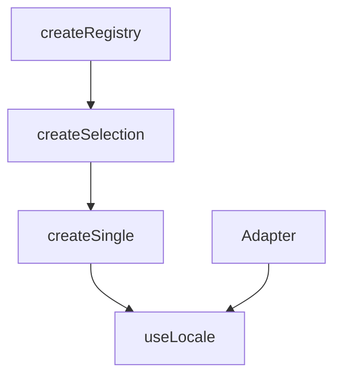

# useLocale

The `useLocale` composable provides comprehensive internationalization (i18n) capabilities, allowing you to manage multiple locales, switch between them dynamically, and translate messages with variable replacement and message linking. Built on `createSingle` for single-locale selection and supports custom adapters for integration with different i18n libraries.

<DocsPageFeatures :frontmatter />

## Installation

Install the Locale plugin in your app's entry point:

```ts main.ts
import { createApp } from 'vue'
import { createLocalePlugin } from '@vuetify/v0'
import App from './App.vue'

const app = createApp(App)

app.use(
  createLocalePlugin({
    default: 'en',
    messages: {
      en: {
        hello: 'Hello',
        welcome: 'Welcome, {name}!',
      },
      es: {
        hello: 'Hola',
        welcome: '¡Bienvenido, {name}!',
      },
    },
  })
)

app.mount('#app')
```

## Usage

Once the plugin is installed, use the `useLocale` composable in any component:

```vue UseLocale
<script setup lang="ts">
  import { useLocale } from '@vuetify/v0'

  const locale = useLocale()

  function changeLocale(id: string) {
    locale.select(id)
  }
</script>

<template>
  <div>
    <h1>{{ locale.t('hello') }}</h1>
    <p>{{ locale.t('welcome', { name: 'John' }) }}</p>

    <button @click="changeLocale('en')">English</button>
    <button @click="changeLocale('es')">Español</button>
    <button @click="changeLocale('fr')">Français</button>
  </div>
</template>
```

## Architecture

`useLocale` extends `createSingle` for locale selection with message interpolation:



<DocsApi />
