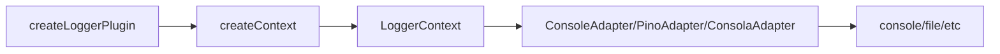

# useLogger

The `useLogger` composable provides a flexible, adapter-based logging system for Vue applications. It supports multiple log levels, runtime enable/disable toggling, and integrates seamlessly with popular logging libraries like Consola and Pino through a simple adapter pattern.

<DocsPageFeatures :frontmatter />

## Installation

Install the Logger plugin in your app's entry point:

```ts main.ts
import { createApp } from 'vue'
import { createLoggerPlugin } from '@vuetify/v0'
import App from './App.vue'

const app = createApp(App)

app.use(
  createLoggerPlugin({
    level: 'debug',
    prefix: '[MyApp]',
  })
)

app.mount('#app')
```

## Usage

Once the plugin is installed, use the `useLogger` composable in any component:

```vue UseLogger
<script setup lang="ts">
  import { useLogger } from '@vuetify/v0'

  const logger = useLogger()

  logger.info('Component mounted')
  logger.debug('Debug information', { userId: 123 })
  logger.warn('Warning message')
  logger.error('Error occurred', new Error('Something went wrong'))
</script>

<template>
  <div>
    <h1>Check the console for logs</h1>
  </div>
</template>
```

## Architecture

`useLogger` uses the plugin pattern with a log adapter:



<DocsApi />
