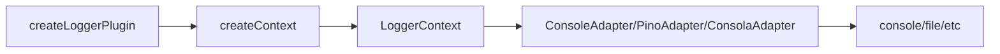

# useLogger

Application logging with configurable levels, filtering, and swappable adapters for popular logging libraries.

<DocsPageFeatures :frontmatter />

## Installation

Install the Logger plugin in your app's entry point:

```ts main.ts
import { createApp } from 'vue'
import { createLoggerPlugin } from '@vuetify/v0'
import App from './App.vue'

const app = createApp(App)

app.use(
  createLoggerPlugin({
    level: 'debug',
    prefix: '[MyApp]',
  })
)

app.mount('#app')
```

## Usage

Once the plugin is installed, use the `useLogger` composable in any component:

```vue collapse no-filename UseLogger
<script setup lang="ts">
  import { useLogger } from '@vuetify/v0'

  const logger = useLogger()

  logger.info('Component mounted')
  logger.debug('Debug information', { userId: 123 })
  logger.warn('Warning message')
  logger.error('Error occurred', new Error('Something went wrong'))
</script>

<template>
  <div>
    <h1>Check the console for logs</h1>
  </div>
</template>
```

## Scoped logging

When several composables share the app-level logger, their output blends together with no easy way to tell which one emitted what. Pass a scope key to `useLogger` to tag every message from that caller with a `[scope]` segment, layered after the plugin prefix:

```ts no-filename
import { useLogger } from '@vuetify/v0'

const logger = useLogger('createKanban')

logger.warn('drop rejected')
// → [v0 warn] [createKanban] drop rejected
```

`useLogger()` with no argument is unchanged — it returns the plugin-configured logger as-is. A scoped logger shares the plugin's level, enabled state, and adapter; only the message prefix differs, so re-leveling or disabling the shared logger affects every scope. A blank scope key is treated as no scope. Without a plugin installed, `useLogger` falls back to a console logger and still appends the `[scope]` segment, so output stays attributable.

## Adapters

Adapters let you swap the underlying logging implementation without changing your application code.

| Adapter | Import | Description |
|---------|--------|-------------|
| `V0LoggerAdapter` | `@vuetify/v0` | Console-based logging (default) |
| `PinoLoggerAdapter` | `@vuetify/v0/logger/adapters/pino` | [Pino](https://getpino.io/) integration |
| `ConsolaLoggerAdapter` | `@vuetify/v0/logger/adapters/consola` | [Consola](https://github.com/unjs/consola) integration |

The default `V0LoggerAdapter` maps each level to the correct native console method — `debug` → `console.debug`, `info` → `console.info`, `warn` → `console.warn`, `error`/`fatal` → `console.error`. This ensures browser DevTools can correctly filter by level.

### Pino

[Pino](https://getpino.io/) is a high-performance JSON logger. Requires the `pino` package.

::: code-group no-filename

```bash pnpm
pnpm add pino
```

```bash npm
npm install pino
```

```bash yarn
yarn add pino
```

```bash bun
bun add pino
```

:::

```ts src/plugins/zero.ts
import pino from 'pino'
import { PinoLoggerAdapter } from '@vuetify/v0/logger/adapters/pino'
import { createLoggerPlugin } from '@vuetify/v0'

const logger = pino({ level: 'debug' })

app.use(
  createLoggerPlugin({
    adapter: new PinoLoggerAdapter(logger),
  })
)
```

### Consola

[Consola](https://github.com/unjs/consola) is an elegant console logger by UnJS. Requires the `consola` package.

::: code-group no-filename

```bash pnpm
pnpm add consola
```

```bash npm
npm install consola
```

```bash yarn
yarn add consola
```

```bash bun
bun add consola
```

:::

```ts src/plugins/zero.ts
import { createConsola } from 'consola'
import { ConsolaLoggerAdapter } from '@vuetify/v0/logger/adapters/consola'
import { createLoggerPlugin } from '@vuetify/v0'

const consola = createConsola({ level: 4 })

app.use(
  createLoggerPlugin({
    adapter: new ConsolaLoggerAdapter(consola),
  })
)
```

### Custom Adapters

Extend `LoggerAdapter` to route logs to any destination:

```ts
import { LoggerAdapter } from '@vuetify/v0'

class DatadogLoggerAdapter extends LoggerAdapter {
  debug (message: string, ...args: unknown[]) {
    datadogLogs.logger.debug(message, ...args)
  }
  info (message: string, ...args: unknown[]) {
    datadogLogs.logger.info(message, ...args)
  }
  warn (message: string, ...args: unknown[]) {
    datadogLogs.logger.warn(message, ...args)
  }
  error (message: string, ...args: unknown[]) {
    datadogLogs.logger.error(message, ...args)
  }
}

app.use(createLoggerPlugin({ adapter: new DatadogLoggerAdapter() }))
```

```ts
abstract class LoggerAdapter {
  abstract debug (message: string, ...args: unknown[]): void
  abstract info (message: string, ...args: unknown[]): void
  abstract warn (message: string, ...args: unknown[]): void
  abstract error (message: string, ...args: unknown[]): void
  trace? (message: string, ...args: unknown[]): void
  fatal? (message: string, ...args: unknown[]): void
}
```

`trace` and `fatal` are optional — if omitted, those calls are silently dropped.

## Architecture

`useLogger` uses the plugin pattern with a log adapter:


```mermaid "Logger Plugin"
flowchart LR
  createLoggerPlugin --> createContext
  createContext --> LoggerContext
  LoggerContext --> Adapter[ConsoleAdapter/PinoAdapter/ConsolaAdapter]
  Adapter --> output[console/file/etc]
```

## Reactivity

The logger exposes only functions — no reactive properties. All interactions are imperative.

| Method | Notes |
| - | - |
| `debug(msg, ...args)` | Log at debug level |
| `info(msg, ...args)` | Log at info level |
| `warn(msg, ...args)` | Log at warn level |
| `error(msg, ...args)` | Log at error level |
| `trace(msg, ...args)` | Log at trace level |
| `fatal(msg, ...args)` | Log at fatal level |
| `level(newLevel)` | Change the active log level at runtime |
| `current()` | Return the current `LogLevel` string |
| `enabled()` | Return `true` if logging is enabled |
| `enable()` | Enable logging |
| `disable()` | Disable logging (silences all output) |

## Examples

::: gn-example
/composables/use-logger/log-console

### Log Console

An interactive devtools console that exercises the full `useLogger` API surface in a single screen. The top row of level buttons calls `logger.level(lvl)` to raise or lower the minimum threshold at runtime — messages below the active level are silenced even if the button is clicked. The row of log-action buttons calls each method directly (`trace()`, `debug()`, `info()`, `warn()`, `error()`, `fatal()`), capturing the formatted line in a local `logs` array so output is visible in the panel without opening the browser console.

The Enabled/Disabled toggle calls `logger.enable()` and `logger.disable()`, which silence all output globally regardless of level — useful for testing that production builds produce no console noise. `logger.current()` and `logger.enabled()` read current state back without side effects.

The example is self-contained via `createLoggerContext` so it works without the app-level plugin. In production you would replace `createLoggerContext` with `createLoggerPlugin` in your entry point and a Pino or Consola adapter for structured output. Scoped loggers (see the "Scoped logging" section above) follow the same imperative API — they inherit the level and enabled state from the shared plugin instance, so toggling via `logger.level()` here would affect all scoped instances too.

:::

<DocsApi />
