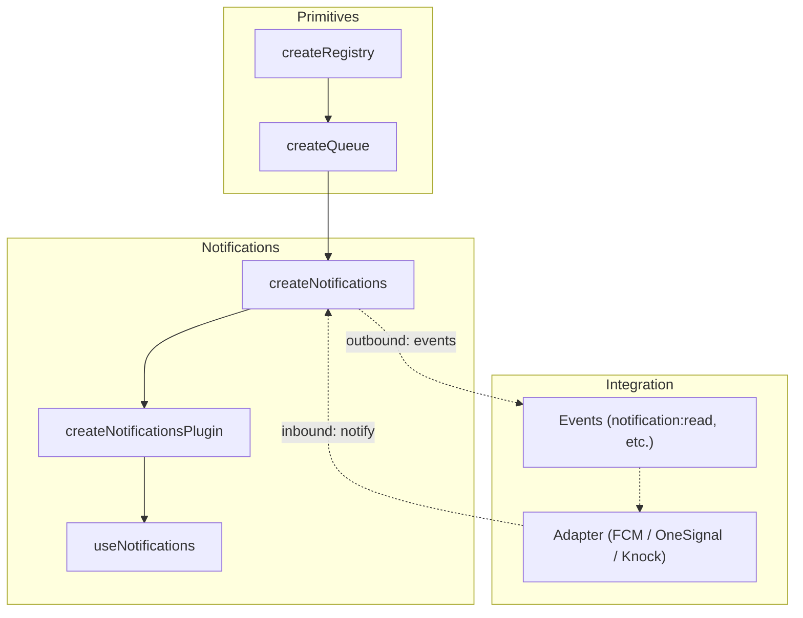
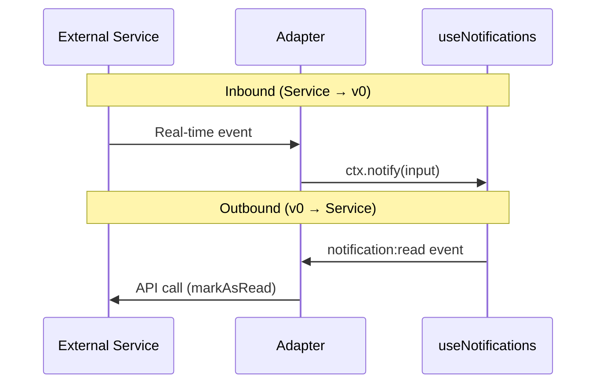

# useNotifications

Headless notification management built on `createQueue`. Manages notification lifecycle with severity levels, actions, state mutations, and optional service adapter integration.

<DocsPageFeatures :frontmatter />

## Installation

Install the Notifications plugin in your app's entry point:

```ts main.ts
import { createApp } from 'vue'
import { createNotificationsPlugin } from '@vuetify/v0'
import App from './App.vue'

const app = createApp(App)

app.use(
  createNotificationsPlugin({
    timeout: -1,
    adapter: myAdapter,
  })
)

app.mount('#app')
```

## Usage

Once the plugin is installed, use the `useNotifications` composable in any component:

```vue collapse no-filename
<script setup lang="ts">
  import { useNotifications } from '@vuetify/v0'

  const notifications = useNotifications()

  function onSave () {
    notifications.notify({
      subject: 'Changes saved',
      severity: 'success',
      timeout: 3000,
    })
  }

  function onError () {
    notifications.notify({
      subject: 'Build failed',
      severity: 'error',
      primaryAction: { label: 'View logs', action: () => router.push('/logs') },
      secondaryAction: { label: 'Dismiss' },
      timeout: -1,
    })
  }
</script>

<template>
  <button @click="onSave">
    Save
  </button>
</template>
```

> [!ASKAI] When should I use the plugin vs standalone createNotifications?

## Architecture

`useNotifications` layers notification semantics on top of the queue and registry primitives, with plugin installation via `createPluginContext`:



> [!ASKAI] How does useNotifications differ from createQueue?

## Reactivity

| Property | Type | Description |
|----------|------|-------------|
| `items` | `ShallowRef<NotificationTicket[]>` | All active notifications |
| `unreadCount` | `ComputedRef<number>` | Notifications without `readAt` |
| `unseenCount` | `ComputedRef<number>` | Notifications without `seenAt` |
| `total` | `ComputedRef<number>` | Total active notification count |

## State Mutations

Each notification tracks timestamps rather than booleans, enabling "read 5 minutes ago" UIs and adapter sync.

> [!ASKAI] Why does useNotifications use timestamps instead of booleans?

### Single

```ts collapse
notifications.read(id)       // Set readAt
notifications.unread(id)     // Clear readAt
notifications.seen(id)       // Set seenAt
notifications.archive(id)    // Set archivedAt
notifications.unarchive(id)  // Clear archivedAt
notifications.snooze(id, until) // Set snoozedUntil
notifications.unsnooze(id)   // Clear snoozedUntil
notifications.dismiss(id)    // Remove from queue
```

Tickets also expose convenience methods directly:

```ts collapse
const ticket = notifications.notify({ subject: 'Hello' })

ticket.read()
ticket.archive()
ticket.snooze(new Date('2026-04-01'))
```

### Bulk

```ts collapse
notifications.readAll()    // Mark all as read
notifications.archiveAll() // Archive all
notifications.clear()      // Remove all from queue
```

## Adapters

An adapter is a function that receives a context with `notify`, `on`, and `off`, and optionally returns a cleanup function. No interface to implement — subscribe to the events you need.



> [!ASKAI] How do I write a custom adapter for my backend?

```ts
type NotificationsAdapter = (context: NotificationsAdapterContext) => void | (() => void)
```

### Adapter Context

| Method | Purpose |
|--------|---------|
| `notify(input)` | Push inbound notifications from the service |
| `on(event, handler)` | Listen for outbound state changes |
| `off(event, handler)` | Remove event listener |

### Events

| Event | Payload | When |
|-------|---------|------|
| `notification:received` | `NotificationTicket` | After `notify()` |
| `notification:read` | `id` | After `read()` |
| `notification:unread` | `id` | After `unread()` |
| `notification:seen` | `id` | After `seen()` |
| `notification:archived` | `id` | After `archive()` |
| `notification:unarchived` | `id` | After `unarchive()` |
| `notification:snoozed` | `id` | After `snooze()` |
| `notification:unsnoozed` | `id` | After `unsnooze()` |

### Firebase Cloud Messaging

[Firebase Cloud Messaging (FCM)](https://firebase.google.com/docs/cloud-messaging) is Google's cross-platform messaging service. Follow the [web setup guide](https://firebase.google.com/docs/cloud-messaging/js/client) to configure your Firebase project and service worker. FCM handles push delivery — the adapter maps inbound messages.

::: code-group

```ts src/plugins/firebase.ts
import type { NotificationsAdapter } from '@vuetify/v0'
import { getMessaging, onMessage } from 'firebase/messaging'
import { firebaseApp } from './firebase'

export const fcmAdapter: NotificationsAdapter = (ctx) => {
  const messaging = getMessaging(firebaseApp)

  const unsubscribe = onMessage(messaging, payload => {
    ctx.notify({
      id: payload.messageId,
      subject: payload.notification?.title,
      body: payload.notification?.body,
      data: payload.data,
      severity: 'info',
    })
  })

  return unsubscribe
}
```

```ts src/main.ts
import { createApp } from 'vue'
import { createNotificationsPlugin } from '@vuetify/v0'
import { fcmAdapter } from './plugins/firebase'
import App from './App.vue'

const app = createApp(App)

app.use(
  createNotificationsPlugin({
    adapter: fcmAdapter,
  })
)

app.mount('#app')
```

:::

### OneSignal

[OneSignal](https://onesignal.com) specializes in push notifications across web, mobile, and email. Their [Web SDK](https://documentation.onesignal.com/docs/web-sdk-setup) handles service worker registration and permission prompts. OneSignal is push-only (no in-app feed), so the adapter is inbound-only.

::: code-group

```ts src/plugins/onesignal.ts
import type { NotificationsAdapter } from '@vuetify/v0'
import OneSignal from '@onesignal/web-sdk'

export const onesignalAdapter: NotificationsAdapter = (ctx) => {
  OneSignal.Notifications.addEventListener('foregroundWillDisplay', event => {
    const { notification } = event
    ctx.notify({
      id: notification.notificationId,
      subject: notification.title,
      body: notification.body,
      data: notification.additionalData,
      severity: 'info',
    })
  })
}
```

```ts src/main.ts
import { createApp } from 'vue'
import { createNotificationsPlugin } from '@vuetify/v0'
import { onesignalAdapter } from './plugins/onesignal'
import App from './App.vue'

const app = createApp(App)

app.use(
  createNotificationsPlugin({
    adapter: onesignalAdapter,
  })
)

app.mount('#app')
```

:::

### Knock

[Knock](https://knock.app) is a notification infrastructure platform with feeds, preferences, and multi-channel delivery. Install their [JavaScript SDK](https://docs.knock.app/sdks/javascript/overview) to get started.

::: code-group

```ts src/plugins/knock.ts
import type { NotificationsAdapter } from '@vuetify/v0'
import Knock from '@knocklabs/client'

const knock = new Knock(import.meta.env.VITE_KNOCK_PUBLIC_KEY)
knock.authenticate(userId)

export const knockAdapter: NotificationsAdapter = (ctx) => {
  const feed = knock.feeds.initialize(feedId)

  // Inbound: Knock -> v0
  feed.on('items.received.realtime', ({ items }) => {
    for (const item of items) {
      ctx.notify({
        id: item.id,
        subject: item.blocks[0]?.rendered,
        data: item.data,
        severity: 'info',
      })
    }
  })

  // Outbound: v0 -> Knock
  ctx.on('notification:read', id => feed.markAsRead(id))
  ctx.on('notification:archived', id => feed.markAsArchived(id))

  return () => feed.teardown()
}
```

```ts src/main.ts
import { createApp } from 'vue'
import { createNotificationsPlugin } from '@vuetify/v0'
import { knockAdapter } from './plugins/knock'
import App from './App.vue'

const app = createApp(App)

app.use(
  createNotificationsPlugin({
    adapter: knockAdapter,
  })
)

app.mount('#app')
```

:::

<DocsApi />
