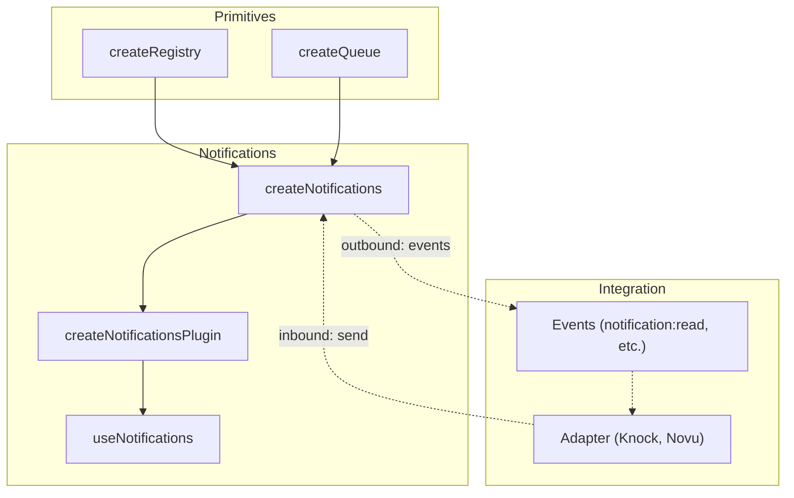
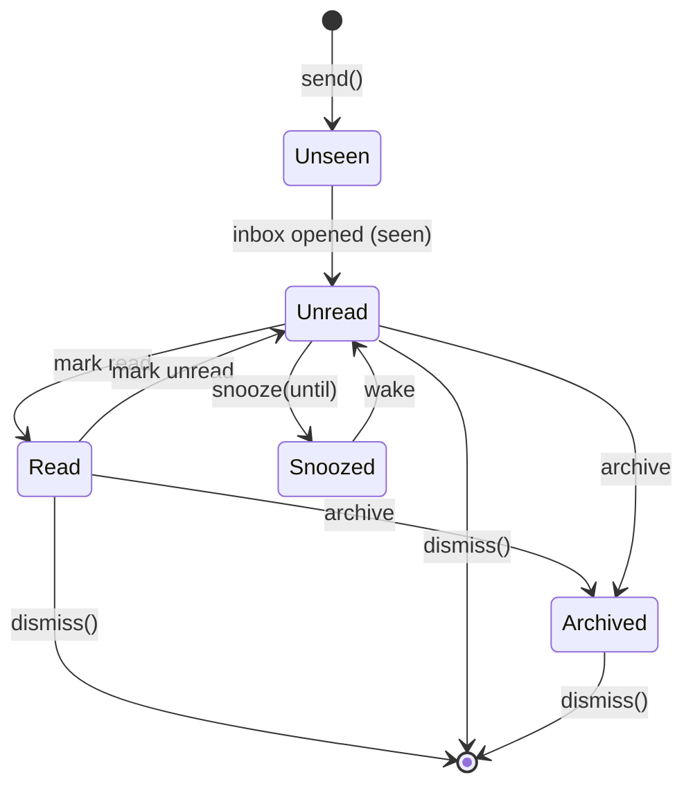

# useNotifications

Notification lifecycle management with severity levels, state mutations, toast queuing, and auto-dismiss.

<DocsPageFeatures :frontmatter />

## Installation

Install the Notifications plugin in your app's entry point:

```ts main.ts
import { createApp } from 'vue'
import { createNotificationsPlugin } from '@vuetify/v0'
import App from './App.vue'

const app = createApp(App)

app.use(createNotificationsPlugin())

app.mount('#app')
```

## Usage

Once the plugin is installed, use the `useNotifications` composable in any component:

```vue collapse no-filename
<script setup lang="ts">
  import { useNotifications } from '@vuetify/v0'

  const notifications = useNotifications()

  function onSave () {
    notifications.send({
      subject: 'Changes saved',
      severity: 'success',
      timeout: 3000,
    })
  }

  function onError () {
    notifications.send({
      subject: 'Build failed',
      severity: 'error',
      timeout: -1,
    })
  }
</script>

<template>
  <button @click="onSave">
    Save
  </button>
</template>
```

## Architecture

`createNotifications` layers notification semantics on top of the registry and queue primitives, with plugin installation via `createPluginContext`:



## Severity Levels

The `severity` field categorizes notifications by urgency. It maps to ARIA live region roles automatically:

| Value | ARIA role | Use for |
|-------|-----------|---------|
| `'error'` | `role="alert"` | Failures, errors, destructive outcomes |
| `'warning'` | `role="alert"` | Degraded state, approaching limits |
| `'info'` | `role="status"` | Neutral updates, background activity |
| `'success'` | `role="status"` | Completed actions, positive outcomes |

`NotificationSeverity` is extensible — custom values like `'critical'` are accepted with autocomplete for the four defaults.

## API

| Method | Description |
|--------|-------------|
| `send(input)` | Create notification + enqueue for toast display |
| `register(input)` | Create notification in registry only (no toast). Use for historical items |
| `queue` | Queue context — `queue.values()`, `queue.pause()`, `queue.resume()` |
| `read(id)` / `unread(id)` | Toggle read state |
| `seen(id)` | Mark as seen |
| `archive(id)` / `unarchive(id)` | Toggle archive state |
| `snooze(id, until)` / `wake(id)` | Snooze with expiry |
| `readAll()` / `archiveAll()` | Bulk operations |
| `onboard(items)` | Bulk-register enriched notifications into registry (no toast) |
| `clear()` | Remove all notifications from the registry |
| `dispose()` | Tear down event listeners and clear the registry |

## Examples

::: example
/composables/use-notifications/context.ts 1
/composables/use-notifications/NotificationProvider.vue 2
/composables/use-notifications/NotificationConsumer.vue 3
/composables/use-notifications/inbox.vue 4
@import @mdi/js

### Notification Center

A single `createNotifications` instance powering four notification surfaces through the `data.type` field:

| Surface | Type | Behavior |
|---------|------|----------|
| **Banner** | `'banner'` | Persistent, dismissible, max 1 visible. System announcements, trial expiry |
| **Toast** | `'toast'` | Auto-dismissing via `timeout`. Action feedback: "Changes saved" |
| **Inline** | `'inline'` | Contextual, embedded in page content. Rate limits, degraded service |
| **Inbox** | `'inbox'` or none | Full lifecycle — read, archive, snooze. Collaboration, CI alerts |

The `data` bag drives routing — the composable doesn't care how notifications render. Each surface filters `items` by `data.type`.

| File | Role |
|------|------|
| `context.ts` | Wraps `createNotifications` with `createContext` for provide/inject |
| `NotificationProvider.vue` | Renders all surfaces: banners, inbox dropdown, snackbar stack |
| `NotificationConsumer.vue` | Triggers notifications — simulates real app events |
| `inbox.vue` | Entry point wiring provider and consumer |

Click **Simulate Event** repeatedly to cycle through banner, snackbar, and inbox notifications. Open the **Inbox** to interact with read/archive/snooze. Notice how `seen` (badge count) and `read` (visual weight) are distinct — mirroring GitHub and Slack.



:::

## Adapters

Adapters let you swap the underlying notification service without changing your application code.

| Adapter | Import | Description |
|---------|--------|-------------|
| `createKnockAdapter` | `@vuetify/v0/notifications` | [Knock](https://knock.app) integration |
| `createNovuAdapter` | `@vuetify/v0/notifications` | [Novu](https://novu.co) integration |

### Knock

[Knock](https://knock.app) is a notification infrastructure platform with feeds, preferences, and multi-channel delivery. Install their [JavaScript SDK](https://docs.knock.app/sdks/javascript/overview) to get started. Supports both inbound (feed → notifications) and outbound (read/archive → Knock API).

::: code-group no-filename

```bash pnpm
pnpm add @knocklabs/client
```

```bash npm
npm install @knocklabs/client
```

```bash yarn
yarn add @knocklabs/client
```

```bash bun
bun add @knocklabs/client
```

:::

::: code-group

```ts src/main.ts
import { createApp } from 'vue'
import { createNotificationsPlugin } from '@vuetify/v0'
import { createKnockAdapter } from '@vuetify/v0/notifications'
import { feed } from './plugins/knock'
import App from './App.vue'

const app = createApp(App)

app.use(
  createNotificationsPlugin({
    adapter: createKnockAdapter(feed),
  })
)

app.mount('#app')
```

```ts src/plugins/knock.ts
import Knock from '@knocklabs/client'

export const knock = new Knock(import.meta.env.VITE_KNOCK_PUBLIC_KEY)
knock.authenticate(import.meta.env.VITE_KNOCK_USER_ID)

export const feed = knock.feeds.initialize(
  import.meta.env.VITE_KNOCK_FEED_CHANNEL_ID
)
```

:::

### Novu

[Novu](https://novu.co) is an open-source notification infrastructure with in-app feeds, digests, and multi-channel delivery. Install their [JavaScript SDK](https://docs.novu.co/sdks/javascript) to get started. Supports both inbound (feed → notifications) and outbound (read/unread/seen/archive/unarchive → Novu API).

The adapter maps Novu severity strings to `NotificationSeverity` by default: `critical`/`high` → `error`, `medium` → `warning`, `low` → `info`. Pass a custom `severity` function to override.

::: code-group no-filename

```bash pnpm
pnpm add @novu/js
```

```bash npm
npm install @novu/js
```

```bash yarn
yarn add @novu/js
```

```bash bun
bun add @novu/js
```

:::

::: code-group

```ts src/main.ts
import { createApp } from 'vue'
import { createNotificationsPlugin } from '@vuetify/v0'
import { createNovuAdapter } from '@vuetify/v0/notifications'
import { novu } from './plugins/novu'
import App from './App.vue'

const app = createApp(App)

app.use(
  createNotificationsPlugin({
    adapter: createNovuAdapter(novu),
  })
)

app.mount('#app')
```

```ts src/plugins/novu.ts
import { Novu } from '@novu/js'

export const novu = new Novu({
  subscriberId: import.meta.env.VITE_NOVU_SUBSCRIBER_ID,
  applicationIdentifier: import.meta.env.VITE_NOVU_APP_ID,
})
```

:::

### Custom Adapters

Implement `NotificationsAdapterInterface` to connect any backend:

```ts
import type { NotificationsAdapterInterface, NotificationsAdapterContext } from '@vuetify/v0'

class MyBackendAdapter implements NotificationsAdapterInterface {
  setup (context: NotificationsAdapterContext) {
    // Wire inbound: push notifications into the registry
    myBackend.onMessage(msg => {
      context.send({ id: msg.id, title: msg.title, body: msg.body })
    })

    // Wire outbound: sync read/archive actions back to the backend
    context.on('notification:read', (data: any) => {
      myBackend.markRead(data.id)
    })
  }

  dispose () {
    myBackend.disconnect()
  }
}

app.use(createNotificationsPlugin({ adapter: new MyBackendAdapter() }))
```

**Adapter context methods:**

| Method | Purpose |
| - | - |
| `send(input)` | Register and enqueue for toast display (real-time inbound) |
| `register(input)` | Register in history only — no toast (initial/historical load) |
| `on(event, handler)` | Subscribe to outbound lifecycle events |
| `off(event, handler)` | Unsubscribe from a lifecycle event |

### Custom Ticket Fields

Extend `NotificationInput` to add domain-specific fields. Pass the type parameter through the adapter and plugin:

```ts
import type { NotificationInput, NotificationsAdapterInterface, NotificationsAdapterContext } from '@vuetify/v0'

interface AppNotification extends NotificationInput {
  priority: 'low' | 'medium' | 'high'
  imageUrl?: string
}

class MyBackendAdapter implements NotificationsAdapterInterface<AppNotification> {
  setup (context: NotificationsAdapterContext<AppNotification>) {
    myBackend.onMessage(msg => {
      context.send({
        id: msg.id,
        subject: msg.title,
        priority: msg.priority,    // custom field
        imageUrl: msg.imageUrl,    // custom field
      })
    })
  }
}

app.use(createNotificationsPlugin<AppNotification>({ adapter: new MyBackendAdapter() }))
```

Custom fields are preserved on the ticket and accessible anywhere you inject the notifications context.

> [!ASKAI] How do I write a custom adapter for my backend?

<DocsApi />
