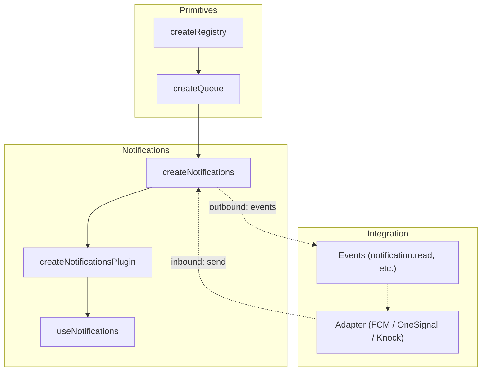
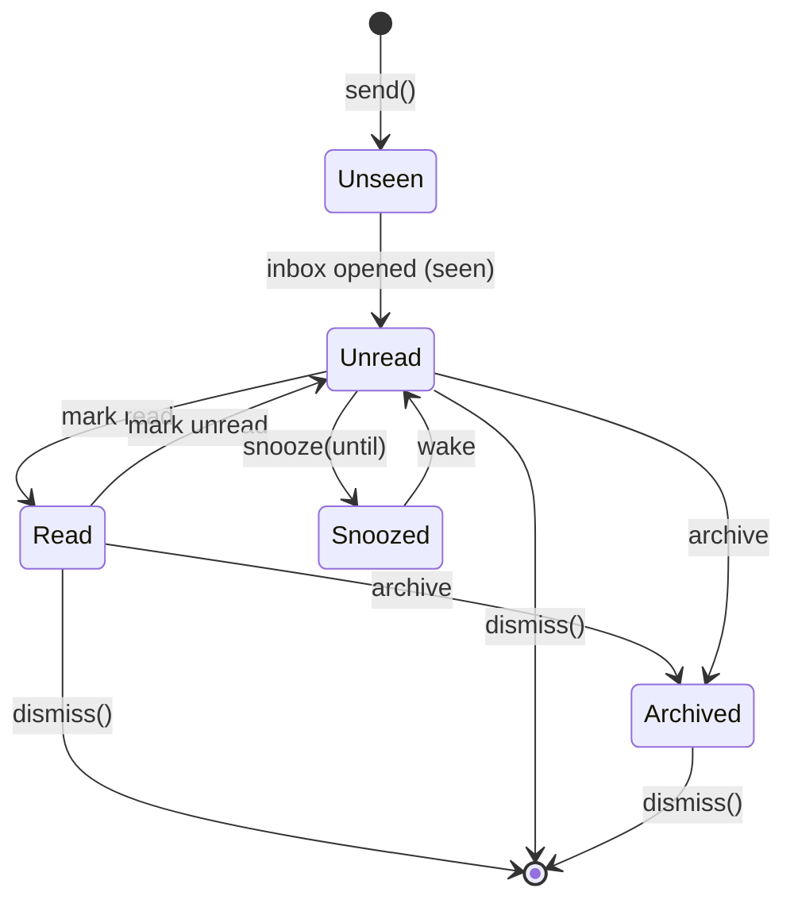

# useNotifications

Headless notification management built on `createQueue`. Manages notification lifecycle with severity levels, state mutations, and optional service adapter integration.

<DocsPageFeatures :frontmatter />

## Installation

Install the Notifications plugin in your app's entry point:

```ts main.ts
import { createApp } from 'vue'
import { createNotificationsPlugin } from '@vuetify/v0'
import App from './App.vue'

const app = createApp(App)

app.use(createNotificationsPlugin())

app.mount('#app')
```

> [!TIP] Notification timeout defaults to `-1` (persistent) — unlike the underlying queue's 3000ms default. Pass `timeout: 3000` per notification for auto-dismiss behavior.

## Usage

Once the plugin is installed, use the `useNotifications` composable in any component:

```vue collapse no-filename
<script setup lang="ts">
  import { useNotifications } from '@vuetify/v0'

  const notifications = useNotifications()

  function onSave () {
    notifications.send({
      subject: 'Changes saved',
      severity: 'success',
      timeout: 3000,
    })
  }

  function onError () {
    notifications.send({
      subject: 'Build failed',
      severity: 'error',
      timeout: -1,
    })
  }
</script>

<template>
  <button @click="onSave">
    Save
  </button>
</template>
```

## Architecture

`useNotifications` layers notification semantics on top of the queue and registry primitives, with plugin installation via `createPluginContext`:



## Reactivity

| Property | Type | Description |
|----------|------|-------------|
| `proxy` | `ProxyRegistryContext` | Reactive proxy — `proxy.values`, `proxy.keys`, `proxy.size` |
| `unreadItems` | `ComputedRef<NotificationTicket[]>` | Notifications without `readAt` |
| `archivedItems` | `ComputedRef<NotificationTicket[]>` | Notifications with `archivedAt` |
| `snoozedItems` | `ComputedRef<NotificationTicket[]>` | Notifications with `snoozedUntil` |

## Examples

::: example
/composables/use-notifications/context.ts 1
/composables/use-notifications/NotificationProvider.vue 2
/composables/use-notifications/NotificationConsumer.vue 3
/composables/use-notifications/inbox.vue 4
@import @mdi/js

### Notification Center

A single `createNotifications` instance powering four notification surfaces through the `data.type` field:

| Surface | Type | Behavior |
|---------|------|----------|
| **Banner** | `'banner'` | Persistent, dismissible, max 1 visible. System announcements, trial expiry |
| **Toast** | `'toast'` | Auto-dismissing via `timeout`. Action feedback: "Changes saved" |
| **Inline** | `'inline'` | Contextual, embedded in page content. Rate limits, degraded service |
| **Inbox** | `'inbox'` or none | Full lifecycle — read, archive, snooze. Collaboration, CI alerts |

The `data` bag drives routing — the composable doesn't care how notifications render. Each surface filters `items` by `data.type`.

| File | Role |
|------|------|
| `context.ts` | Wraps `createNotifications` with `createContext` for provide/inject |
| `NotificationProvider.vue` | Renders all surfaces: banners, inbox dropdown, snackbar stack |
| `NotificationConsumer.vue` | Triggers notifications — simulates real app events |
| `inbox.vue` | Entry point wiring provider and consumer |

Click **Simulate Event** repeatedly to cycle through banner, snackbar, and inbox notifications. Open the **Inbox** to interact with read/archive/snooze. Notice how `seen` (badge count) and `read` (visual weight) are distinct — mirroring GitHub and Slack.



:::

## Adapters

Adapters connect external notification services to `useNotifications`. Each adapter handles mapping between the service's SDK and the notification lifecycle. Import adapters from `@vuetify/v0/notifications`.

> [!ASKAI] How do I write a custom adapter for my backend?

### Knock

[Knock](https://knock.app) is a notification infrastructure platform with feeds, preferences, and multi-channel delivery. Install their [JavaScript SDK](https://docs.knock.app/sdks/javascript/overview) to get started. Supports both inbound (feed → notifications) and outbound (read/archive → Knock API).

::: code-group

```ts src/main.ts
import { createApp } from 'vue'
import { createNotificationsPlugin } from '@vuetify/v0'
import { createKnockAdapter } from '@vuetify/v0/notifications'
import { feed } from './plugins/knock'
import App from './App.vue'

const app = createApp(App)

app.use(
  createNotificationsPlugin({
    adapter: createKnockAdapter(feed),
  })
)

app.mount('#app')
```

```ts src/plugins/knock.ts
import Knock from '@knocklabs/client'

export const knock = new Knock(import.meta.env.VITE_KNOCK_PUBLIC_KEY)
knock.authenticate(userId)

export const feed = knock.feeds.initialize(
  import.meta.env.VITE_KNOCK_FEED_CHANNEL_ID
)
```

:::

<DocsApi />
