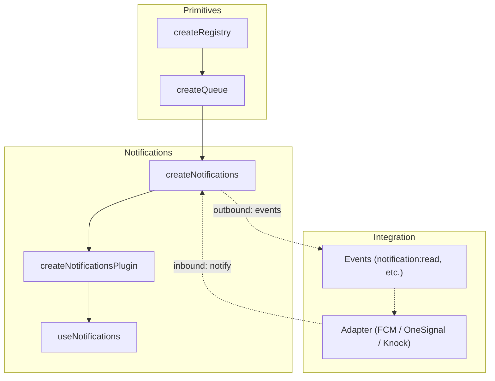

# useNotifications

Headless notification management built on `createQueue`. Manages notification lifecycle with severity levels, state mutations, and optional service adapter integration.

<DocsPageFeatures :frontmatter />

## Installation

Install the Notifications plugin in your app's entry point:

```ts main.ts
import { createApp } from 'vue'
import { createNotificationsPlugin } from '@vuetify/v0'
import App from './App.vue'

const app = createApp(App)

app.use(createNotificationsPlugin())

app.mount('#app')
```

## Usage

Once the plugin is installed, use the `useNotifications` composable in any component:

```vue collapse no-filename
<script setup lang="ts">
  import { useNotifications } from '@vuetify/v0'

  const notifications = useNotifications()

  function onSave () {
    notifications.notify({
      subject: 'Changes saved',
      severity: 'success',
      timeout: 3000,
    })
  }

  function onError () {
    notifications.notify({
      subject: 'Build failed',
      severity: 'error',
      timeout: -1,
    })
  }
</script>

<template>
  <button @click="onSave">
    Save
  </button>
</template>
```

## Architecture

`useNotifications` layers notification semantics on top of the queue and registry primitives, with plugin installation via `createPluginContext`:



## Reactivity

| Property | Type | Description |
|----------|------|-------------|
| `items` | `ShallowRef<NotificationTicket[]>` | All active notifications |
| `unreadItems` | `ComputedRef<NotificationTicket[]>` | Notifications without `readAt` |
| `archivedItems` | `ComputedRef<NotificationTicket[]>` | Notifications with `archivedAt` |
| `snoozedItems` | `ComputedRef<NotificationTicket[]>` | Notifications with `snoozedUntil` |

## State Mutations

Each notification tracks timestamps rather than booleans, enabling "read 5 minutes ago" UIs and adapter sync.

> [!ASKAI] Why does useNotifications use timestamps instead of booleans?

### Single

```ts collapse
notifications.read(id)       // Set readAt
notifications.unread(id)     // Clear readAt
notifications.seen(id)       // Set seenAt
notifications.archive(id)    // Set archivedAt
notifications.unarchive(id)  // Clear archivedAt
notifications.snooze(id, until) // Set snoozedUntil
notifications.unsnooze(id)   // Clear snoozedUntil
notifications.unregister(id) // Remove from queue
```

Tickets also expose convenience methods directly:

```ts collapse
const ticket = notifications.notify({ subject: 'Hello' })

ticket.read()
ticket.archive()
ticket.snooze(new Date('2026-04-01'))
```

### Bulk

```ts collapse
notifications.readAll()    // Mark all as read
notifications.archiveAll() // Archive all
notifications.clear()      // Remove all from queue
```

## Adapters

Adapters connect external notification services to `useNotifications`. Each adapter handles mapping between the service's SDK and the notification lifecycle. Import adapters from `@vuetify/v0/notifications`.

> [!ASKAI] How do I write a custom adapter for my backend?

### Firebase Cloud Messaging

[Firebase Cloud Messaging (FCM)](https://firebase.google.com/docs/cloud-messaging) is Google's cross-platform messaging service. Follow the [web setup guide](https://firebase.google.com/docs/cloud-messaging/js/client) to configure your Firebase project and service worker.

::: code-group

```ts src/firebase.ts
import { initializeApp } from 'firebase/app'

export const firebaseApp = initializeApp({
  apiKey: import.meta.env.VITE_FIREBASE_API_KEY,
  authDomain: import.meta.env.VITE_FIREBASE_AUTH_DOMAIN,
  projectId: import.meta.env.VITE_FIREBASE_PROJECT_ID,
  messagingSenderId: import.meta.env.VITE_FIREBASE_MESSAGING_SENDER_ID,
  appId: import.meta.env.VITE_FIREBASE_APP_ID,
})
```

```ts src/main.ts
import { createApp } from 'vue'
import { createNotificationsPlugin } from '@vuetify/v0'
import { createFcmAdapter } from '@vuetify/v0/notifications'
import { getMessaging } from 'firebase/messaging'
import { firebaseApp } from './firebase'
import App from './App.vue'

const app = createApp(App)

app.use(
  createNotificationsPlugin({
    adapter: createFcmAdapter(getMessaging(firebaseApp)),
  })
)

app.mount('#app')
```

:::

### OneSignal

[OneSignal](https://onesignal.com) specializes in push notifications across web, mobile, and email. Their [Web SDK](https://documentation.onesignal.com/docs/web-sdk-setup) handles service worker registration and permission prompts. Inbound-only — maps foreground push events to notifications.

::: code-group

```ts src/onesignal.ts
import OneSignal from '@onesignal/web-sdk'

await OneSignal.init({
  appId: import.meta.env.VITE_ONESIGNAL_APP_ID,
})

export { OneSignal }
```

```ts src/main.ts
import { createApp } from 'vue'
import { createNotificationsPlugin } from '@vuetify/v0'
import { createOneSignalAdapter } from '@vuetify/v0/notifications'
import { OneSignal } from './onesignal'
import App from './App.vue'

const app = createApp(App)

app.use(
  createNotificationsPlugin({
    adapter: createOneSignalAdapter(OneSignal),
  })
)

app.mount('#app')
```

:::

### Knock

[Knock](https://knock.app) is a notification infrastructure platform with feeds, preferences, and multi-channel delivery. Install their [JavaScript SDK](https://docs.knock.app/sdks/javascript/overview) to get started. Supports both inbound (feed → notifications) and outbound (read/archive → Knock API).

::: code-group

```ts src/knock.ts
import Knock from '@knocklabs/client'

export const knock = new Knock(import.meta.env.VITE_KNOCK_PUBLIC_KEY)
knock.authenticate(userId)

export const feed = knock.feeds.initialize(
  import.meta.env.VITE_KNOCK_FEED_CHANNEL_ID
)
```

```ts src/main.ts
import { createApp } from 'vue'
import { createNotificationsPlugin } from '@vuetify/v0'
import { createKnockAdapter } from '@vuetify/v0/notifications'
import { feed } from './knock'
import App from './App.vue'

const app = createApp(App)

app.use(
  createNotificationsPlugin({
    adapter: createKnockAdapter(feed),
  })
)

app.mount('#app')
```

:::

<DocsApi />
