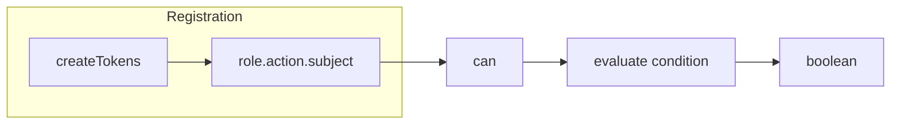

# usePermissions

Manage role-based permissions across your app. Register permissions for roles, actions, and subjects with optional context-aware conditions.

<DocsPageFeatures :frontmatter />

## Usage

Install the Permissions plugin once, then access the context anywhere via `createPermissions`.

```ts
import { createApp } from 'vue'
import { createPermissionsPlugin } from '@vuetify/v0'
import App from './App.vue'

const app = createApp(App)

app.use(
  createPermissionsPlugin({
    permissions: {
      admin: [
        [['read', 'write'], 'user', true],
        [['read', 'write'], 'post', true],
        ['delete', ['user', 'post'], true],
      ],
      editor: [
        [['read', 'write'], 'post', true],
        ['read', 'user', true],
        ['delete', 'post', (context) => context.isOwner],
      ],
      viewer: [
        ['read', ['user', 'post'], true],
      ],
    },
  })
)

app.mount('#app')
```

Now in any component, check permissions for specific roles:

```vue UsePermissions
<script setup lang="ts">
  import { usePermissions } from '@vuetify/v0'

  const permissions = usePermissions()
  const currentUser = { role: 'editor', id: 'user123' }
</script>

<template>
  <div>
    <button v-if="permissions.can('admin', 'delete', 'user')">
      Delete User (Admin Only)
    </button>

    <button v-if="permissions.can('editor', 'write', 'post')">
      Edit Post
    </button>

    <button
      v-if="permissions.can('editor', 'delete', 'post', { isOwner: true })"
    >
      Delete Own Post
    </button>
  </div>
</template>
```

Optionally register permissions at runtime:

```vue UsePermissions
<script setup lang="ts">
  import { usePermissions } from '@vuetify/v0'

  const permissions = usePermissions()

  // Register permission at runtime
  permissions.register({
    id: 'moderator.ban.user',
    value: (context) => context.userLevel < 3
  })

  // Check the permission
  const canBan = permissions.can('moderator', 'ban', 'user', { userLevel: 2 })
</script>
```

## Architecture

`usePermissions` uses `createTokens` for permission flattening and lookup:



<DocsApi />
