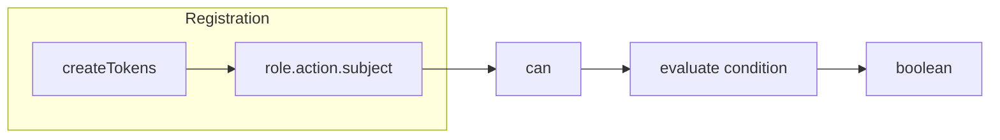

# usePermissions

Role-based access control with actions, subjects, and context-aware conditions.

<DocsPageFeatures :frontmatter />

## Installation

Install the Permissions plugin in your app's entry point:

```ts main.ts
import { createApp } from 'vue'
import { createPermissionsPlugin } from '@vuetify/v0'
import App from './App.vue'

const app = createApp(App)

app.use(
  createPermissionsPlugin({
    permissions: {
      admin: [
        [['read', 'write'], 'user', true],
        [['read', 'write'], 'post', true],
        ['delete', ['user', 'post'], true],
      ],
      editor: [
        [['read', 'write'], 'post', true],
        ['read', 'user', true],
        ['delete', 'post', (context) => context.isOwner],
      ],
      viewer: [
        ['read', ['user', 'post'], true],
      ],
    },
  })
)

app.mount('#app')
```

## Usage

Once the plugin is installed, check permissions for specific roles in any component:

```vue collapse UsePermissions
<script setup lang="ts">
  import { usePermissions } from '@vuetify/v0'

  const permissions = usePermissions()
  const currentUser = { role: 'editor', id: 'user123' }
</script>

<template>
  <div>
    <button v-if="permissions.can('admin', 'delete', 'user')">
      Delete User (Admin Only)
    </button>

    <button v-if="permissions.can('editor', 'write', 'post')">
      Edit Post
    </button>

    <button
      v-if="permissions.can('editor', 'delete', 'post', { isOwner: true })"
    >
      Delete Own Post
    </button>
  </div>
</template>
```

Optionally register permissions at runtime:

```vue collapse UsePermissions
<script setup lang="ts">
  import { usePermissions } from '@vuetify/v0'

  const permissions = usePermissions()

  // Register permission at runtime
  permissions.register({
    id: 'moderator.ban.user',
    value: (context) => context.userLevel < 3
  })

  // Check the permission
  const canBan = permissions.can('moderator', 'ban', 'user', { userLevel: 2 })
</script>
```

## Adapters

Adapters let you swap the underlying permission resolution strategy without changing your application code.

| Adapter | Import | Description |
|---------|--------|-------------|
| `V0PermissionsAdapter` | `@vuetify/v0/permissions/adapters/v0` | Token-based permission lookup (default) |

### Custom Adapters

Extend the `PermissionsAdapter` abstract class to integrate any backend authorization system:

```ts src/adapters/my-permission-adapter.ts collapse
import { PermissionsAdapter } from '@vuetify/v0/permissions/adapters'
import type { PermissionContext, PermissionTicket } from '@vuetify/v0'
import type { ID } from '@vuetify/v0'

class MyPermissionsAdapter extends PermissionsAdapter {
  can<Z extends PermissionTicket>(
    role: ID,
    action: string,
    subject: string,
    context: Record<string, any>,
    permissions: PermissionContext<Z>,
  ): boolean {
    // Delegate to your auth system
    return myAuthClient.check(String(role), `${action}:${subject}`, context)
  }
}

// Use with plugin
app.use(
  createPermissionsPlugin({
    adapter: new MyPermissionsAdapter(),
  })
)
```

## Architecture

`usePermissions` uses `createTokens` for permission flattening and lookup:


```mermaid "Permissions Flow"
flowchart LR
  subgraph Registration
    createTokens --> flatten[role.action.subject]
  end

  flatten --> can
  can --> condition[evaluate condition]
  condition --> result[boolean]
```

## Reactivity

Permissions are stored in a token registry. There are no reactive properties — all interactions are through lookup methods (`can()`, `get()`, `has()`).

> [!TIP] Using with reactive state
> Wrap `can()` in a computed to react to permission changes:
```ts
const canEdit = computed(() => permissions.can(user.role, 'edit', 'post'))
```

## Examples

::: gn-example
/composables/use-permissions/context.ts 1
/composables/use-permissions/AccessProvider.vue 2
/composables/use-permissions/Sidebar.vue 3
/composables/use-permissions/Workspace.vue 4
/composables/use-permissions/access-control.vue 5

### Role-Based Workspace

An RBAC workspace where a single role switcher drives two independent consumers at once. `AccessProvider` builds the permission map with `createPermissionsContext` and provides it under a custom namespace; both `Sidebar` and `Workspace` inject that same context with `usePermissions(NAMESPACE)` and gate their UI through `can()`. Switching roles reflows the navigation (which sections are visible) and the toolbar (which actions are enabled) simultaneously, because each `can()` call lives inside a `toRef` or a method that reads the reactive `role` prop.

The toolbar surfaces the context-aware edge case. An editor is denied `publish` by default, but the permission tuple `['publish', 'documents', context => context.isOwner === true]` re-evaluates dynamically when ownership context is supplied as the fourth argument to `can()`. Toggling the owner switch flips the publish button without touching the role definition — the difference between static role checks (RBAC) and attribute-driven conditions (ABAC).

Reach for this provider/consumer split when several disconnected parts of a screen must honor the same access rules — admin shells, document editors, settings panels. The provider owns the rule set once; every descendant reads it through injection rather than threading permissions down as props. To resolve permissions from a backend instead of static tuples, supply a custom [PermissionsAdapter](#adapters); to drive flag-based UI variations the same way, see [useFeatures](/composables/plugins/use-features).

| File | Role |
|------|------|
| `context.ts` | Shared namespace, role list, section and action data, and the permission rule map |
| `AccessProvider.vue` | Creates the permissions context and provides it to the subtree |
| `Sidebar.vue` | Consumer that filters navigation sections by `can(role, 'view', …)` |
| `Workspace.vue` | Consumer that enables document actions, including the owner-gated publish check |
| `access-control.vue` | Entry point that owns the role state and wraps both consumers in the provider |
:::

<DocsApi />
