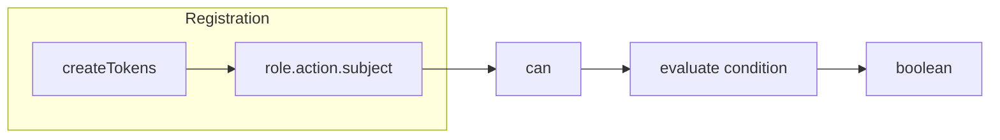

# usePermissions

Role-based access control with actions, subjects, and context-aware conditions.

<DocsPageFeatures :frontmatter />

## Installation

Install the Permissions plugin in your app's entry point:

```ts main.ts
import { createApp } from 'vue'
import { createPermissionsPlugin } from '@vuetify/v0'
import App from './App.vue'

const app = createApp(App)

app.use(
  createPermissionsPlugin({
    permissions: {
      admin: [
        [['read', 'write'], 'user', true],
        [['read', 'write'], 'post', true],
        ['delete', ['user', 'post'], true],
      ],
      editor: [
        [['read', 'write'], 'post', true],
        ['read', 'user', true],
        ['delete', 'post', (context) => context.isOwner],
      ],
      viewer: [
        ['read', ['user', 'post'], true],
      ],
    },
  })
)

app.mount('#app')
```

## Usage

Once the plugin is installed, check permissions for specific roles in any component:

```vue collapse UsePermissions
<script setup lang="ts">
  import { usePermissions } from '@vuetify/v0'

  const permissions = usePermissions()
  const currentUser = { role: 'editor', id: 'user123' }
</script>

<template>
  <div>
    <button v-if="permissions.can('admin', 'delete', 'user')">
      Delete User (Admin Only)
    </button>

    <button v-if="permissions.can('editor', 'write', 'post')">
      Edit Post
    </button>

    <button
      v-if="permissions.can('editor', 'delete', 'post', { isOwner: true })"
    >
      Delete Own Post
    </button>
  </div>
</template>
```

Optionally register permissions at runtime:

```vue collapse UsePermissions
<script setup lang="ts">
  import { usePermissions } from '@vuetify/v0'

  const permissions = usePermissions()

  // Register permission at runtime
  permissions.register({
    id: 'moderator.ban.user',
    value: (context) => context.userLevel < 3
  })

  // Check the permission
  const canBan = permissions.can('moderator', 'ban', 'user', { userLevel: 2 })
</script>
```

## Adapters

Adapters let you swap the underlying permission resolution strategy without changing your application code.

| Adapter | Import | Description |
|---------|--------|-------------|
| `V0PermissionsAdapter` | `@vuetify/v0/permissions/adapters/v0` | Token-based permission lookup (default) |

### Custom Adapters

Extend the `PermissionsAdapter` abstract class to integrate any backend authorization system:

```ts src/adapters/my-permission-adapter.ts collapse
import { PermissionsAdapter } from '@vuetify/v0/permissions/adapters'
import type { PermissionContext, PermissionTicket } from '@vuetify/v0'
import type { ID } from '@vuetify/v0'

class MyPermissionsAdapter extends PermissionsAdapter {
  can<Z extends PermissionTicket>(
    role: ID,
    action: string,
    subject: string,
    context: Record<string, any>,
    permissions: PermissionContext<Z>,
  ): boolean {
    // Delegate to your auth system
    return myAuthClient.check(String(role), `${action}:${subject}`, context)
  }
}

// Use with plugin
app.use(
  createPermissionsPlugin({
    adapter: new MyPermissionsAdapter(),
  })
)
```

## Architecture

`usePermissions` uses `createTokens` for permission flattening and lookup:


```mermaid "Permissions Flow"
flowchart LR
  subgraph Registration
    createTokens --> flatten[role.action.subject]
  end

  flatten --> can
  can --> condition[evaluate condition]
  condition --> result[boolean]
```

## Reactivity

Permissions are stored in a token registry. There are no reactive properties — all interactions are through lookup methods (`can()`, `get()`, `has()`).

> [!TIP] Using with reactive state
> Wrap `can()` in a computed to react to permission changes:
```ts
const canEdit = computed(() => permissions.can(user.role, 'edit', 'post'))
```

## Examples

::: gn-example
/composables/use-permissions/role-checker

### Role Checker

A permission matrix that maps three roles (`admin`, `editor`, `viewer`) against two subjects (`user`, `post`) and three actions (`read`, `write`, `delete`). Switching the active role re-evaluates every cell immediately, because `can()` is called inside a `toRef` that recomputes whenever `role` changes — no explicit `computed` or watcher needed.

The bottom panel surfaces the context-aware edge case: `editor` is denied `delete` on `post` by default, but allowed when `{ isOwner: true }` is passed as the fourth argument to `can()`. This demonstrates how condition callbacks in the permission tuples (`(ctx) => ctx.isOwner === true`) receive the runtime context object and gate access dynamically — without any changes to the role definition.

Reach for this pattern when you need to preview the full access profile of a role at a glance — useful in admin settings panels, permission editors, or audit dashboards. For integrating with a backend auth system rather than static tuples, implement a custom `PermissionsAdapter` that delegates to your existing `can()` API (see the Adapters section above).

:::

<DocsApi />
