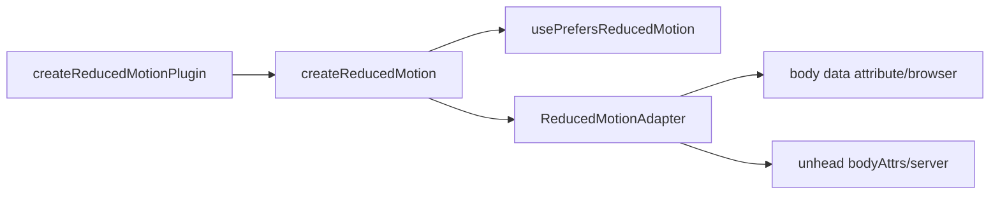

# useReducedMotion

Respect or override the user's `prefers-reduced-motion` setting, with a reactive flag and a body data attribute for CSS-only consumers.

<DocsPageFeatures :frontmatter />

## Installation

Install the reduced-motion plugin in your app's entry point:

```ts main.ts
import { createApp } from 'vue'
import { createReducedMotionPlugin } from '@vuetify/v0'
import App from './App.vue'

const app = createApp(App)

app.use(createReducedMotionPlugin({ mode: 'system' }))

app.mount('#app')
```

## Usage

```ts collapse
import { useReducedMotion } from '@vuetify/v0'

const motion = useReducedMotion()

// Should motion be minimized right now?
motion.isReduced.value // true | false

// Override at runtime
motion.select('always') // force reduce
motion.select('never') // force full motion
motion.select('system') // follow the OS setting
```

## Modes

The `selectedMode` decides how the OS preference is interpreted.

| Mode | Behavior |
| - | - |
| `system` | Follow `prefers-reduced-motion` (default) |
| `always` | Force `isReduced` to `true`, ignoring the OS |
| `never` | Force `isReduced` to `false`, ignoring the OS |

> [!WARNING]
> `never` forces full motion on users whose OS asked for less — it also flips the body attribute to `no-preference`, so your own reduce styles stop matching. Reserve it for an explicit, user-driven control (e.g. a settings toggle), never an app-wide default.

Need the raw OS preference regardless of `selectedMode`? Call [usePrefersReducedMotion](/composables/system/use-media-query) directly.

### Persisting the override

Pass `persist: true` to remember a user's manual override across reloads. This requires the storage plugin to be installed:

```ts main.ts
import { createStoragePlugin, createReducedMotionPlugin } from '@vuetify/v0'

app.use(createStoragePlugin())
app.use(createReducedMotionPlugin({ persist: true }))
```

## Architecture

`useReducedMotion` uses the plugin pattern with a media-query core and a DOM adapter:



## Adapters

Adapters control how the reduced-motion state is applied to the DOM. The default writes a body data attribute in the browser and renders the same attribute via [@unhead](https://unhead.unjs.io/) on the server, so the attribute is present in the initial HTML reflecting the configured mode — correct for `always` and `never`; in the default `system` mode the server cannot know the OS preference and renders `no-preference`.

| Adapter | Import | Description |
|---------|--------|-------------|
| `V0ReducedMotionAdapter` | `@vuetify/v0` | Browser: sets the `data-reduced-motion` attribute on `document.body`. Server: pushes `bodyAttrs` via `@unhead` and patches the entry on changes. Default. |

The head plugin (e.g. `@unhead/vue`) must be installed before `createReducedMotionPlugin`, otherwise the server render silently skips the attribute.

### Custom Adapters

Implement `ReducedMotionAdapter` to apply the state your own way. Stash any teardown on `this.dispose` — the plugin registers it on `app.onUnmount`, so it is cleaned up on app unmount:

```ts
import { createReducedMotionPlugin, IN_BROWSER, ReducedMotionAdapter } from '@vuetify/v0'
import type { ReducedMotionAdapterSetupContext } from '@vuetify/v0'
import type { App } from 'vue'
import { watch } from 'vue'

class ClassReducedMotionAdapter extends ReducedMotionAdapter {
  setup (app: App, context: ReducedMotionAdapterSetupContext) {
    if (!IN_BROWSER) return

    function sync (reduced: boolean) {
      document.documentElement.classList.toggle('reduce-motion', reduced)
    }

    sync(context.isReduced.value)
    this.dispose = watch(context.isReduced, sync)
  }
}

app.use(createReducedMotionPlugin({ adapter: new ClassReducedMotionAdapter() }))
```

## Standalone Usage

Use `createReducedMotion` to create a raw context without the plugin system — useful for testing or embedding in another composable. The standalone context does not set the body data attribute:

```ts
import { createReducedMotion } from '@vuetify/v0'

const motion = createReducedMotion({ mode: 'system' })

motion.isReduced.value // tracks the OS setting
motion.select('always')
motion.isReduced.value // true
```

Inside a component or effect scope, cleanup is automatic; outside any scope, call `motion.dispose()` when done.

When `useReducedMotion` is called without an installed plugin, it returns a no-op fallback (`isReduced` is `false`, `select` does nothing), so consuming code never throws.

## Reactivity

| Property | Reactive | Notes |
| - | :-: | - |
| `selectedMode` | <AppSuccessIcon /> | Active override mode (`'system' \| 'always' \| 'never'`) |
| `isReduced` | <AppSuccessIcon /> | `true` when motion should be minimized, considering `selectedMode` |
| `select(mode)` | <AppErrorIcon /> | Set the active mode |
| `dispose()` | <AppErrorIcon /> | Stop the OS media-query subscription |

## Styling

When installed, the plugin sets `data-reduced-motion="reduce" | "no-preference"` on `document.body` (and renders it server-side via [@unhead](https://unhead.unjs.io/), reflecting the configured mode), so stylesheets can respond without any JavaScript:

```css
[data-reduced-motion="reduce"] *,
[data-reduced-motion="reduce"] ::before,
[data-reduced-motion="reduce"] ::after {
  animation-duration: 0.01ms !important;
  animation-iteration-count: 1 !important;
  transition-duration: 0.01ms !important;
}
```

In the default `system` mode the server cannot read the OS preference, so the initial HTML carries `no-preference` and a reduce-preferring user gets full motion until the client adapter takes over. Pair the attribute selector with a native media query for pre-hydration coverage:

```css
@media (prefers-reduced-motion: reduce) {
  /* same reductions — covers first paint before the plugin runs */
}
```

## Examples

::: gn-example
/composables/use-reduced-motion/basic

### Mode Switching

Toggle between the three modes and watch `isReduced` flip. The bouncing dot stops the moment motion is reduced — either because the OS reports `prefers-reduced-motion: reduce` in `system` mode, or because `always` forces it.

The raw OS readout — pulled from `usePrefersReducedMotion` — shows what the system reports independent of the override. Surface it in a settings panel so users can compare their system preference against what the app is actually applying.

:::

<DocsApi />
