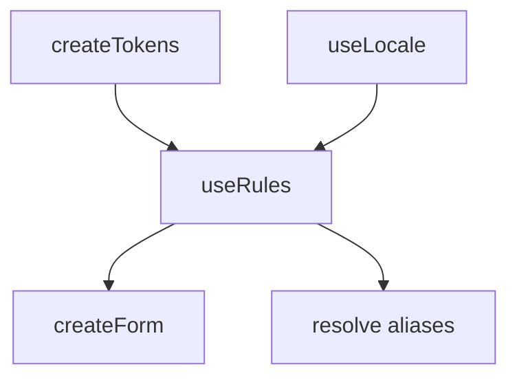

# useRules

The `useRules` composable provides a set of named validation rule aliases — such as `required`, `email`, and `minLength` — that resolve to `FormValidationRule` functions. Error messages are stored in a token registry, making them overridable per-instance without touching your locale configuration. When a locale plugin is installed, messages are looked up through it automatically.

<DocsPageFeatures :frontmatter />

## Installation

Install the Rules plugin to make a shared rules context available across your entire app:

```ts main.ts
import { createApp } from 'vue'
import { createRulesPlugin } from '@vuetify/v0'
import App from './App.vue'

const app = createApp(App)

app.use(
  createRulesPlugin({
    messages: {
      required: 'This field cannot be empty',
    },
    aliases: {
      phone: (err?) => v => /^\d{10}$/.test(String(v)) || (err ?? 'Invalid phone number'),
    },
  })
)

app.mount('#app')
```

## Usage

### Standalone

`useRules` works without a plugin. When called outside component scope it returns a fallback instance using default English messages:

```ts
import { createRules } from '@vuetify/v0'

const rules = createRules()

// Use aliases directly to build rule functions
const required = rules.aliases.required()
const minLen = rules.aliases.minLength(8)

required('')        // 'Field is required'
required('hello')   // true
minLen('hi')        // 'Must be at least 8 characters'
minLen('password')  // true
```

### Resolving Aliases

Pass alias strings or tuples to `resolve()` for use with `createForm`:

```ts
import { createRules, createForm } from '@vuetify/v0'

const rules = createRules()
const form = createForm({ rules })

const password = form.register({
  id: 'password',
  value: '',
  rules: ['required', ['minLength', 8]],
})
```

### In a Component

When the plugin is installed, use `useRules` to access the shared context:

```vue
<script setup lang="ts">
  import { useRules } from '@vuetify/v0'

  const rules = useRules()
  const resolved = rules.resolve(['required', ['minLength', 8]])
</script>
```

### Overriding Messages

Pass `messages` to override specific default strings per-instance. Keys correspond to alias names:

```ts
import { createRules } from '@vuetify/v0'

const rules = createRules({
  messages: {
    required: 'Cannot be blank',
    email: 'Enter a valid email address',
  },
})
```

### Custom Aliases

Add custom rule aliases alongside the built-ins:

```ts
import { createRules } from '@vuetify/v0'

const rules = createRules({
  aliases: {
    phone: (err?) => v => /^\d{10}$/.test(String(v)) || (err ?? 'Invalid phone'),
    zip: (err?) => v => /^\d{5}$/.test(String(v)) || (err ?? 'Invalid zip code'),
  },
})

const phoneRule = rules.aliases.phone()
phoneRule('1234567890') // true
phoneRule('abc')        // 'Invalid phone'
```

### With useLocale

When `createLocalePlugin` is installed, `useRules` automatically routes error message lookups through it using the key pattern `rules.<alias>`. Add rule translations to your locale messages and they will be used instead of the token registry defaults:

```ts main.ts
import { createApp } from 'vue'
import { createLocalePlugin, createRulesPlugin } from '@vuetify/v0'
import App from './App.vue'

const app = createApp(App)

app.use(
  createLocalePlugin({
    default: 'en',
    messages: {
      en: {
        rules: {
          required: 'This field is required',
          email: 'Enter a valid email address',
          minLength: 'Must be at least {0} characters',
        },
      },
      es: {
        rules: {
          required: 'Este campo es obligatorio',
          email: 'Introduce un correo válido',
          minLength: 'Debe tener al menos {0} caracteres',
        },
      },
    },
  })
)

app.use(createRulesPlugin())

app.mount('#app')
```

The message resolution priority is:
1. Explicit `err` string passed to the alias builder — `rules.aliases.required('Cannot be blank')`
2. Locale translation via `useLocale` — `rules.required` key in the active locale
3. Token registry override — `messages` option passed to `createRulesPlugin` or `createRules`
4. Built-in English default

## Built-in Aliases

| Alias | Signature | Description |
| - | - | - |
| `required` | `(err?)` | Value must be truthy or `0` |
| `email` | `(err?)` | Must match `*@*.*` pattern |
| `number` | `(err?)` | Must be parseable as a number |
| `integer` | `(err?)` | Must contain only digits |
| `capital` | `(err?)` | Must contain only uppercase letters |
| `maxLength` | `(len, err?)` | Length must be ≤ `len` |
| `minLength` | `(len, err?)` | Length must be ≥ `len` |
| `strictLength` | `(len, err?)` | Length must equal `len` |
| `exclude` | `(chars[], err?)` | Must not contain any of the given characters |
| `notEmpty` | `(err?)` | Must have a `length` property greater than `0` |
| `pattern` | `(re, err?)` | Must match the given regular expression |

## Architecture

`useRules` uses `createTokens` for message storage and integrates with `useLocale` for i18n:



## Reactivity

`useRules` has no reactive state. Aliases are plain functions — call them to produce a `FormValidationRule`.

| Property | Reactive | Notes |
| - | :-: | - |
| `aliases` | <AppErrorIcon /> | Static map of builder functions |
| `resolve()` | <AppErrorIcon /> | Pure function, returns array of rule functions |

<DocsApi />
