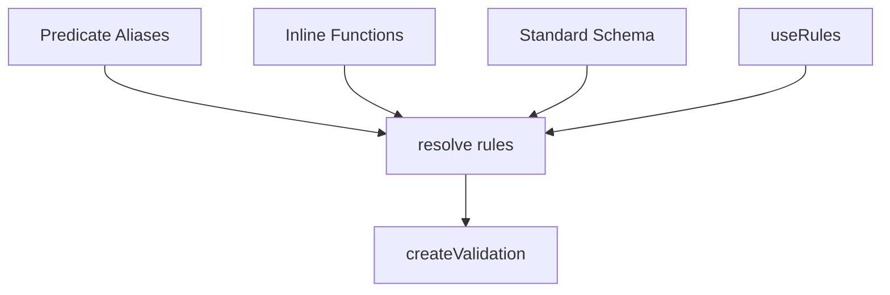

# useRules

Validation rule management with Standard Schema support and custom aliases.

<DocsPageFeatures :frontmatter />

## Installation

Register the plugin with your app-wide aliases:

```ts main.ts
import { createApp } from 'vue'
import { createRulesPlugin } from '@vuetify/v0'
import App from './App.vue'

const app = createApp(App)

app.use(
  createRulesPlugin({
    aliases: {
      required: v => (v === 0 || !!v) || 'Required',
      email: v => !v || /^.+@\S+\.\S+$/.test(String(v)) || 'Invalid email',
      slug: v => !v || /^[a-z][a-z0-9-]*$/.test(String(v)) || 'Invalid slug',
    },
  })
)

app.mount('#app')
```

> [!TIP]
> Return `false` instead of a string to defer the error message to the locale plugin. When `useLocale` is installed, `false` resolves to `locale.t('$rules.<aliasName>')`. Without locale, it falls back to the alias name.

## Usage

### In a Component

`createValidation` resolves aliases automatically via `useRules()` — no manual wiring needed:

```vue
<script setup lang="ts">
  import { createValidation } from '@vuetify/v0'
  import { shallowRef } from 'vue'

  const name = shallowRef('')
  const validation = createValidation({
    value: name,
    rules: ['required', 'slug'],
  })
</script>
```

### Standalone

`createRules` works without a plugin for use outside component scope:

```ts
import { createRules } from '@vuetify/v0'

const rules = createRules({
  aliases: {
    required: v => !!v || 'Required',
  },
})

rules.resolve(['required'])
```

### Custom Aliases

An alias is a **predicate** — a `FormValidationRule` that returns `true`, a `string`, or `false`:

```ts
app.use(
  createRulesPlugin({
    aliases: {
      // String return — inline error message
      required: v => !!v || 'This field is required',

      // String return — domain-specific
      slug: v => !v || /^[a-z][a-z0-9-]*$/.test(String(v)) || 'Invalid slug',

      // false return — defers to locale plugin for message
      email: v => !v || /^.+@\S+\.\S+$/.test(String(v)) || false,
    },
  })
)
```

## Architecture

`useRules` resolves aliases, functions, and Standard Schema objects into `FormValidationRule[]` for use with `createValidation`:


```mermaid "Rules Architecture"
flowchart TD
  aliases[Predicate Aliases] --> resolve
  functions[Inline Functions] --> resolve
  StandardSchema[Standard Schema] --> resolve
  useRules --> resolve[resolve rules]
  resolve --> createValidation
```

## Reactivity

`useRules` has no reactive state. Aliases are plain predicate functions — `resolve()` wraps them with locale-aware error message lookup when they return `false`.

| Property | Reactive | Notes |
| - | :-: | - |
| `aliases` | <AppErrorIcon /> | Static map of predicate functions |
| `resolve()` | <AppErrorIcon /> | Pure function, returns array of rule functions |

## Examples

::: example
/composables/use-rules/context.ts 1
/composables/use-rules/FormField.vue 2
/composables/use-rules/dashboard.vue 3

### API Key Manager

This example registers 4 custom aliases (`required`, `email`, `slug`, `prefix`) as predicates with inline error strings. Each input gets its own `createValidation` instance with a `value` ref and rules. A rate limit field uses an inline function rule to show that aliases and functions can coexist.

The controls let you trigger validation, prefill valid or invalid data, and reset. The state panel reflects each validation's `isValid`, error count, and active rule count in real time — showing the tri-state validation lifecycle (`null` → `true`/`false`) and how reset returns everything to its initial state.

| File | Role |
|------|------|
| `context.ts` | Defines predicate aliases via `createRulesContext` |
| `FormField.vue` | Reusable field component — binds validation errors and border state |
| `dashboard.vue` | Provides rules context, creates per-input validations, renders UI |

**Key patterns:**

- `createRulesContext({ aliases })` registers predicate validators
- `true` = pass, `string` = fail with message, `false` = fail with locale lookup
- `createValidation({ value, rules })` — one instance per input, resolves aliases via `useRules()`
- Validation state (`errors`, `isValid`, `isValidating`) lives on the context, not on individual tickets
- Components decide when to call `validate()` — validation triggers are a UI concern

:::

## Standard Schema

`useRules` supports [Standard Schema](https://standardschema.dev/) — a universal interface for validation libraries. Pass schema objects directly in `rules` arrays alongside alias strings and inline functions — `resolve()` auto-detects and wraps them.

### Zod

```vue
<script setup lang="ts">
  import { z } from 'zod'
  import { createValidation } from '@vuetify/v0'
  import { shallowRef } from 'vue'

  const email = shallowRef('')
  const emailValidation = createValidation({
    value: email,
    rules: ['required', z.string().email('Invalid email')],
  })

  const age = shallowRef('')
  const ageValidation = createValidation({
    value: age,
    rules: [z.coerce.number().int().min(18, 'Must be 18+').max(120)],
  })
</script>
```

### Valibot

```vue
<script setup lang="ts">
  import * as v from 'valibot'
  import { createValidation } from '@vuetify/v0'
  import { shallowRef } from 'vue'

  const username = shallowRef('')
  const validation = createValidation({
    value: username,
    rules: ['required', v.pipe(v.string(), v.minLength(3), v.maxLength(20))],
  })
</script>
```

### ArkType

```vue
<script setup lang="ts">
  import { type } from 'arktype'
  import { createValidation } from '@vuetify/v0'
  import { shallowRef } from 'vue'

  const score = shallowRef('')
  const validation = createValidation({
    value: score,
    rules: [type('1 <= number <= 100')],
  })
</script>
```

> [!TIP]
> Schema objects produce async rules. `createValidation` handles this transparently — no special handling needed in components.

### Compatible Libraries

Any library that implements the [Standard Schema v1 spec](https://standardschema.dev/) works out of the box:

| Library | Version | Import |
| - | - | - |
| [Zod](https://zod.dev/) | v3.24+ | `import { z } from 'zod'` |
| [Valibot](https://valibot.dev/) | v1.0+ | `import * as v from 'valibot'` |
| [ArkType](https://arktype.io/) | v2.0+ | `import { type } from 'arktype'` |

### isStandardSchema()

`isStandardSchema(value)` is exported for use in custom rule factories. Returns `true` if the value implements the Standard Schema v1 interface (`~standard.version === 1`):

```ts
import { isStandardSchema } from '@vuetify/v0'

function myRuleFactory (input: unknown) {
  if (isStandardSchema(input)) {
    // wrap as standard schema rule
  }
}
```

<DocsApi />
