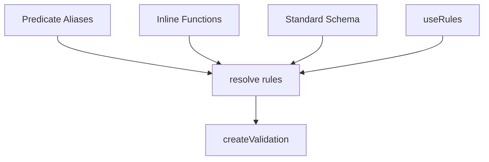

# useRules

Headless validation composable that resolves rules from multiple sources — [Standard Schema](https://standardschema.dev/) objects, custom aliases, and raw functions — into `FormValidationRule[]` for use with `createValidation`. No built-in validators are included; bring your own via a schema library or register custom aliases at the plugin level.

A validation function returns one of three values:
- **`true`** — validation passes
- **`string`** — validation fails, the string is the error message
- **`false`** — validation fails, the error message is resolved from the locale plugin (`$rules.<name>`)

<DocsPageFeatures :frontmatter />

## Installation

Register the plugin with your app-wide aliases:

```ts main.ts
import { createApp } from 'vue'
import { createRulesPlugin } from '@vuetify/v0'
import App from './App.vue'

const app = createApp(App)

app.use(
  createRulesPlugin({
    aliases: {
      required: v => (v === 0 || !!v) || 'Required',
      email: v => !v || /^.+@\S+\.\S+$/.test(String(v)) || 'Invalid email',
      slug: v => !v || /^[a-z][a-z0-9-]*$/.test(String(v)) || 'Invalid slug',
    },
  })
)

app.mount('#app')
```

> [!TIP]
> Return `false` instead of a string to defer the error message to the locale plugin. When `useLocale` is installed, `false` resolves to `locale.t('$rules.<aliasName>')`. Without locale, it falls back to the alias name.

## Usage

### In a Component

Access the shared rules context and use it with `createValidation`:

```vue
<script setup lang="ts">
  import { useRules, createValidation } from '@vuetify/v0'

  const rules = useRules()
  const validation = createValidation({ rules })

  const name = validation.register({
    id: 'name',
    value: '',
    rules: ['required', 'slug'],
  })
</script>
```

### Standalone

`createRules` works without a plugin for use outside component scope:

```ts
import { createRules } from '@vuetify/v0'

const rules = createRules({
  aliases: {
    required: v => !!v || 'Required',
  },
})

rules.resolve(['required'])
```

### Custom Aliases

An alias is a **predicate** — a `FormValidationRule` that returns `true`, a `string`, or `false`:

```ts
app.use(
  createRulesPlugin({
    aliases: {
      // String return — inline error message
      required: v => !!v || 'This field is required',

      // String return — domain-specific
      slug: v => !v || /^[a-z][a-z0-9-]*$/.test(String(v)) || 'Invalid slug',

      // false return — defers to locale plugin for message
      email: v => !v || /^.+@\S+\.\S+$/.test(String(v)) || false,
    },
  })
)
```

## Adapters

`useRules` supports [Standard Schema](https://standardschema.dev/) — a universal interface for validation libraries. Pass schema objects directly in `rules` arrays alongside alias strings and inline functions — `resolve()` auto-detects and wraps them.

### Zod

```vue
<script setup lang="ts">
  import { z } from 'zod'
  import { useRules, createValidation } from '@vuetify/v0'

  const rules = useRules()
  const validation = createValidation({ rules })

  const email = validation.register({
    id: 'email',
    value: '',
    rules: ['required', z.string().email('Invalid email')],
  })

  const age = validation.register({
    id: 'age',
    value: '',
    rules: [z.coerce.number().int().min(18, 'Must be 18+').max(120)],
  })
</script>
```

### Valibot

```vue
<script setup lang="ts">
  import * as v from 'valibot'
  import { useRules, createValidation } from '@vuetify/v0'

  const rules = useRules()
  const validation = createValidation({ rules })

  const username = validation.register({
    id: 'username',
    value: '',
    rules: ['required', v.pipe(v.string(), v.minLength(3), v.maxLength(20))],
  })
</script>
```

### ArkType

```vue
<script setup lang="ts">
  import { type } from 'arktype'
  import { useRules, createValidation } from '@vuetify/v0'

  const rules = useRules()
  const validation = createValidation({ rules })

  const score = validation.register({
    id: 'score',
    value: '',
    rules: [type('1 <= number <= 100')],
  })
</script>
```

> [!TIP]
> Schema objects produce async rules. `createValidation` handles this transparently — no special handling needed in components.

### Compatible Libraries

Any library that implements the [Standard Schema v1 spec](https://standardschema.dev/) works out of the box:

| Library | Version | Import |
| - | - | - |
| [Zod](https://zod.dev/) | v3.24+ | `import { z } from 'zod'` |
| [Valibot](https://valibot.dev/) | v1.0+ | `import * as v from 'valibot'` |
| [ArkType](https://arktype.io/) | v2.0+ | `import { type } from 'arktype'` |

## Examples

::: example
/composables/use-rules/context.ts 1
/composables/use-rules/FormField.vue 2
/composables/use-rules/dashboard.vue 3

### API Key Manager

This example registers 4 custom aliases (`required`, `email`, `slug`, `prefix`) as predicates with inline error strings, and wires them into `createValidation`. A rate limit field uses an inline function rule to show that aliases and functions can coexist.

The controls let you trigger validation, prefill valid or invalid data, and reset. The state panel reflects each field's `isValid`, `isPristine`, and error count in real time — showing the tri-state validation lifecycle (`null` → `true`/`false`) and how reset returns everything to its initial state.

| File | Role |
|------|------|
| `context.ts` | Defines predicate aliases, creates validation, registers fields |
| `FormField.vue` | Reusable field component — binds ticket value, errors, and border state |
| `dashboard.vue` | Entry point — renders fields, action buttons, and live state panel |

**Key patterns:**

- `createRules({ aliases })` registers predicate validators
- `true` = pass, `string` = fail with message, `false` = fail with locale lookup
- `createValidation({ rules })` links the rules context so `resolve()` runs during `register()`
- Each ticket exposes `isValid`, `isPristine`, `errors` as reactive refs
- Components decide when to call `validate()` — validation triggers are a UI concern

:::

## Architecture

`useRules` resolves aliases, functions, and Standard Schema objects into `FormValidationRule[]` for use with `createValidation`:


```mermaid "Rules Architecture"
flowchart TD
  aliases[Predicate Aliases] --> resolve
  functions[Inline Functions] --> resolve
  StandardSchema[Standard Schema] --> resolve
  useRules --> resolve[resolve rules]
  resolve --> createValidation
```

## Reactivity

`useRules` has no reactive state. Aliases are plain predicate functions — `resolve()` wraps them with locale-aware error message lookup when they return `false`.

| Property | Reactive | Notes |
| - | :-: | - |
| `aliases` | <AppErrorIcon /> | Static map of predicate functions |
| `resolve()` | <AppErrorIcon /> | Pure function, returns array of rule functions |

<DocsApi />
