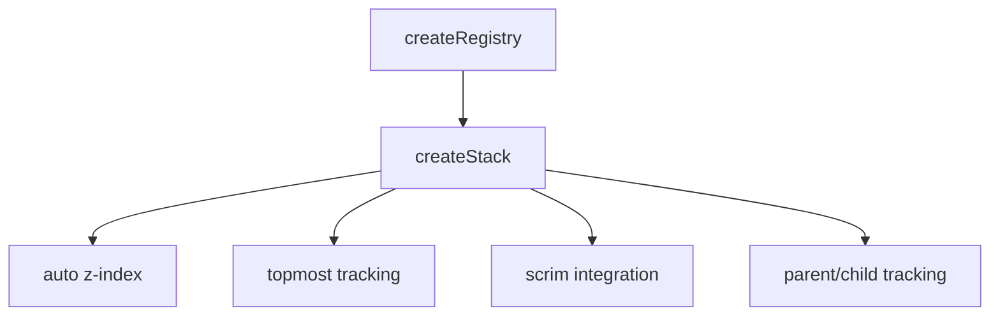
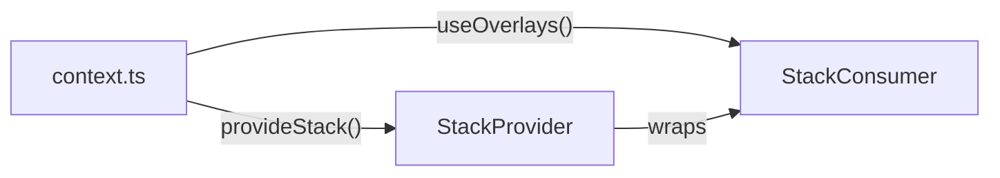

# useStack

A composable for managing overlay z-index stacking with automatic calculation, scrim integration, and parent/child tracking for nested overlays.

<DocsPageFeatures :frontmatter />

## Installation

Install the Stack plugin in your app's entry point:

```ts main.ts
import { createApp } from 'vue'
import { createStackPlugin } from '@vuetify/v0'
import App from './App.vue'

const app = createApp(App)

app.use(createStackPlugin())

app.mount('#app')
```

> [!TIP]
> For client-side only apps, you can skip plugin installation and use the default `stack` singleton directly. The plugin is required for SSR to ensure each request gets its own stack instance.

## Usage

Use the `useStack` composable to register an overlay and receive its z-index and position in the stack:

```ts collapse
import { shallowRef } from 'vue'
import { useStack } from '@vuetify/v0'

const isOpen = shallowRef(false)

const stack = useStack(isOpen, () => {
  isOpen.value = false
})

// stack.styles.value = { zIndex: 2000 } when first overlay
// stack.styles.value = { zIndex: 2010 } when second overlay
// stack.globalTop.value = true when this is the topmost overlay
```

## Architecture

`createStack` extends `createRegistry` with z-index management and scrim coordination:



## Examples

::: example
/composables/use-stack/context.ts
/composables/use-stack/StackProvider.vue
/composables/use-stack/StackConsumer.vue
/composables/use-stack/overlays.vue

### Overlay Stack

This example demonstrates overlay stacking with `createStack`. Each overlay gets an automatically calculated z-index, and the scrim appears below the topmost overlay.



**File breakdown:**

| File | Role |
|------|------|
| `context.ts` | Defines overlay context with open/close methods |
| `StackProvider.vue` | Provides stack context and renders scrim |
| `StackConsumer.vue` | Displays buttons to open overlays at different stack levels |
| `overlays.vue` | Entry point that composes Provider around Consumer |

**Key patterns:**

- `useStack(isActive)` registers overlay when active
- `globalTop` determines if this overlay should handle escape key
- `styles` provides the z-index CSS
- Scrim uses `stack.scrimZIndex` to position below top overlay

Click a button to open an overlay. Open multiple overlays to observe z-index layering.

:::

<DocsApi />
