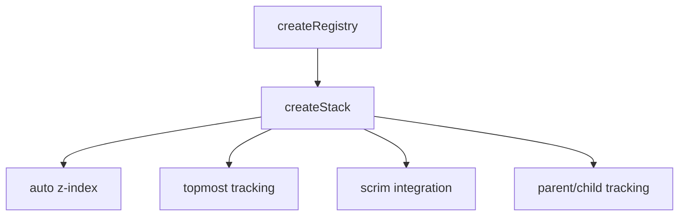

# useStack

Overlay z-index coordinator with automatic stacking order and parent-child nesting support.

<DocsPageFeatures :frontmatter />

## Installation

Install the Stack plugin in your app's entry point:

```ts main.ts
import { createApp } from 'vue'
import { createStackPlugin } from '@vuetify/v0'
import App from './App.vue'

const app = createApp(App)

app.use(createStackPlugin())

app.mount('#app')
```

> [!TIP]
> For client-side only apps, you can skip plugin installation and use the default `stack` singleton directly. The plugin is required for SSR to ensure each request gets its own stack instance.

## Usage

Use the `useStack` composable to register an overlay and receive its z-index and position in the stack:

```ts collapse
import { shallowRef, watch } from 'vue'
import { useStack } from '@vuetify/v0'

const isOpen = shallowRef(false)

const stack = useStack()
const ticket = stack.register({
  onDismiss: () => { isOpen.value = false }
})

// Activate when opening, deactivate when closing
watch(isOpen, open => {
  if (open) ticket.select()
  else ticket.unselect()
})

// ticket.zIndex.value = 2000 when first overlay
// ticket.zIndex.value = 2010 when second overlay
// ticket.globalTop.value = true when this is the topmost overlay
```

## Context / DI

Use `createStackContext` when you need a separate z-index namespace (e.g., overlays inside a modal):

```ts
import { createStackContext } from '@vuetify/v0'

const [useModalStack, provideModalStack, modalStack] =
  createStackContext({ namespace: 'my:modal-stack', baseZIndex: 3000 })

// In parent component
provideModalStack()

// In child overlay component
const stack = useModalStack()
const ticket = stack.register({ id: 'tooltip-1' })
ticket.zIndex.value  // z-index for this overlay
```

## Architecture

`createStack` extends `createRegistry` with z-index management and scrim coordination:


```mermaid "Stack Hierarchy"
flowchart TD
  createRegistry --> createStack:::primary
  createStack --> zIndex[auto z-index]
  createStack --> globalTop[topmost tracking]
  createStack --> scrim[scrim integration]
  createStack --> nested[parent/child tracking]
```

## Reactivity

Stack state and ticket properties are reactive for automatic UI updates.

| Property | Reactive | Notes |
| - | :-: | - |
| `isActive` | <AppSuccessIcon /> | Any overlays selected |
| `top` | <AppSuccessIcon /> | Topmost overlay ticket |
| `scrimZIndex` | <AppSuccessIcon /> | Z-index for scrim element |
| `isBlocking` | <AppSuccessIcon /> | Top overlay blocks dismissal |
| `topElement` | <AppSuccessIcon /> | Element of the topmost open modal (`<dialog>`), or `null`; consumed by `Portal`/`Snackbar.Portal` via `teleport="top-layer"` |
| ticket `zIndex` | <AppSuccessIcon /> | Computed from selection order |
| ticket `globalTop` | <AppSuccessIcon /> | True if topmost |
| ticket `isSelected` | <AppSuccessIcon /> | Overlay active state |

## Examples

::: gn-example
/composables/use-stack/context.ts 1
/composables/use-stack/StackProvider.vue 2
/composables/use-stack/StackConsumer.vue 3
/composables/use-stack/overlays.vue 4

### Overlay Stack

Three overlays — Settings, Confirm, and Alert — share a single `createStack` instance scoped to the example via `provide('v0:stack', stack)`. Each overlay registers with `stack.register({ onDismiss })` and calls `ticket.select()` / `ticket.unselect()` to activate or deactivate. The stack computes `ticket.zIndex` automatically based on registration order, so the third overlay always renders above the second.

`StackProvider` creates the isolated stack and wires the `Scrim` component alongside it — Scrim reads from the same context, so its z-index is always coordinated with the topmost overlay without any manual calculation. The Alert overlay uses `blocking: true`, which prevents dismissal via the scrim click (`ticket.globalTop` is still `true`, but the stack's `isBlocking` flag tells the scrim to ignore pointer events).

Open multiple overlays to see z-index layering in action. This pattern applies directly to any overlay surface — dialogs, drawers, notification toasts — because the stacking logic lives entirely in `createStack`, not in the overlay components themselves. For SSR, install `createStackPlugin` at app level instead of calling `createStack` directly. See [Scrim](/components/providers/scrim) for the backdrop component and [createRegistry](/composables/registration/create-registry) for the underlying registry pattern.

| File | Role |
|------|------|
| `context.ts` | Defines the overlay shape and provides a typed context via `createContext` |
| `StackProvider.vue` | Creates an isolated `createStack`, provides it to descendants, and renders the Scrim |
| `StackConsumer.vue` | Renders buttons to open each overlay and displays their active z-index |
| `overlays.vue` | Entry point that composes Provider around Consumer |

:::

## Recipes

### Top-Layer Teleport

Pass `el` when registering a modal overlay so `useStack().topElement` resolves to its DOM element. `Portal` and `Snackbar.Portal` read `topElement` when `teleport="top-layer"` (the Snackbar.Portal default), teleporting overlays into the topmost open modal's subtree so they share its top-layer context and stay interactive:

```ts no-filename
const stack = useStack()
const ticket = stack.register({
  el: () => dialogRef.value?.element,
  onDismiss: () => { isOpen.value = false },
})
```

Dialog and AlertDialog pass their `<dialog>` element automatically — this pattern is only needed when building a custom modal component from scratch.

### Scrim Integration

Use the `Scrim` component alongside `useStack` to provide a backdrop for your overlays. The Scrim automatically positions itself below the topmost overlay:

```vue
<script setup lang="ts">
import { Scrim } from '@vuetify/v0'
</script>

<template>
  <Scrim class="fixed inset-0 bg-black/50" />
</template>
```

The Scrim reads from the same stack context, so its z-index is always coordinated with your registered overlays.

## FAQ

::: faq

??? Do I have to install the plugin to use useStack?

Not for client-only apps — you can use the default `stack` singleton directly. Install `createStackPlugin` for SSR, where it ensures each request gets its own isolated stack instance instead of sharing one across requests.

??? How do I give a nested group of overlays its own z-index range?

Use `createStackContext({ namespace, baseZIndex })` to create a separate stacking namespace — e.g. overlays opened inside a modal — then provide it and register tickets against that context instead of the global stack.

??? How do I stop a scrim click from dismissing the top overlay?

Register it with `blocking: true`. The overlay stays topmost, but the stack's `isBlocking` flag tells the Scrim to ignore pointer events, so clicking the backdrop won't dismiss it.

??? How does useStack decide each overlay's z-index?

It assigns them from selection order: the first activated overlay gets the base z-index (2000), and each one stacked on top steps up from there (2010, …). Pass `baseZIndex` to `createStackContext` to shift the starting point for a separate namespace.

:::

<DocsApi />
