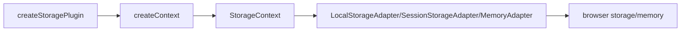

# useStorage

The `useStorage` composable provides reactive storage management with support for multiple storage backends (localStorage, sessionStorage, memory). Built with an adapter pattern for flexibility, it automatically serializes values, manages reactive refs, and provides SSR-safe operations.

<DocsPageFeatures :frontmatter />

## Installation

Install the Storage plugin in your app's entry point:

```ts main.ts
import { createApp } from 'vue'
import { createStoragePlugin } from '@vuetify/v0'
import App from './App.vue'

const app = createApp(App)

app.use(createStoragePlugin())

app.mount('#app')
```

## Usage

Once the plugin is installed, use the `useStorage` composable in any component:

```vue UseStorage
<script setup lang="ts">
  import { useStorage } from '@vuetify/v0'

  const storage = useStorage()

  // Get a reactive ref for a storage key
  const username = storage.get('username', 'Guest')

  // Update the value (automatically persists to storage)
  function updateUsername(name: string) {
    username.value = name
  }
</script>

<template>
  <div>
    <h1>Welcome, {{ username }}!</h1>
    <input v-model="username" placeholder="Enter your name" />
  </div>
</template>
```

## Architecture

`useStorage` uses the plugin pattern with storage adapters:



<DocsApi />
