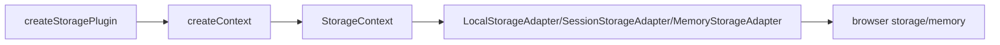

# useStorage

Reactive storage with automatic serialization, caching, and SSR-safe operations.

<DocsPageFeatures :frontmatter />

## Installation

Install the Storage plugin in your app's entry point:

```ts main.ts
import { createApp } from 'vue'
import { createStoragePlugin } from '@vuetify/v0'
import App from './App.vue'

const app = createApp(App)

app.use(createStoragePlugin())

app.mount('#app')
```

## Usage

Once the plugin is installed, use the `useStorage` composable in any component:

```vue collapse no-filename UseStorage
<script setup lang="ts">
  import { useStorage } from '@vuetify/v0'

  const storage = useStorage()

  // Get a reactive ref for a storage key
  const username = storage.get('username', 'Guest')

  // Update the value (automatically persists to storage)
  function updateUsername(name: string) {
    username.value = name
  }
</script>

<template>
  <div>
    <h1>Welcome, {{ username }}!</h1>
    <input v-model="username" placeholder="Enter your name" />
  </div>
</template>
```

## Standalone Usage

Use `createStorage` directly without the plugin system for standalone or module-level caching:

```ts collapse no-filename createStorage
import { createStorage } from '@vuetify/v0'

const storage = createStorage({ prefix: 'myapp:' })

storage.set('theme', 'dark')

const theme = storage.get('theme', 'light')

console.log(theme.value) // 'dark'
```

### TTL (Time-to-Live)

Set a `ttl` option (in milliseconds) to automatically expire cached entries. Expired entries return the default value on `get()` and are removed from storage.

```ts collapse no-filename TTL
import { createStorage } from '@vuetify/v0'

// Cache expires after 5 minutes
const cache = createStorage({
  prefix: 'api-cache:',
  ttl: 5 * 60 * 1000,
})

// Store fetched data — automatically timestamped
cache.set('users', await fetchUsers())

// Later reads return the default if expired
const users = cache.get('users', [])
```

> [!TIP] How TTL works
> When `ttl` is set, values are internally wrapped as `{ __ttl, __v, __t }` with a timestamp. On `get()`, if the entry is older than the TTL, it is treated as absent and removed from storage. Non-TTL entries stored previously are read normally.

## Adapters

Adapters let you swap the underlying storage backend without changing your application code.

| Adapter | Import | Description |
|---------|--------|-------------|
| `localStorage` | — | Browser localStorage (default in browser) |
| `sessionStorage` | — | Browser sessionStorage |
| `MemoryStorageAdapter` | `@vuetify/v0/storage/adapters/memory` | In-memory storage (default in SSR) |

## Architecture

`useStorage` uses the plugin pattern with storage adapters:


```mermaid "Storage Plugin"
flowchart LR
  createStoragePlugin --> createContext
  createContext --> StorageContext
  StorageContext --> Adapter[LocalStorageAdapter/SessionStorageAdapter/MemoryStorageAdapter]
  Adapter --> storage[browser storage/memory]
```

## Reactivity

The `get()` method returns reactive refs that sync with storage automatically.

| Property | Reactive | Notes |
| - | :-: | - |
| `get()` return value | <AppSuccessIcon /> | Returns `Ref<T>` synced with storage |
| `has()` | <AppErrorIcon /> | Returns `boolean` — checks if key exists (TTL-aware) |

> [!TIP] Auto-persistence
> Refs returned by `get()` are watched with `{ deep: true }`. Any changes to the ref value automatically persist to storage.

> [!TIP] Empty strings are preserved
> `get()` uses nullish coalescing (`??`) internally, so an empty string `''` is a valid stored value — it is never treated as absent or replaced by the default. Only `null` and `undefined` trigger the default.

## Examples

::: gn-example
/composables/use-storage/persistent-settings

### Persistent Settings

A settings panel with four independently persisted keys — `name`, `theme`, `count`, and `items` — each returned from `storage.get()` as a reactive `Ref`. Writing to any ref (e.g. incrementing `count.value++` or pushing to `items.value`) is sufficient to persist the value; there is no explicit `set()` call because the refs are watched with `{ deep: true }` internally.

The `items` key demonstrates deep-watch auto-persistence on an array: adding or removing elements triggers the watcher and serializes the new array to storage in a single write. The `has('count')` readout at the bottom shows how to distinguish "key present with a stored value" from "key absent, returning default" — useful when you need to detect a first visit vs. a returning user.

The example uses `MemoryStorageAdapter` for isolation, but swapping in `localStorage` or `sessionStorage` requires only changing the adapter at plugin-install time. In a real app the panel's state would survive page refreshes with `localStorage`. Reach for `useStorage` over raw `localStorage` calls whenever you want reactive refs, a shared prefix, TTL expiration, or SSR safety without writing the serialization layer yourself. See [useHydration](/composables/plugins/use-hydration) for coordinating storage reads with SSR hydration.

:::

<DocsApi />
