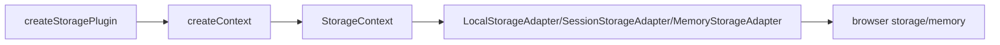

# useStorage

Reactive storage with automatic serialization, caching, and SSR-safe operations.

<DocsPageFeatures :frontmatter />

## Installation

Install the Storage plugin in your app's entry point:

```ts main.ts
import { createApp } from 'vue'
import { createStoragePlugin } from '@vuetify/v0'
import App from './App.vue'

const app = createApp(App)

app.use(createStoragePlugin())

app.mount('#app')
```

## Usage

Once the plugin is installed, use the `useStorage` composable in any component:

```vue collapse no-filename UseStorage
<script setup lang="ts">
  import { useStorage } from '@vuetify/v0'

  const storage = useStorage()

  // Get a reactive ref for a storage key
  const username = storage.get('username', 'Guest')

  // Update the value (automatically persists to storage)
  function updateUsername(name: string) {
    username.value = name
  }
</script>

<template>
  <div>
    <h1>Welcome, {{ username }}!</h1>
    <input v-model="username" placeholder="Enter your name" />
  </div>
</template>
```

## Adapters

Adapters let you swap the underlying storage backend without changing your application code.

| Adapter | Import | Description |
|---------|--------|-------------|
| `localStorage` | — | Browser localStorage (default in browser) |
| `sessionStorage` | — | Browser sessionStorage |
| `MemoryStorageAdapter` | `@vuetify/v0/storage/adapters/memory` | In-memory storage (default in SSR) |

## Architecture

`useStorage` uses the plugin pattern with storage adapters:


```mermaid "Storage Plugin"
flowchart LR
  createStoragePlugin --> createContext
  createContext --> StorageContext
  StorageContext --> Adapter[LocalStorageAdapter/SessionStorageAdapter/MemoryStorageAdapter]
  Adapter --> storage[browser storage/memory]
```

## Reactivity

The `get()` method returns reactive refs that sync with storage automatically.

| Property | Reactive | Notes |
| - | :-: | - |
| `get()` return value | <AppSuccessIcon /> | Returns `Ref<T>` synced with storage |
| `has()` | <AppErrorIcon /> | Returns `boolean` — checks if key exists (TTL-aware) |

> [!TIP] Auto-persistence
> Refs returned by `get()` are watched with `{ deep: true }`. Any changes to the ref value automatically persist to storage.

> [!TIP] Empty strings are preserved
> `get()` uses nullish coalescing (`??`) internally, so an empty string `''` is a valid stored value — it is never treated as absent or replaced by the default. Only `null` and `undefined` trigger the default.

## Examples

::: gn-example
/composables/use-storage/useSettings.ts 1
/composables/use-storage/SettingsPanel.vue 2
/composables/use-storage/settings-panel.vue 3

### Persistent Settings Panel

A settings panel built directly on `createStorage` — the standalone factory behind the plugin. The `name` and `theme` fields are reactive refs returned from `storage.get()` with a default; writing to either ref is enough to persist it, because `get()` watches the value with `{ deep: true }` internally. There is no explicit `set()` call for these — editing the input or picking a theme writes through automatically. A separate "draft note" demonstrates the explicit lifecycle: `set()` to persist, `has()` to check presence, and `remove()` to drop the key.

The draft is the interesting part. It is held in a local `shallowRef` buffer and only copied into storage when you click Save, so `has('note')` honestly reports whether a draft has been persisted rather than merely cached. Because `has()` returns a plain boolean snapshot — it is not reactive, per the Reactivity table above — the composable re-reads it into a reactive `saved` flag after every `set()` and `remove()`. Forget calls `remove()` to delete the key and clears the buffer, flipping `saved` back to `false`.

The example uses `MemoryStorageAdapter` for isolation; swapping in `localStorage` or `sessionStorage` is a one-line adapter change and makes the panel survive page refreshes. Reach for the storage layer over raw `localStorage` calls whenever you want reactive refs, a shared key prefix, TTL expiration, or SSR safety without hand-writing serialization. With the plugin installed you would call [useStorage](/composables/plugins/use-storage) instead of `createStorage` to share one instance app-wide; see [useHydration](/composables/plugins/use-hydration) and the [plugins guide](/guide/fundamentals/plugins) for coordinating storage reads with SSR hydration.

| File | Role |
|------|------|
| `useSettings.ts` | Wraps `createStorage`, exposing persisted `name` and `theme` refs plus the draft buffer and `save` / `forget` / `reset` behavior |
| `SettingsPanel.vue` | Presentational panel built on `Input` and `Button` that binds the settings and triggers the save and forget actions |
| `settings-panel.vue` | Entry that instantiates the composable, wires it to the panel, and renders the live stored snapshot |
:::

## Recipes

### Standalone Usage

Use `createStorage` directly without the plugin system for standalone or module-level caching:

```ts collapse no-filename createStorage
import { createStorage } from '@vuetify/v0'

const storage = createStorage({ prefix: 'myapp:' })

storage.set('theme', 'dark')

const theme = storage.get('theme', 'light')

console.log(theme.value) // 'dark'
```

#### TTL (Time-to-Live)

Set a `ttl` option (in milliseconds) to automatically expire cached entries. Expired entries return the default value on `get()` and are removed from storage.

```ts collapse no-filename TTL
import { createStorage } from '@vuetify/v0'

// Cache expires after 5 minutes
const cache = createStorage({
  prefix: 'api-cache:',
  ttl: 5 * 60 * 1000,
})

// Store fetched data — automatically timestamped
cache.set('users', await fetchUsers())

// Later reads return the default if expired
const users = cache.get('users', [])
```

> [!TIP] How TTL works
> When `ttl` is set, values are internally wrapped as `{ __ttl, __v, __t }` with a timestamp. On `get()`, if the entry is older than the TTL, it is treated as absent and removed from storage. Non-TTL entries stored previously are read normally.

## FAQ

::: faq

??? Do I need to call `set()` to persist a value?

No. The ref returned by `get(key, default)` is watched with `{ deep: true }`, so writing to `.value` (or binding it with `v-model`) persists automatically. `set()` is the explicit alternative when you don't hold the ref.

??? Why doesn't an empty string fall back to my default?

`get()` uses nullish coalescing internally, so `''` is treated as a valid stored value — only `null` and `undefined` trigger the default. This preserves intentionally-cleared fields.

??? How do I make cached entries expire automatically?

Pass a `ttl` (in milliseconds) to `createStorage`. Entries are timestamped on write; once older than the TTL, `get()` returns the default and removes the entry from storage.

:::

<DocsApi />
